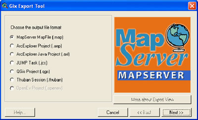
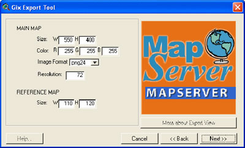
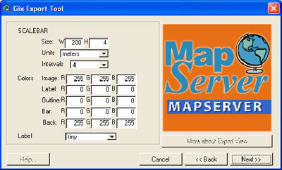

=======================================================================
Creating MapServer CLASS definitions from ArcView legends \| OneGeology
=======================================================================

.. container::
   :name: outer_container

   .. container:: top_banner_box
      :name: page_top

      Providing geoscience data globally |OneGeology logo|
      `Navigation <#menu>`__\ 
      \ `Main content <#content>`__\ 
      \ `Bottom links <#bottom_links>`__

   .. container:: print

      .. rubric:: OneGeology
         :name: onegeology

   .. container:: technical_progress

      `Home </home.html>`__ > `How to serve a OneGeology
      WMS <home.html>`__ > Creating MapServer CLASS definitions from
      ArcView legends

   .. container:: clear horizontal_links navigation

      .. container::
         :name: menu

         `About us </what_is/home.html>`__
            -  `The Mission </what_is/mission.html>`__
            -  `Objectives </what_is/objective.html>`__
            -  `How </what_is/how.html>`__
            -  `The Accord </what_is/accord.html>`__
            -  `Members & membership
               type </participants/members.html>`__
            -  `Countries
               involved </participants/app/1gCountries.cfc?method=viewCountries>`__
            -  `Organisational
               bodies </participants/organisational_bodies.html>`__
            -  `Sponsors </participants/sponsors.html>`__
            -  `Interactive
               map </participants/app/1gCountries.cfc?method=viewCountryMap>`__

         `Governance </organisation/home.html>`__
            -  `Administration </organisation/secretariat.html>`__
            -  `Memorandum of understanding </organisation/mou.html>`__
            -  `Technical implementation
               group </organisation/tig.html>`__
            -  `Operational
               group </organisation/operationalGroup.html>`__
            -  `Strategic Steering
               Committee </organisation/strategicSteering.html>`__

         `Technical </technical_progress/technical.html>`__
            -  `GeoSciML </technical_progress/geosciml.html>`__
            -  `ESRI grant
               offer </technical_progress/esriGrantOffer.html>`__
            -  `Providing services </service_provision/home.html>`__
            -  `Register your data or
               service </technical_progress/buddy_home.html>`__
            -  `Web services accreditation
               scheme </technical_progress/accreditationForm.cfm>`__
            -  `How to use a OneGeology service </use/home.html>`__

         `Meetings </meetings/home.html>`__
            -  `Operational Group </meetings/oog_meetings.html>`__
            -  `Strategic Steering
               Committee </meetings/steering_meetings.html>`__
            -  `Technical Implementation
               Group </meetings/technical_meetings.html>`__
            -  `Board </meetings/board_meetings.html>`__

         `Portal </portal/home.html>`__

         `eXtra </eXtra/home.html>`__
            -  `Culture </eXtra/culture/home.html>`__
            -  `Geodiversity </eXtra/Geodiversity/home.html>`__
            -  `OneGeology Kids </eXtra/kids/home.html>`__
            -  `Showcase </eXtra/Showcase/home.html>`__

   .. container::
      :name: content

      .. container:: fullwidth

         .. rubric:: Appendix B: Creating MapServer CLASS definitions
            from ArcView legends
            :name: appendix-b-creating-mapserver-class-definitions-from-arcview-legends
            :class: technical_progress_side_menu

         The Gix Export Tool can help you create the CLASS sections of
         your map file from an ESRI ArcView 3.x .apr file. This tool
         converts ESRI ArcView 3.x (NOT ArcMap) projects to common open
         source alternatives including a MapServer map file. (Please
         note that this tool has only been used to convert simple
         symbology e.g. geology polygons symbolized by a solid colour
         according to its lithology value. Its ability to convert more
         complex symbology has not been tested.) Download the `Gix
         Export Tool <http://gix.sourceforge.net/>`__
         (http://gix.sourceforge.net/). Run the executable and follow
         the instructions to install the tool as an ArcView 3.x
         extension. Having installed the Gix Export Tool, create or open
         an ArcView project containing your symbolized data.

         | |ArcView map view showing symbolized data|
         | ArcView map view showing symbolized data

         | |Loading the Gix ArcView extension|
         | Loading the Gix ArcView extension

         Load the Gix Export Tool Extension (File — Extensions, tick
         required extension, click OK).

         | |Loading the Gix ArcView extension|
         | Loading the Gix ArcView extension

         Complete the following steps to convert your project to a
         MapServer map file.

         #. Select View — Export View.

            | |ArcView, Exporting your View|
            | ArcView, Exporting your View

         #. The first screen asks you to select your output file format
            — choose MapServer map file (.map) and click next.

            | |Gix export tool, selecting output format|
            | Gix export tool, selecting output format

         #. The next screen asks you to select a version (choose
            default) and output file. The output file generated will be
            a temporary file from which you will cut the CLASS
            components and paste them into the master map file you have
            been creating elsewhere. Select a location for your output
            file and click next.

            | |Gix export tool, selecting output file|
            | Gix export tool, selecting output file

         #. The next screen asks for details of the main and reference
            map. You won’t use these sections so accept the defaults and
            click next.

            | |Gix export tool, details for the main, and reference
              maps|
            | Gix export tool, details for the main, and reference maps

         #. The next screen asks for details of the legend. Again, you
            won’t use these sections so accept the defaults and click
            next.

            | |Gix export tool, details for the legend|
            | Gix export tool, details for the legend

         #. The next screen asks for details of the scale bar. Again,
            you won’t use these sections so accept the defaults and
            click next.

            | |Gix export tool, details for the scale bar|
            | Gix export tool, details for the scale bar

         #. The next screen asks for details of the OGC metadata. Again,
            you won’t use these sections so accept the defaults and
            click next.

            | |Gix export tool, OGC metadata details|
            | Gix export tool, OGC metadata details

         #. The next screen asks for details of final options. Again,
            you won’t use these sections so accept the defaults.

            | |Gix export tool, character set encoding and symbology
              options|
            | Gix export tool, character set encoding and symbology
              options

         #. Click Finish to create your map file.

         Open up the map file you created in a text editor and complete
         the following steps for each layer in your map file:

         #. Navigate to the line beginning CLASSITEM
         #. Highlight from here down to the END #CLASS line associated
            with that layer
         #. Copy and paste the selected lines to an empty text file
         #. Delete all TEMPLATE ’ template.html’ lines (one for each
            class)
         #. Paste the remaining content into your master map file within
            the section for the layer you are dealing with. A good
            position is after the END line which closes the METADATA for
            that layer.

         If your symbolization in ArcView had polygon boundaries you
         will need to remove these from the MapServer symbolization.
         This may be easier to do by deleting all the ‘OUTLINECOLOR’
         lines from the generated map file than by altering your ArcView
         symbolization.

         Section last modified: 19 January 2010

         `Back <appendixA.html>`__\ \|\ `Next <appendixC.html>`__

   .. container:: horizontal_links

      .. container::

         `Contact us </misc/contact_us.html>`__

      .. container::

         `Newsletters </misc/news.html>`__

      .. container::

         `Downloads </misc/downloads.html>`__

      .. container::

         `Privacy </misc/privacy.html>`__

      .. container::

         `Participating countries
         map </participants/app/1gCountries.cfc?method=viewCountryMap>`__

      .. container::
         :name: pageTopBtn

         `Top <#page_top>`__

   OneGeology © 2017. This site is hosted by the `British Geological
   Survey <http://www.bgs.ac.uk/hosted.html>`__ but responsibility for
   the content of the site lies with OneGeology not with the British
   Geological Survey. Questions, suggestions, or comments regarding the
   contents of this site should be directed to `the OneGeology
   administration <mailto:onegeology@bgs.ac.uk>`__.

.. |ArcView map view showing symbolized data| image:: appendixb/711a2f745e9afb482a097757959ac57ecae2bfe2.jpg
   :width: 600px
   :height: 466px
.. |Loading the Gix ArcView extension| image:: appendixb/9b8f33b69e2ab8c6b3ffe3f1f9c8586b4fda77eb.jpg
   :width: 600px
   :height: 490px
.. |Loading the Gix ArcView extension| image:: appendixb/31ef03ffcf9a56760f0bcdda383cf9e186371052.jpg
   :width: 600px
   :height: 501px
.. |ArcView, Exporting your View| image:: appendixb/ee25ee781b71b3f1390462fed56b6560ba20c27b.jpg
   :width: 600px
   :height: 543px

.. |Gix export tool, selecting output file| image:: appendixb/62458360f56d3e2a6910dfcbc08519d761f6d544.jpg
   :height: 242px

.. |Gix export tool, details for the legend| image:: appendixb/1e38a40643d247d096ee4b8cbf1d63349a8e75ed.jpg
   :height: 242px

.. |Gix export tool, OGC metadata details| image:: appendixb/91867d943d1882ce816bd9b1e3b686bc238f9267.jpg
   :height: 242px
.. |Gix export tool, character set encoding and symbology options| image:: appendixb/57cb1ec6c90b4e236b06991b3bce13b336af8da9.jpg
   :height: 242px
