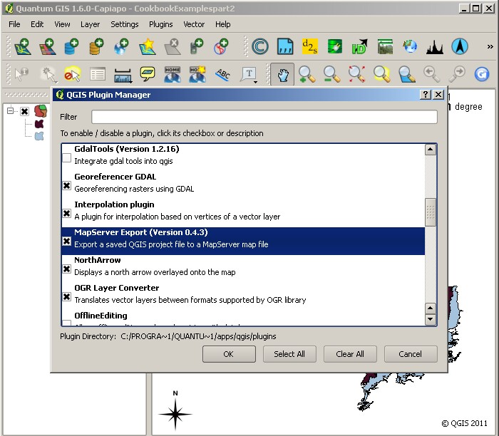

===============================================
Creating MapServer CLASS definitions using QGIS
===============================================

.. container::
   :name: outer_container

   .. container::
      :name: content

      .. container:: fullwidth

         .. rubric:: Appendix D: Creating MapServer CLASS definitions
            using Quantum GIS
            :name: appendix-d-creating-mapserver-class-definitions-using-quantum-gis
            :class: technical_progress_side_menu

         Quantum GIS (QGIS) is a user friendly Open Source Geographic
         Information System (GIS) licensed under the `GNU General Public
         License <http://www.gnu.org/copyleft/gpl.html>`__
         (http://www.gnu.org/copyleft/gpl.html). QGIS is an official
         project of the `Open Source Geospatial Foundation
         (OSGeo) <http://www.osgeo.org/>`__ (http://www.osgeo.org/). It
         runs on Linux, Unix, Mac OSX, and Windows and supports numerous
         vector, raster, and database formats and functionalities.

         The current stable version of QGIS (QGIS 2.12) is available for
         download from
         https://www.qgis.org/en/site/forusers/download.html

         For information on how to use QGIS to view WMS and WFS services
         see the ‘how to’ `section 1.4.7 </howto/1_4_7.html>`__

         You can use the MapServer Export QGIS plugin to create a .map
         configuration file. You will first need to enable the plugin,
         which comes bundled as part of the standard installation,
         through the Plugins menu. Select *Manage plugins* then select
         *MapServer Export* from the *QGIS Plugin Manager*.

         | |QGIS Enabling the MapServer Export plugin|
         | QGIS Enabling the MapServer Export plugin

         With the map data you wish to serve as a WMS open in QGIS,
         select *Plugins* and then *MapServer Export* to start the
         conversion process.

         | |QGIS Running the MapServer Export plugin|
         | QGIS Running the MapServer Export plugin

         You are given some options when you run the plugin (as below).
         You may use the defaults or add your own (as we have here). It
         isn’t important if you don’t know what to enter at this stage
         as you can edit the values in the .map file in any text editor.
         It may help though if add some dummy values, just so you get
         the correct structure.

         | |QGIS MapServer Export: Save project to map file|
         | QGIS MapServer Export: Save project to map file

         When you have made all the edits you want to add, click ok. If
         there are no errors, you will get a results summary window (as
         below).

         | |QGIS MapServer Export results summary|
         | QGIS MapServer Export results summary

         **Note** the URLs shown in the results summary will not work in
         the OneGeology exemplar service set-up (as detailed in this
         cookbook); you will need to follow the instructions in `Section
         4.3 <4_3.html>`__ to complete the set-up process.

.. |QGIS Running the MapServer Export plugin| image:: appendixd/b3d7dde36b9b9caaec187b20ab1e5e79cc096868.jpg
   :width: 703px
   :height: 647px
.. |QGIS MapServer Export: Save project to map file| image:: appendixd/74149622023daaac436dc389b4e50f3732ddb193.jpg
   :width: 617px
   :height: 532px
.. |QGIS MapServer Export results summary| image:: appendixd/876f5c56eb15e3bc98f7fcb6c656395455cc9ba1.jpg
   :width: 685px
   :height: 352px
