Using the OneGeology Portal
===========================

.. todo::
   Currently taken WMS cookbook 1.4 text removing over-technical detail. Needs to have a general intro to the different kinds of service (WMS, WFS and WCS) service and what sort of things you might be able to  do with them. Probably not covering the kinds of data (traditional geol map, boreholes, minerals) in this section? Should make a generic list of the sorts of functionality a client may provide so can refer to this under each item. Need to consider whether we can actually maintain detailed instructions on more than a couple of examples. And should we? Should be able just to point to software's own documentation on using OGC services. Maybe just make a list with pointer to home page, specific documentation package may have for OGC services (should be standard stuff these days) and any gotchas/special considerations we have noticed for particular examples. The target audience for this section could include a range of levels of IT and geological knowledge and include people just using the services and service providers who also need to understand how their services can be made use of.

.. todo::

   Below introductory paragraph should probably point to some general OneGeology introduction elsewhere on www.onegeology.org to explain the range of data and purpose of OneGeology. We may need to get it written if it doesn't exist right now. We want to refer to purpose, kinds of data that are available or will be in future. This page is where the kinds of viewing, data query etc. that can be done will be introduced.

.. todo::

   List the other parts of www.onegeology.org that will link directly to here. At the moment a sidebar sub-menu "Technical detail for participants" -> "How to use a OneGeology service" and some links from other pages. Also the page http://onegeology.org/portal/portal_uses.html has links to various client pages but it all seems a bit of a repetitive anomaly and something that should be entirely replaced by content here.

The OneGeology portal allows you to discover all the services that have been registered with OneGeology. You can view all those that return image output on a map of the world and can query the data behind those that provide that ability. Also some services allow you to highlight areas satisfying some simple query criteria on the age or lithology of mapped geological units.

http://portal.onegeology.org

- The portal can be accessed using most internet browsers.
- Basic map data is called a WMS (Web Map Service)
- Detailed map data and information in the OneGeology Portal is called a WFS (Web Feature Service) which are types of ‘GeoSciML’, a computer interoperable data exchange language.
- This language is designed in a format that can be used in a wide variety of desktop programs such as ArcMap, Gaia from Carbontools, and NASA World Wind.
- OneGeology aims to use Free and Open Source software wherever possible.
- All OneGeology data can be viewed via the Portal: http://portal.onegeology.org
- OneGeology aims to use Free and Open Source software wherever possible.
- The data is “served” directly from the provider organisation.
- The provider organisation retains full ownership and responsibility and is able to change or modify data whenever necessary.

The Portal has the following functions:

- Zoom
- Pan
- Get Information tool
- Help menu
- multi-layer map view,
- opacity selection,
- legend viewer,
- details of provider organisation / geological survey
- web link URL to the provider survey
- brief description of the data layer
- conditions of use information for each layer

OneGeology makes data from geological data providers around the world accessible to those who would like to see and use it. The majority of this data is the type that is portrayed on traditional geological maps. There are increasing amounts with different geologically related types of data such as geophysics, boreholes and hydrogeology. This data is made available by means of Open GeoSpatial Consortium `OGC <http://www.opengeospatial.org>`_ standard web services that can be accessesed by a number of free and commercial clients. Currently OneGeology makes use of three OGC standards: Web Map Service `WMS <http://www.opengeospatial.org/standards/wms>`_, Web Feature Service `WFS <http://www.opengeospatial.org/standards/wfs>`_ and Web Coverage Service `WCS <http://www.opengeospatial.org/standards/wcs>`_. These different service standards define different kinds of capability for examining the data.

WMS provides the ability to see a map image projected to its correct geographical location in a number of map projections. This will usually be accompanied by a legend which explains the symbology used in the map. Commonly, many WMS also provide the ability to select a point on the map and get a summary in text or other format of data values for that point. The majority of OneGeology services are WMS. A small number of these WMS also provide the ability to change the symbology of the map depending on the underlying data (e.g. to highlight formations of a particular age). These are called `SLD <http://www.opengeospatial.org/standards/sld>`_ enabled WMS.

WFS provide the ability to query a service based on spatial and other criteria and return the matching data in a `GML <http://www.opengeospatial.org/standards/gml>`_ format and maybe other formats as well. It assumes the data has been structured as a collection of features with spatial and other, possibly complex properties. OneGeology is focussed on two standard formats for data exchange: `GeoSciML <http://www.geosciml.org>`_ and `ERML <http://www.earthresourceml.org/>`_. The data available from a given WFS may be visually portrayed in one or more related WMS layers.

WCS also provices the ability to return matching data based on spatial and other criteria but the data is structured as coverages where values of some fixed set of properties are defined for each point over some spatial domain. Although theoretically different kinds of division of spatial domain are possible, currently all coverages are based on regular grids. The properties are also simple whether numerical or categorical. As image formats generally specify colour values at regular grid cells then a WCS may return coverages that can be viewed as an image directly as well as data formats that need to be processed by some application.

In simple terms, currently WFS are used for spatial data stored in some vector format and WCS for data stored in a raster gridded format.

.. todo::

   Should we also mention the CSW for searching metadata about the services in the above list?

Viewing data registered in the OneGeology Portal
-------------------------------------------------

The OneGeology Portal is found at: http://portal.onegeology.org/ and is accessible as either an English (the default) or French language service.

You will need to use Internet Explorer 6 and above, Firefox 2 and above or recent versions of Safari, Opera, and Chrome. You will need to enable JavaScript and allow pop-ups.

   .. todo::

      Need to find an updated link for Blue Marble

When you open the OneGeology Portal you get a map of the world, the `Blue Marble: Next Generation+Topo+Bathy (Terra/MODIS) <http://visibleearth.nasa.gov/view_detail.php?id=7105>`_. By default you now also get some automatically selected geology map layers, depending on the scale you are zoomed into. For example, at full map extent you now get the ‘*World CGMW 1:50M Geological Units Onshore*’ map.

.. figure:: images/newsiteR.jpg
      :width: 600
      :alt: Default display of the OneGeology Portal, with automatically selected geology layers

      Default display of the OneGeology Portal, with automatically selected geology layers image

You may at any time turn off the automatically selected layers by unticking the option ‘*Automatically displayed layers depending on scale and location*’ in the top right of the browser window.

The overview window in the bottom right corner of the map indicates the area of the globe you are currently looking at in the map window, by means of a red outline map superimposed on the global map. For example in the above map the red outline is shown for the whole globe, but in the below map the red box is located in the Southern Ocean.

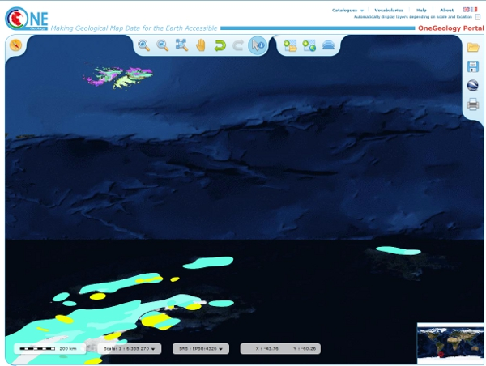

      The overview window shows where you are on the globe

.. figure:: images/AddLayer.jpg
      :width: 600
      :alt: Click the Add OneGeology map layers icon to open the OneGeology Portal catalogue map layer listing

      Add OneGeology map layers icon

To view any other registered geology maps you need to click on the ‘*Add OneGeology map layers*’ icon to open the OneGeology Portal catalogue listing.

.. figure:: images/newsiteAddLayersR.jpg
      :width: 600
      :alt: OneGeology Portal catalogue map layers listed by Geographic area. Use the options in this window to control which maps are displayed, and how they are displayed

      OneGeology Portal catalogue map layers listed by Geographic area. Use the options in this window to control which maps are displayed, and how they are displayed

Click on the + buttons to expand the levels. Select a map by clicking on the box to the left of the map you wish to view. A tick will appear.

Select all the map layers you wish to view at this time before closing the catalogue listing. The selected maps should then be visible. You can add other layers later on if you desire.

You may navigate around the map using the GIS tools found at the top of the page. The functions of these tools is as follows (from left to right):

.. figure:: images/IconsGIS.jpg
      :height: 915
      :alt: GIS tools

      GIS tools

* Zoom in — click on this image and then click on the world background map to zoom in centred on the clicked location. Click and drag a rectangle to zoom to a specific area.
* Zoom out — click on this image and then click on the world background map to zoom out centred on the clicked location. Click and drag a rectangle to zoom out from a specific area
* View full global extent — click this image to start again with a view of the full world background map.
* Pan by clicking and dragging the map to move — click this image and then click and drag on the map to move to a different area (north, west, etc)
* Return back to previous map view
* If you have gone back to a previous view, you may use this tool to go forward.
* Use this tool to get more information about the active map layers (this is termed a GetFeatureInfo request). Select the tool and click the map to open up a new window with detailed information about the geology at that point. The information returned and format of the information varies from map to map and layer to layer dependant upon how much information the provider organization wishes to display and the capabilities of the service.

.. figure:: images/GetFInfoR.jpg
      :alt: Example of information that may be retrieved using the information tool
      :width: 600

      Example of information that may be retrieved using the information tool

.. figure:: images/ViewProps.jpg
      :width: 50
      :height: 50
      :alt: Active Layers Properties icon

      Active Layers Properties icon

To view metadata about the map layers and to change the way the layers are displayed you need to Click on the ‘*Active Layers Properties*’ icon. This will open a list of all the map layers that you have selected to be viewed in the OneGeology Portal; it will now also display all the map layers that have been automatically selected.

   .. figure:: images/activelayers1r.jpg
      :width: 600
      :alt: Active layers in a OneGeology Portal session

      Active layers in a OneGeology Portal session

Within this dialogue menu you can manage the individual layers in the following ways (looking at the icons from left to right):

   .. figure:: images/activelayers1detail.jpg
      :width: 500
      :alt: Tools to manage the active layers

      Tools to manage the active layers

   * Move the map layer up (so it lies above other layers and may obscure them), and move the map layer down (so it lies beneath other layers and may be obscured by them).  In the figure we can see that we cannot move the SUR TNO 1M SLT further up because the up away is greyed out.
   * Show or hide the map layer.
   * Change the opacity of the map layer (use the slider rule to change the % value to make underlying maps visible) so that it is possible to see through a layer to underlying layers where they overlap
   * Zoom to the extent of the map layer to make that particular map layer fill the centre of the map browser.
   * Delete the map layer from the view (you can add it back again later).

Note the *i* icon has no actual function, it just exists to inform you whether the layer is queryable, that is whether you can perform a GetFeatureInfo request on it and get back some information.  Note too, in the above figure that one of the layers is shown to be greyed out.  A greyed out layer indicates that the layer (such as PER INGEMMET 1:1M Faults, is not visible at the selected map scale.  Finally note we can show or hide all the automatically selected layers by unticking the ‘*Automatically displayed layers depending on scale and location*’ option at the top of the dialogue window.

   .. figure:: images/9.jpg
      :width: 600
      :alt: Layer viewed with 30% opacity
      :figclass: right

      Layer viewed with 30% opacity

   .. figure:: images/8.jpg
      :width: 600
      :alt: Layer viewed with 100% opacity
      :figclass: left

      Layer viewed with 100% opacity

To find out further information about any map layer you can click the arrow to right of the layer title; inforamtion found here is extracted from the service GetCapabilites response document and includes information such as:

   * The data owner
   * The service title
   * The legend of the map layer
   * Information about the layer data and other digital data services of the data provider
   * TC211/ISO 19115:2003 or FGDC metadata for the layer
   * The service URL (you can use this URL to view the OneGeology WMS layer in any WMS client as described in later sections).

   .. figure:: images/GetCapInfoR.jpg
      :width: 600
      :alt: Example of GetCapabilities data that may be obtained from the Active Layer properties dialogue, with pop-up legend from the Legend link

      Example of GetCapabilities data that may be obtained from the Active Layer properties dialogue, with pop-up legend from the Legend link

   .. figure:: images/GetCapInfoR2.jpg
      :width: 600
      :alt: Example of GetCapabilities data that may be obtained from the Active Layer properties dialogue, with pop-up legend from the Legend link

      Example of GetCapabilities data that may be obtained from the Active Layer properties dialogue, with pop-up legend from the Legend link

   This (above) information is harvested automatically by the OneGeology Portal client software from the GetCapabilities response document of the WMS.

Go To Function
^^^^^^^^^^^^^^

   .. figure:: images/searchlocation.jpg
      :width: 500
      :alt: The Go To icon

      The Go To icon

   Click in the Search Location box to to enter a place name, select from returned options area to zoom to.

   In the first example (below) we enter Dominica in the ‘Search Location’ text box.  This opens a drop down window that shows all the matches for Dominica in the OneGeology Portal gazeteer.  Select the place name you want by clicking on it and the OneGeology Portal will zoom to that location.  Note the OneGeology Portal only zooms to the area, it doesn’t necessarily open any available geology layers in that area.

   .. figure:: images/gotodomTr.jpg
      :width: 600
      :alt: Using the Go To functionality to zoom to an area (the Dominican Republic) by entering a search string

      Using the Go To functionality to zoom to an area (the Dominican Republic) by entering a search string ~ Dominica

Viewing layers in different projections
^^^^^^^^^^^^^^^^^^^^^^^^^^^^^^^^^^^^^^^

   The portal allows you to select other projections to view the map layers.  The projections supported by the portal are:

   EPSG:3031
     Antarctic Polar Stereographic (WGS84) http://spatialreference.org/ref/epsg/3031/
   EPSG:3034
     Lambert Conformal Conic (ETRS89) http://spatialreference.org/ref/epsg/3034/
   EPSG:3413
     NSIDC Sea Ice Polar Stereographic North (WGS84) http://www.spatialreference.org/ref/epsg/3413/
   EPSG:3857
     Web Mercator (WGS84) http://spatialreference.org/ref/sr-org/7483/
   EPSG:4258
     2D Latitude / Longitude (ETRS89) http://www.spatialreference.org/ref/epsg/4258/
   EPSG:4326
     2D Latitude / Longitude (WGS84) http://spatialreference.org/ref/epsg/4326/

   The default projection to view layers in the portal is *2D Latitude / Longitude (WGS84)* or EPSG:4326.  All layers in the portal **must** support this projection as part of their service.  To select another projection you must use the list at the bottom of the main portal window.  The current projection is shown in bold in the list, so for example in the below figure the active projection at the time of clicking the list was **NSIDC Sea Ice Polar Stereographic North (WGS84)**.

   .. figure:: images/ChangingProjection.jpg
      :width: 403
      :height: 162
      :alt: Projections are selected from the list at the bottom of the main portal window

      Projections are selected from the list at the bottom of the main portal window

   Whilst all layers in the portal must support 2D Latitude / Longitude (WGS84), other projections are optional.  When you choose to change to any projection other the default, you should expect that some layers will not support the newly selected projection; layers that do not support the selected projection are deselected (so the portal will not make any requests to them for map layers) and shown in the active layers properties window with a yellow warning triangle.

   .. figure:: images/LayersWithoutProjectionRequested.jpg
      :width: 400
      :alt: Active layers that do not support the projection are deselected and shown with a warning triangle

      Active layers that do not support the projection are deselected and shown with a warning triangle

   In many cases viewing the OneGeology layers in the default projection is sufficient, but in some cases, for example when you are dealing with layers close to the poles, a differnt projection better shows the data.  For example compare the two images below showing map layers for Antarctica and surrounding regions.  In the first example we have the default projection that shows Antarctica as a distorted strip of land at the  bottom of the flattened globe.

   .. figure:: images/defaultViewSouthernHemisphere.jpg
      :width: 600
      :alt: Map layers from the Southern hemisphere showing in the the standard 2D Latitude / Longitude (WGS84) ~ EPSG:4326 projection

      Map layers from the Southern hemisphere showing in the the standard 2D Latitude / Longitude (WGS84) ~ EPSG:4326 projection

   In the second example, we have the same map layers shown in *the Antarctic Polar Stereographic (WGS84)* projection that shows Antarctica as it should be, as a single land mass.  Note that the portal uses a different backdrop for this projection than that used for the default projection, namely the `Landsat Image Mosaic of Antarctica (LIMA). <https://lima.usgs.gov>`_ Note too that this LIMA backdrop does not extend much further than the Antarctica land mass, so whilst there are map layers that support this projection other than Antarctica, for example the Falkland Islands (Malvinas) layers, there is currently no backdrop for these map layer extents.

   .. figure:: images/Antarctic-projection-example2.jpg
      :width: 600
      :alt: Map layers from the Southern hemisphere showing in the Antarctic Polar Stereographic (WGS84) ~ EPSG:3031 projection

      Map layers from the Southern hemisphere showing in the Antarctic Polar Stereographic (WGS84) ~ EPSG:3031 projection

   Examples of other map layers in other projections are shown below:

   NSIDC Sea Ice Polar Stereographic North (WGS84)

   .. figure:: images/NSIDC-projection-exampleCropped.jpg
      :width: 600
      :alt: Map layer displayed in NSIDC Sea Ice Polar Stereographic North (WGS84) projection

      Map layer displayed in NSIDC Sea Ice Polar Stereographic North (WGS84) projection

   Web Mercator (WGS84)

   .. figure:: images/SphericalMercator-example.jpg
      :width: 600
      :alt: Map layers displayed in Web Mercator (WGS84) projection

      Map layers displayed in Web Mercator (WGS84) projection

   2D Latitude / Longitude (ETRS89)

   .. figure:: images/ETRS89-2D-example.jpg
      :width: 600
      :alt: Map layers displayed in 2D Latitude / Longitude (ETRS89) projection

      Map layers displayed in 2D Latitude / Longitude (ETRS89) projection

Note that when using the ETRS-89 based projections you will not be able to zoom out (or pan the map) wider than than the intended extent of the projection.

Reviewing external map data
----------------------------

   You may also use the OneGeology Portal client to review other WMS services, either as check of your own service before requesting that it is added to the OneGeology Portal catalogue, or to view any other data services that you discover.

   You add additional WMS services using the ‘Add external layers’ option and adding the service URL (without any request parameters).

   .. figure:: images/ViewExternals1r.jpg
      :width: 400
      :alt: Using the Add external layers functionality.  Use this to review your own map service before requesting it to be formally added to the OneGeology Portal

      Using the Add external layers functionality.  Use this to review your own map service before requesting it to be formally added to the OneGeology Portal

   Select the layers you want to display in the OneGeology Portal by ticking the boxes on the left of the layer name.  You can also select the WMS version (i.e. either version 1.3.0 or version 1.1.1) you would like to view (or test), by using the radio buttons on the right of the layer name.

   A service or layer added using the external layers functionality is only visible to you, and is only available for your active session.

Exporting to Keyhole Markup Language (KML)
------------------------------------------

   *KML* is a file format used to display geographic data in an Earth browser such as Google Earth, Google Maps. It is an XML–based language schema for expressing geographic annotation and visualization on existing or future Web-based, two-dimensional maps and  three-dimensional Earth browsers. KML was developed for use with Google Earth, which was originally named Keyhole Earth Viewer. It was created by Keyhole Inc, which was acquired by Google in 2004, but is now an internationally recognized standard by the Open Geospatial Consortium (OGC) in it’s version 2.2 form.

   You may export the contents of any active map service to KML to allow you to view those layers in Google Earth (or other applications that support the KML format).

   * Click the Save KML context button
   * Enter a file name of your choice that you will save the KML as, and click OK.

   .. figure:: images/Save2KML1r.jpg
      :width: 400
      :alt: Using the Export to KML option to view your map in Google Earth

      Using the Export to KML option to view your map in Google Earth

   Once the KML file has been created you can save it or choose to immediately open the data in Google Earth.

Creating and using Web Map Context (WMC) documents
--------------------------------------------------

   Saving your current OneGeology Portal view as a Web Map Context document is an easy way to save your personal data view and allows you to open the same view again at a later date.  This avoids the need to keep adding layers to the view each time you enter the OneGeology Portal. This is most useful if viewing a large number of layers at any one time.

   This also allows you to share your map session with other people, either by giving them a copy of the file, or by making the file available on a public web server.

   ‘\ `Web Map Context Documents <http://www.opengeospatial.org/standards/wmc>`_\ ’ is an OGC specification and any WMC document created in the OneGeology Portal should be usable in a number of client software applications.

Saving your context file
^^^^^^^^^^^^^^^^^^^^^^^^^^^^^

   * Click the Save WMC context button to create a WMC document
   * Enter a file name of your choice that you will save the WMC as, and click OK.

   Note when naming your Web Map Context document(which is in XML format) you should provide only the name and not the file ending, for example, if you name a file ‘*IrelandGeology*’ in the dialog box the resultant file will be called ‘*IrelandGeology.xml*’. If you do add a file ending you will still get an .xml file suffix, for example if you name your file ‘*IrelandGeology.wmc*’ the resultant file will be called ‘*IrelandGeology.wmc.xml*’

   .. figure:: images/Save2wmcR.jpg
      :width: 400
      :alt: Using the Save WMC context option to save your map settings

      Using the Save WMC context option to save your map settings

   This will create a Web Map Context document containing all the geology maps you currently have added to the OneGeology Portal and the Blue Marble base layer, but will not currently add any of the layers that were automatically selected.

Opening a Web Map Context file in the OneGeology Portal
^^^^^^^^^^^^^^^^^^^^^^^^^^^^^^^^^^^^^^^^^^^^^^^^^^^^^^^^

   To open a Web Map Context document in the OneGeology Portal, you need to select the ‘*Load a WMC context*’ menu option (folder icon)

   You have the choice to ‘*Load a Context file (WMC)*’ that you have already saved on your PC, or to use a ‘*Context URL*’, that is a Web Map Context file that has been made available on some web server (as in this figure example).  You also have the option to keep the layers that are already loaded in you map, or to just view the layers in the context file (which is the default option).  Note that currently you still get the automatically selected layers showing, even if you chose not to keep the layers already added.

   .. figure:: images/loadWMC.jpg
      :width: 400
      :alt: Loading a Web Map Context document

      Loading a Web Map Context document

   When you have made your selection, click the ‘*Load*’ button to load the context file and view the saved map session.

   Alternatively you can use the external Web Map Context URL as a parameter value to append to the OneGeology Portal URL, to automatically open the map session captured in context file.  This functionality is particularly useful if you want to provide a link to the OneGeology Portal (on a website or in an email to someone) with your map automatically showing.

   To do this you need to send a request like:

   `f |url| <http://portal.onegeology.org/?language=eng&method=addExternalContext&url=http://ogc.bgs.ac.uk/wmc/IrelandGeologyEdited-wmc.xml>`_

   .. |url| raw:: html

      http://portal.onegeology.org/? 
      language=eng&amp; 
      method=addExternalContext&amp; 
      url=http://ogc.bgs.ac.uk/wmc/IrelandGeologyEdited-wmc.xml

Opening a WMC file in other clients
^^^^^^^^^^^^^^^^^^^^^^^^^^^^^^^^^^^^

   Other clients are known to support Web Map Context documents, for example we could load the example file (http://ogc.bgs.ac.uk/wmc/IrelandGeologyEdited-wmc.xml) in an OpenLayers client like the one at http://openlayers.org/dev/examples/wmc.html.  Here we need to copy the contents of the file into the form window and click on the ‘*read as new map*’ button to view our map.

   .. figure:: images/WMConOLr.jpg
      :width: 600
      :alt: Using a OneGeology Portal WMC document in an OpenLayers client

      Using a OneGeology Portal WMC document in an OpenLayers client

Known issues
^^^^^^^^^^^^

   If when you load your Web Map Context file you get an error, you should check that the file has the correct XML header, this is because some browsers are known to add an additional XML line at the top of the document when creating the file.  So if you see the following lines at the top of your document:

   .. code-block:: xml

      <?xml version="1.0" encoding="utf-8" ?>
        <?xml version="1.0"?>

   You will need to edit it so that is appears as:

   .. code-block:: xml

      <?xml version="1.0" encoding="utf-8" ?>

.. _use_portal_thematic_analysis:

Analysis tools
---------------

We may use ‘*Open Layer Details*’ (in "Datasets" tab click on dataset name or arrow next to name)  to discover further information about the layers in a map session.  Information that may be revealed in this dialogue is that the layer is available for ‘*Analysis*’, as in the below example.

.. figure:: images/ThematicAnal.jpg
   :width: 600
   :alt: Layer properties dialogue, showing analysis functionality is available in an active layer.

   Layer properties dialogue, showing analysis functionality is available in an active layer.

The analysis tool has two principal functions.  

1. Alternative portrayal of WMS/WFS services, where supported. Allowing highlighting of specific lithologies or ages.  
2. Statistical analysis of map features available in an associated GeoSciML WFS, (Supported v4.0 and v3.2);

Click on the ‘*Analysis*’ button to show the options available for the layer.  For example for the New Zealand service layer, "NZL GNS 1:1M Geological Units (GeoSciML WFS)", there is a *Portrayal* service and *Statistics* functionality enabled.

.. figure:: images/ThematicAnalysisSelection.jpg
   :width: 600
   :alt: Analysis options tab

   Analysis options tab

Portrayal Services
^^^^^^^^^^^^^^^^^^^
GeoSciML
"""""""""

The analysis tool offers you two ways to filter your map, you can filter by lithology or you can filter by age via nested hierarchical dropdowns. 

The initial view shows the top level filters, simply "Filter by lithology" and "Filter by age".

If we select "Filter by lithology" we will see a search bar and heirarchical nested GeoSciML vocablary, starting at "*Compound material*"

.. figure:: images/ThematicAnalysisQueryBuilder.jpg
   :width: 600
   :alt: The portrayal analysis query builder window

   The portrayal analysis query builder window

The values for the lithology filter options are taken from the `CGI Simple Lithology controlled vocabulary <http://resource.geosciml.org/static/vocabulary/cgi/201211/simplelithology.html>`_.

In the age filter window the initial view shows the ‘*Phanerozoic*’ and ‘*Precambrian*’ options.
These options reflect the structure of the underlying controlled vocabularies.

The values for the age filter options come from the ICS 2012 Geologic timescale vocabularies, for example, `Phanerozoic <http://resource.geosciml.org/classifier/ics/ischart/Phanerozoic>`_ or `Precambrian <http://resource.geosciml.org/classifier/ics/ischart/Precambrian>`_.

In any window you can refine your selection by drilling down into the hierarchy, and then clicking on an option box to make your filter selection. 

In the below figure example, we have expanded the lithology view options by first clicking on the arrow to the left of the text ‘*Compound material*’ option.  We can continue to expand the hierarchy until we reach a term we would like to query. In this case "Sand". Select the term you would like to query by clicking on the checkbox on the terms left.  

.. figure:: images/ThematicAnalysisQueryBuilderSearch.jpg
   :width: 400
   :alt: Selection of "Sand" from the controlled vocabularies

   Selection of "Sand" from the controlled vocabularies

As well as drilling down through the hierarchy progressively to find the term you wish to filter by, you can also search for terms directly by entering the search term in the box at the top of the respective Age and Lithology window. This will expand the hierarchy and highlight all terms contain all or part of that search text. 

Its also possible to select higher level terms such as "Composite genesis material", this will automaticallu also select all subordinate terms in the hierarchy (See below). 

.. figure:: images/ThematicAnalysisSelectionByAge.jpg
   :width: 400
   :alt: Selection of "Composite genesis material" from the controlled vocabularies

   Selection of "Composite genesis material" from the controlled vocabularies

In this (above) example we have selected the New zealand WFS service ‘*NZL GNS 1:1M Geological Units (GeoSciML WFS)*’ layer, which has GeoSciML-Portrayal attribution.  We then decided to filter by lithology, looking to view only those geology polygons that are attributed as belonging to the "Composite genesis material" class (by ticking the checkbox to the left of the term).  Then we select a colour (red from the dropdox at the top of the tab) with which to apply to all the polygons that match the lithology criteria, and click the "Portrayal" button at the bottom of the analysis tab.

The analysis tool generates an external SLD file like the one below: 

    .. code-block:: xml

       <sld:StyledLayerDescriptor
       version="1.0.0"
       xmlns="http://www.opengis.net/ogc"
       xmlns:sld="http://www.opengis.net/sld"
       xmlns:ogc="http://www.opengis.net/ogc"
       xmlns:gml="http://www.opengis.net/gml"
       xmlns:xsi="http://www.w3.org/2001/XMLSchema-instance"
       xsi:schemaLocation="http://www.opengis.net/sld
         http://schemas.opengis.net/sld/1.0.0/StyledLayerDescriptor.xsd">
         <sld:NamedLayer>
           <sld:Name>US-DE_DGS_100k_Surficial_Geology</sld:Name>
             <sld:UserStyle>
               <sld:FeatureTypeStyle>
                 <sld:Rule>
                   <ogc:Filter>
                     <ogc:Or>
                       <ogc:PropertyIsEqualTo>
                         <ogc:PropertyName>representativeAge_uri</ogc:PropertyName>
                         <ogc:Literal>
                           http://resource.geosciml.org/classifier/ics/ischart/Pleistocene
                         </ogc:Literal>
                       </ogc:PropertyIsEqualTo>
                       <ogc:PropertyIsEqualTo>
                         <ogc:PropertyName>representativeAge_uri</ogc:PropertyName>
                         <ogc:Literal>
                           http://resource.geosciml.org/classifier/ics/ischart/Calabrian
                         </ogc:Literal>
                       </ogc:PropertyIsEqualTo>
                       <ogc:PropertyIsEqualTo>
                         <ogc:PropertyName>representativeAge_uri</ogc:PropertyName>
                         <ogc:Literal>
                           http://resource.geosciml.org/classifier/ics/ischart/Gelasian
                         </ogc:Literal>
                       </ogc:PropertyIsEqualTo>
                       <ogc:PropertyIsEqualTo>
                         <ogc:PropertyName>representativeAge_uri</ogc:PropertyName>
                         <ogc:Literal>
                           http://resource.geosciml.org/classifier/ics/ischart/Ionian
                         </ogc:Literal>
                       </ogc:PropertyIsEqualTo>
                       <ogc:PropertyIsEqualTo>
                         <ogc:PropertyName>representativeAge_uri</ogc:PropertyName>
                         <ogc:Literal>
                           http://resource.geosciml.org/classifier/ics/ischart/UpperPleistocene
                         </ogc:Literal>
                       </ogc:PropertyIsEqualTo>
                     </ogc:Or>
                   </ogc:Filter>
                 <sld:PolygonSymbolizer>
                   <sld:Fill>
                     <sld:CssParameter name="fill">#3366FF</sld:CssParameter>
                   </sld:Fill>
                 </sld:PolygonSymbolizer>
               </sld:Rule>
             </sld:FeatureTypeStyle>
           </sld:UserStyle>
         </sld:NamedLayer>
       </sld:StyledLayerDescriptor>

When this external customized SLD file has been generated for our lithology  filter selection, the OneGeology Portal then makes a new `GetMap request referencing this SLD <http://maps.dgs.udel.edu/geoserver/DGS_Surficial_and_Contact_Geology/wms?service=WMS&TRANSPARENT=TRUE&version=1.3.0&request=GetMap&STYLES=&EXCEPTIONS=INIMAGE&FORMAT=image/png&CRS=EPSG%3A4326&SLD=http%3A%2F%2Fogc.bgs.ac.uk%2Fsld%2F20130628_1372432351566_OpenLayers.Layer.WMS_991.sld&SAVEDLAYERS=US-DE_DGS_100k_Surficial_Geology&BBOX=39.57931760121924,-75.79289049774037,39.784397224903465,-75.45691470533502&WIDTH=1250&HEIGHT=763&>`_ for our area of selection like:

  .. code-block:: text

      http://maps.dgs.udel.edu/geoserver/DGS_Surficial_and_Contact_Geology/wms?
        SERVICE=WMS&
        TRANSPARENT=TRUE&
        VERSION=1.3.0&
        REQUEST=GetMap&
        STYLES=&
        EXCEPTIONS=INIMAGE&
        FORMAT=image/png&
        CRS=EPSG%3A4326&
        SLD=http://portal.onegeology.org/slds/20130628_1372432351566_OpenLayers.Layer.WMS_991.sld&
        SAVEDLAYERS=US-DE_DGS_100k_Surficial_Geology&
        BBOX=39.57931760121924,-75.79289049774037,39.784397224903465,-75.45691470533502&
        WIDTH=1250&
        HEIGHT=763&

The resultant custom map (with the GeoSciML-Portrayal filter for "Composite genesis material" polygons applied) is shown below:

      .. figure:: images/ThematicAnalysisSelectionByAgeResult.jpg
         :width: 600
         :alt: "Composite genesis material" geology polygons

         "Composite genesis material" geology polygons

Similarly, we could filter for some other GeoSciML-Portrayal attribution in the map, such as age, or a combination of lithology and age.

EarthResourceML-Lite
"""""""""""""""""""""

You can perform similar portrayal actions to the above on services which are using using EarthResourceML-Lite (ERML) such as the layer "Arctic GTK 1:1M Mineral Resources". 

.. figure:: images/ERML1.JPG
   :width: 600
   :alt: ERML layer "Arctic GTK 1:1M Mineral Resources" displayed

   ERML layer "Arctic GTK 1:1M Mineral Resources" displayed

In this case the analysis tool again offers you two ways to filter your map, by commodity or by mineral occurence type via nested hierarchical dropdowns. 

.. figure:: images/ERML2.JPG
   :width: 600
   :alt: ERML layer analysis tab highlighted

   ERML layer analysis tab highlighted

The initial view shows the top level filters, "Filter by commodity" and "Filter by mineral occurence type".

.. figure:: images/ERML3.JPG
   :width: 400
   :alt: ERML Analysis tab detail

   ERML Analysis tab detail

If we select "Filter by commodity" we will see a search bar and heirarchical nested ERML vocablary, starting at "*Produced commodity*"

The values for commodity and mineral occurence type options are taken from the `CGI EarthResourceML-Lite - version 2.0.1 controlled vocabulary <http://resource.geosciml.org/vocabulary/earthresourceml/2016/>`_.

In the below figure example, we have expanded the commodity view options by clicking on the arrow to the left of the text ‘*Produced Commodity*’ then ‘*Metal*’ then ‘*Base metal*’.  We can continue to expand the hierarchy until we reach a term we would like to query. In this case "Copper". Select the term you would like to query by clicking on the checkbox on the terms left.  

.. figure:: images/ERML4.JPG
   :width: 600
   :alt: ERML Analysis tab - selection of commodity - Copper

   ERML Analysis tab - selection of commodity - Copper

As well as drilling down through the hierarchy progressively to find the term you wish to filter by, you can also search for terms directly by entering the search term in the box at the top of the respective commodity or mineral occurence type window. This will expand the hierarchy and highlight all terms contain all or part of that search text. 

Selecting higher level terms such as "Metal", will automatically also select all subordinate terms in the hierarchy. 

In this example we have selected the "Arctic GTK 1:1M Mineral Resources" web service, which has ERML-Portrayal functionality.  We then decided to filter by commodity, looking to view only those points that are attributed as belonging to the "Copper" class (by ticking the checkbox to the left of the term).  Then we select a colour (orange from the dropdox at the top of the tab) with which to apply to all the points that match the commodity criteria, and click the "Portrayal" button at the bottom of the analysis tab.

.. figure:: images/ERML5.JPG
   :width: 300
   :alt: ERML Analysis tab - selection of commodity - Copper. Portrayal button location.

   ERML Analysis tab - selection of commodity - Copper. Portrayal button location.

The resultant custom map with the ERML-Portrayal filter for "Copper" points applied is shown below:

.. figure:: images/ERML6.JPG
   :width: 600
   :alt:  ERML Analysis results of Copper selection.

   ERML Analysis results of Copper selection

An example of the same process results using the ERML-Portrayal filter for "Occurrence" (which includes "Deposit") points applied is shown below:

.. figure:: images/ERML7.JPG
   :width: 600
   :alt: ERML Analysis results of deposit selection.

   ERML Analysis results of deposit selection.

Statistics
^^^^^^^^^^^

The statistics functionality of the analysis tool are coupled to a WFS associated with a WMS Layer, this is usually as identified by the presence of a **GeoSciML32_wfs_age_or_litho_queryable** keyword in the layer metadata

The process is similar portrayal actions descibed above. 

In this example we are going to use the layer  "BRA CPRM 1:1M Bedrock (GeoSciML WFS) (GeoSciML Portrayal)". 

.. figure:: images/STATS1.JPG
   :width: 600
   :alt: BRA CPRM 1:1M Bedrock (GeoSciML WFS) (GeoSciML Portrayal) layer with statistics capability.

   BRA CPRM 1:1M Bedrock (GeoSciML WFS) (GeoSciML Portrayal) layer with statistics capability.

If the OneGeology Portal detects that your selected layer has an associated GeoSciML v3.2 WFS, then when you open the analysis window you will see the "Statistics" button at the bottom of the tab, next to the "Portrayal" button. 

.. figure:: images/STATS2.JPG
   :width: 600
   :alt: BRA CPRM 1:1M Bedrock (GeoSciML WFS) (GeoSciML Portrayal) layer analysis window

   BRA CPRM 1:1M Bedrock (GeoSciML WFS) (GeoSciML Portrayal) layer analysis window

:: 

  The statistics function is only able to work when zoomed in to quite small areas; precisely this is when the spatial resolution is less than 0.0015 (e.g. a pixel shows less than 0.0015 degrees latitude of the ground surface), we recommend zooming onto the area you are interested in until the scale bar is 500 m or smaller. When viewing the map if you are not zoomed in far enough you will see a red pop up error in the lower left of the canvas.

  If you get this error it's recommended you refresh the portal, and then zoom in further to the area of interest.::

.. figure:: images/STATS3.JPG
   :width: 600
   :alt: Appropriate zoom for statistical analysis

   Appropriate zoom for statistical analysis. 

Make your filter selection, by age or lithology, in the same way as described for the GeoSciML-Portrayal section. In the below example we have first selected the ‘Rock’ option and applied a green portrayal filter. 

.. figure:: images/STATS4.JPG
   :width: 600
   :alt: GeoSciML portrayal results of "Rock" selection.

   GeoSciML portrayal results of "Rock" selection.

If we now click the "Statistics" button we will see the results below. 

.. figure:: images/STATS5.JPG
   :width: 600
   :alt: Statistics results shown below filter options and buttons.

   Statistics results shown below filter options and buttons.

.. figure:: images/STATS6.JPG
   :width: 600
   :alt: Statistics results detail shown below filter options and buttons.

   Statistics results detail shown below filter options and buttons.

The statistical analysis can be run on any of the attributes in the dataset in the canvas extent using the the "Please choose a field:" dropdowns, such as OlderNamedAge or  CompositionPart. 

.. figure:: images/STATS7.png
   :width: 600
   :alt: Alternative statistics results.

   Alternative statistics results.   

.. figure:: images/STATS8.JPG
   :width: 600
   :alt: Alternative statistics results.

   Alternative statistics results.

Using OneGeology Data
======================

Data displayed on the OneGeology portal is able to be accessed via other platforms such as QGIS and ArcMap. The following pages show how you may access services using these OGC standards (including those not part of OneGeology) in a number of popular desktop software clients and web based browser applications. We concentrate first on the web based portal provided by OneGeology itself and then cover other commonly available clients.

.. todo::

   Should we expand the above WMS, WFS and WCS introductions to say generically what you could do with each in a general client before treating the specific clients? Then for each client we say: CSW yes/no -> how, WMS yes/no -> how, WFS yes/no -> how, WCS yes/no -> how. Having covered standard things like "you need the service URL" we just say where you put it, and for GetFeatureInfo how you do it in particular client etc.

.. todo::

   NASA World Wind: Check software updates (HTTP/Central/.NET version doesn't appear to have been updated, 1.4 is still latest) Java SDK version is being updated (https://github.com/NASAWorldWind/WorldWindJava/releases/), but not sure if this is something you can just install and run, rather than  use to build something. Current content http://onegeology.org/howto/1_4_4.html
   Google Earth: Check software updates and if issues still exist. Also check if same affects World Wind. Current content at http://onegeology.org/howto/1_4_6.html
   Gaia: Looks like same version as before but links changed? (http://www.thecarbonproject.com/Products/Gaia), now version 3.4.2.  Also supports version 1.1.0 WFS so perhaps worth documenting? Current content at http://onegeology.org/howto/1_4_2.html
   Dapple: This is still available (https://download.cnet.com/Dapple/3000-2379_4-75841105.html), might be worth keeping as is GeoSoft, and BGS is partnering with GeoSoft on ODA work.  Version is still the same, and still works as documented.  Only issue is on install, also needed to add DirectX End-User Runtime (https://www.microsoft.com/en-gb/download/details.aspx?id=35). Current content at http://onegeology.org/howto/1_4_5.html
   MapInfo: Can anyone check whether this is up-to-date? Current content at http://onegeology.org/howto/1_4_8.html
   uDig: Current content at http://onegeology.org/howto/1_4_9.html is pretty minimal. Is there any point maintaining a specific page?

* `Using QGIS`_
* `Using ESRI`_

  * `Using ArcCatalog`_
  * `Using ArcMap`_
  * `Using ArcPRO`_

  The documentation for the following clients has not been updated for several years so may not be up-to-date.

  * `Using NASA World Wind`_
  * `Using Google Earth <http://www.onegeology.org/howto/1_4_6.html>`_
  * `Using Gaia`_
  * `Using Dapple <http://www.onegeology.org/howto/1_4_5.html>`_
  * `Using MapInfo <http://www.onegeology.org/howto/1_4_8.html>`_
  * `Using uDig`_

Using QGIS
------------

.. todo::

   * Update screenshots to version 3 when available
   * Metasearch CSW plugin

Quantum GIS (QGIS) is a user friendly Open Source Geographic Information System (GIS) licensed under the `GNU General Public License <http://www.gnu.org/copyleft/gpl.html>`_ (http://www.gnu.org/copyleft/gpl.html). QGIS is an official project of the `Open Source Geospatial Foundation (OSGeo) <http://www.osgeo.org/>`_ (http://www.osgeo.org/). It runs on Linux, Unix, Mac OSX, and Windows and supports numerous vector, raster, and database formats and functionalities.

The current stable version of QGIS (QGIS 2.18) is available for download from https://www.qgis.org/en/site/forusers/download.html

Quantum GIS (QGIS) supports WMS versions 1.3.0 (and lower) with GetCapabilities, GetMap, GetFeatureInfo, GetLegendGraphic, layer transparency, and provides a metadata browser for the service.

Using QGIS to view WMS
^^^^^^^^^^^^^^^^^^^^^^^

.. figure:: images/qgis_addWMS.png
   :alt: QGIS menu option for adding a WMS

   Figure 1 - QGIS menu option for adding a WMS

.. |wmsBtn| image:: images/qgis_btnWMS.png

To add a WMS layer from the menu, choose *Layer > Add Layer > Add WMS/WMTS Layer*. Alternatively, click on the |wmsBtn| button on the *Manage Layers Toolbar*. In the *Add Layer(s) from a WM(T)S Server* pop-up box click the *New* button, and then in the *Create a new WMS connection* pop-up add a name for your service, such as OneGeology shapefile exemplar (fcgi) using MapServer 6 and the service URL (with no parameters) as below and then click 'OK'.

We recommend using no parameters (above), so that you get the latest version of the WMS service. If you are testing your own system and you want to test a particular version you can add that version as a parameter; such as:

::

	http://ogc.bgs.ac.uk/fcgi-bin/exemplars/BGS_Bedrock_and_Superficial_Geology/wms?version=1.1.1&

.. figure:: images/qgis_addNewWMSService.png
   :alt: Adding a new WMS Service

   Figure 2 - Adding a new WMS Service

As with most other clients at this stage all you’ve done is add the WMS service to the list of available WMS services. To add a layer you need to select the WMS service from the *Add Layer(s) from a WM(T)S Server* pop-up box, and click ‘Connect’. This will show you a list of the layers being served from the WMS service.

If you are behind a firewall, you may also need to add information about your proxy server. This is done through the *Settings > Options* menu in the *Network* section.

Click on the layer you want and click ‘Add’, this will add that layer in the background, but keep the pop-up window to allow you to add another layer. Press *Ctrl* and click again on a selected layer to deselect it.

.. figure:: images/qgis_selectWMSLayers.png
   :alt: Selecting layers

   Figure 3 - Selecting layers

Note, if you select several layers (using *Ctrl* or *Shift* keys) and then click Add, QGIS will show those selected WMS layers as a single ‘derived’ layer in the GIS. In this example we have joined the bedrock lithostratigraphy and the superficial lithostratigraphy geology layers to create a single layer which we name ‘Lithostratigraphy’. Note you can rename any WMS layer to one that suits your needs, change the layer CRS, and change the layer image encoding (the default is png).

.. figure:: images/qgis_createDerivedWMSLayers.png
   :alt: Creating derived layers

   Figure 4 - Creating derived layers

If the selected layer is set to be queryable in the WMS service, you may use the identify tool to retrieve information on any feature in the map.

.. figure:: images/qgis_WMSIdentify.png
   :alt: WMS feature identification

   Figure 5 - WMS feature identification

You may right click on any layer in the layer list and go to *Properties* to get the metadata for that layer and the serivce that serves it.

.. figure:: images/qgis_WMSMetadataProperties.png
   :alt: Layer properties metadata

   Figure 6 - Layer properties metadata

.. _use_qgis_simple_wfs:

Using QGIS to access simple feature WFS
^^^^^^^^^^^^^^^^^^^^^^^^^^^^^^^^^^^^^^^^

.. |wfsBtn| image:: images/qgis_btnWFS.png

To add a WFS layer you need to go through a similar process as you do to add a WMS layer, that is, you must first add the WFS service by clicking on the |wfsBtn| tool on the *Manage Layers Toolbar*, then connect to the service, then select the layer you want to add. Even if the WFS service URL is the same as a WMS connection you already have listed you will need to add the WFS service URL.

.. figure:: images/qgis_addNewWFSService.png
   :alt: Adding a new WFS service

   Figure 7 - Adding a new WFS service

When you add a WFS layer you can choose to request all the features of that layer, or you may choose to request only those features that overlap the current extent, depending on whether the option *Only request features overlapping the view extent* is enabled. This will allow you to download and add to your map only the features relevant to your area of interest. However, if you change your extent by panning or zooming the map, new features will be fetched for your new view extent.

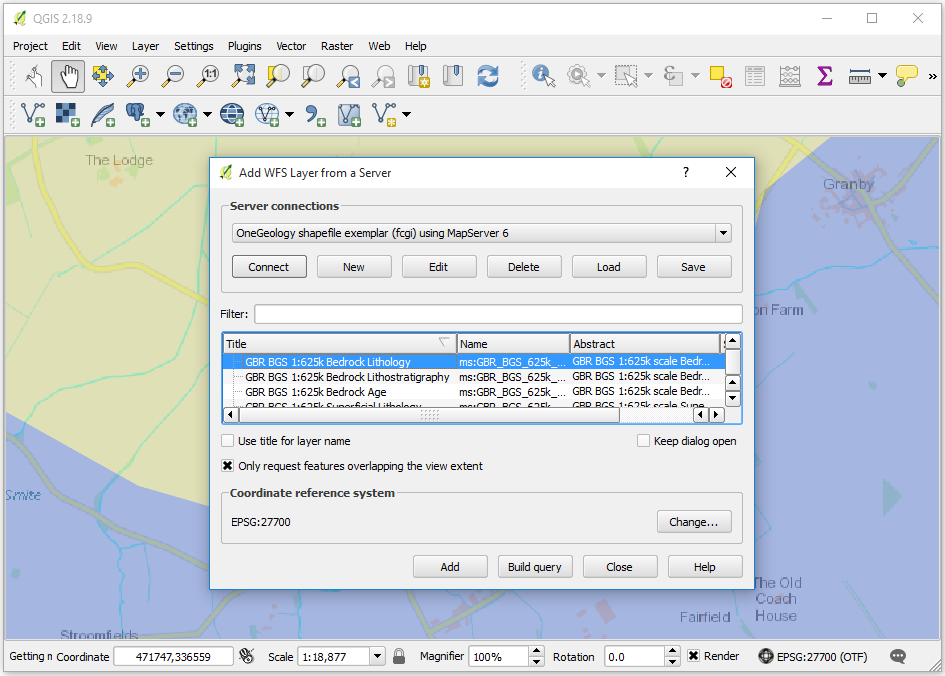

   Figure 7 - Adding a new WFS service

Below we have zoomed to the full extent of the WFS layer, therefore all features for that layer have been returned. Individual feature attributes can be inspected by using the *Identify* tool or by opening the *Attribute Table*.

.. figure:: images/qgis_WFSIdentify.PNG
   :alt: Identifying WFS features

   Figure 8 - Identifying WFS features

When we view a WFS service, it should be noted that we actually download a representation of the data itself, not an image. We can therefore save a copy of that data for re-use elsewhere. Simple right click on the layer and go to *Save As*. Exporting formats include **ESRI Shapefile** and **GeoJSON**. Exported data can be limited to selected features or to features in the current map extent.

.. figure:: images/qgis_wfsExport.PNG
   :alt: Exporting WFS layer

   Figure 9 - Exporting WFS layer

Using QGIS to view WCS
^^^^^^^^^^^^^^^^^^^^^^^

.. |wcsBtn| image:: images/qgis_btnWCS.png

Adding a WCS layer is again a similar process than adding a WMS layer:

* Add the WCS service by clicking on the |wcsBtn| button on the *Manage Layers Toolbar*
* Connect to the service
* Select the layer you want to add

.. figure:: images/qgis_addNewWCSService.png
   :alt: Creating a connection to a WCS service

   Figure 10 - Creating a connection to a WCS service

Only one layer can be selected at a time. After selecting it, and choosing your favourite format, click 'Add'. Repeat this process if you wand to add more layers and then click 'Close'.

.. figure:: images/qgis_addNewWCSService.png
   :alt: Adding a WCS layer

   Figure 11 - Adding a WCS layer

Your layer(s) should now be displaying on the map.

.. figure:: images/qgis_displayWcsLayer.png
   :alt: Displaying a WCS layer

   Figure 12 - Displaying a WCS layer

WCS layers can be exported as rasters. To do so, right click on the layer and go to *Save As*. You can choose to crop the exported raster by specifying an extent or getting the current map extent.

.. figure:: images/qgis_exportWCSLayer.png
   :alt: Exporting a WCS layer

   Figure 13 - Exporting a WCS layer

See: https://docs.qgis.org/testing/en/docs/user_manual/working_with_ogc/ogc_client_support.html

Using ESRI
------------

The ArcGIS software package comes with several applications. Here we'll briefly show how to use **ArcCatalog** to setup OGC service connections and how to use **ArcMap** to deal with OGC layers.

The following notes are based on ESRI ArcGIS server version 10.5 (SP1).

Using ArcCatalog
^^^^^^^^^^^^^^^^

WMS Service Connection
""""""""""""""""""""""

To add a WMS service to your list of available WMS services, on the *Catalog Tree* window, you use the *GIS servers > Add WMS Server* option, and then add the Service URL (without parameters). You may select to use the default service version (which would normally be the highest version) or you may force a specified version depending on your needs.

.. figure:: images/esri_catalog_addingWms.png
   :alt: Adding a WMS service to the list of available services in ArcCatalog

   Figure 1 - Adding a WMS service to the list of available services in ArcCatalog

You will be able to preview the service layers in ArcCatalog; however, if the map service is scale layered (only visible at certain scales), you won't be able to see the map until you have zoomed in to an appropriate scale. Similarly, if the layers are queryable, you will be able to use the information tool to retrieve feature information.

You will not be able to view the legend graphics in ArcCatalog.

.. figure:: images/esri_catalog_reviewingWms.png
   :alt: Reviewing available WMS services in ArcCatalog

   Figure 2 - Reviewing available WMS services in ArcCatalog

The above screen-shot shows a number of WMS (GIS Servers) listed in the left hand menu. These are services that have previously been added to ArcCatalog. To retrieve layer name information, preview, and do GetFeatureInfo requests, you must first double-click on the layer name. This will re-query the service and retrieve only active layers at the time of your query.

WFS Service Connection
""""""""""""""""""""""

This functionality is only available with a `Data Interoperability <http://desktop.arcgis.com/en/arcmap/latest/extensions/data-interoperability/what-is-the-data-interoperability-extension-.htm>`_ license. A free alternative to get hold of the data in the WFS would be downloading the features in the WFS using QGIS and then exporting them as an ESRI Shapefile (see section *Using QGIS to view WFS*).

If you do have a Data Interoperability license, on the *Catalog Tree* window go to *Interoperability Connections > Add Interoperability Connection* to open the *Interoperability Connection* dialog. In the dialog, select WFS as format and enter the WFS url in the *Dataset* option.

.. figure:: images/esri_catalog_connectingWfs.png
   :alt: Connecting to a WFS service in ArcCatalog

   Figure 3 - Connecting to a WFS service in ArcCatalog

Before clicking *OK*, go to *Parameters* and select the *Feature Types* to download. *Feature Types* aren't selected by default, so you'll need to do this step if you want to see any layer in your WFS connection. The *WFS Parameters* dialog also allows you to set many other options, as shown in the picture below. Once you're happy with your settings click *OK* to close this dialog and *OK* again to create the WFS connection.

.. figure:: images/esri_catalog_parametersWfs.png
   :alt: WFS Parameters dialog

   Figure 4 - WFS Parameters dialog

When you create a connection, you might see that multiple versions of your layer have been created in different geometries. Refresh your connection (right click on layer and go to *Refresh*) and only the relevant geometry will be kept.

.. figure:: images/esri_catalog_allGeometriesWfs.png
   :alt: WFS connection showing all available geometries

   Figure 5 - WFS connection showing all available geometries

You can preview and identify individual features in a layer from a WFS connection by selecting the layer and going to the *Preview* tab.

.. figure:: images/esri_catalog_reviewingWfs.png
   :alt: Previewing and identifying a WFS layer

   Figure 6 - Previewing and identifying a WFS layer

WCS Service Connection
""""""""""""""""""""""

Adding a WCS service to your list of available WCS services is identical than doing it for a WMS service: on the *Catalog Tree* window go to *GIS servers > Add WMS Server* option and then add the Service URL (without parameters). You may select to use the default service version (which would normally be the highest version) or you may force a specified version depending on your needs.

.. figure:: images/esri_catalog_addingWcs.png
   :alt: Adding a WCS service to the list of available services in ArcCatalog

   Figure 7 - Adding a WCS service to the list of available services in ArcCatalog

Your WCS will now be available within the list of GIS Servers.

.. figure:: images/esri_catalog_reviewingWcs.png
   :alt: Previewing WCS layers in ArcCatalog

   Figure 7 - Previewing WCS layers in ArcCatalog

Using ArcMap
^^^^^^^^^^^^

.. |addDataBtn| image:: images/esri_map_addDataBtn.PNG

.. |addCatalogBtn| image:: images/esri_map_catalogBtn.PNG

In ArcMap you can use the *Add Data* button (|addDataBtn|) to add an WMS, WFS or WCS layer or simply drag-and-drop a layer from the *Catalog* window. This window is the equivalent to the *Catalog Tree* window in ArcCatalog and can be enabled by pressing |addCatalogBtn|. OGC service connections are usually created in ArcCatalog before the data is used in ArcMap; however, the connections can also be set at the time of adding the data.

.. figure:: images/esri_map_addingData.PNG
   :alt: Adding data to ArcMap

   Figure 8 - Adding data to ArcMap

WMS Layers
"""""""""""

WMS layers in ArcMap behave differently than other ESRI native layers. For instance, they are arranged in hierarchical entries which can't be rearranged. This tipically includes

::

	- Service name
	    - Group layer
	        - Actual layers

However there can be multiple or even nested group layers. Also, the only way to get information about feature attributes in a WMS layer is through the *Identify* tool, as shown in the previous section.

If the map is scale layered (layers are shown greyed out) you may use the *Zoom to Make Visible* option. This zooms into the layer to the scale cited in the layer below which the layer will be visible, that is you need to zoom in a little bit further using the zoom tool to be able to view the map.

If you are going to provide scale layered data, it is suggested that you also provide an outline coverage map viewable at all scales to allow users to pan around the area of interest, without needing to zoom in first.

.. figure:: images/esri_map_zoomVisibleWms.PNG
   :alt: Accessing the Zoom to make visible tool in ArcMap for scale layered data

   Figure 9 - Accessing the *Zoom to make visible* tool in ArcMap for scale layered data

There are two ways you can view the legend for any layer. First off you can use the ‘Add WMS legend to map’ option, which will overlay a large copy of the legend on top of your map window. You will probably need to move or resize this legend graphic in order to see your map.

.. figure:: images/esri_map_addLegendWms.PNG
   :alt: Adding a WMS legend to a map in ArcMap

   Figure 10 - Adding a WMS legend to a map in ArcMap

The legend will scale to the initial scale of your map and will not redraw (rescale) if you change the scale of your map view.

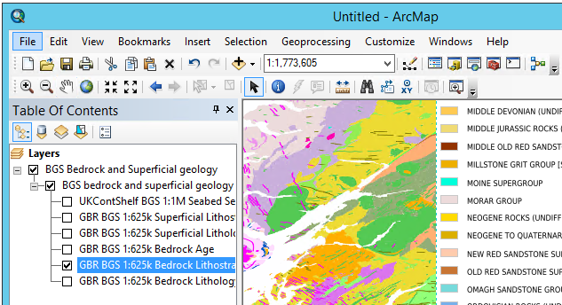

   Figure 11 - WMS legend displayed on the map layer in ArcMap

Alternatively, you may use the layer properties dialogue to save a copy of the legend. To do so use the *Legend URL* or right click on the legend image and go to *Save As*. If your layer presents multiple styles, they will be available in the drop down menu of this dialog.

.. figure:: images/esri_map_lgndSaveWms.PNG
   :alt: Saving a WMS legend graphic to file in ArcM

   Figure 12 - Saving a WMS legend graphic to file in ArcMap

For more information about WMS layers go to `Using WMS service layers <http://desktop.arcgis.com/en/arcmap/latest/map/web-maps-and-services/using-wms-service-layers.htm>`_

WFS Layers
"""""""""""

WFS layers behave in ArcMap like any other type of vector layer. You can, for instance, identify individual features, see feature attributes in the *Attribute Table*, join the layer to other dataset or apply symbology.

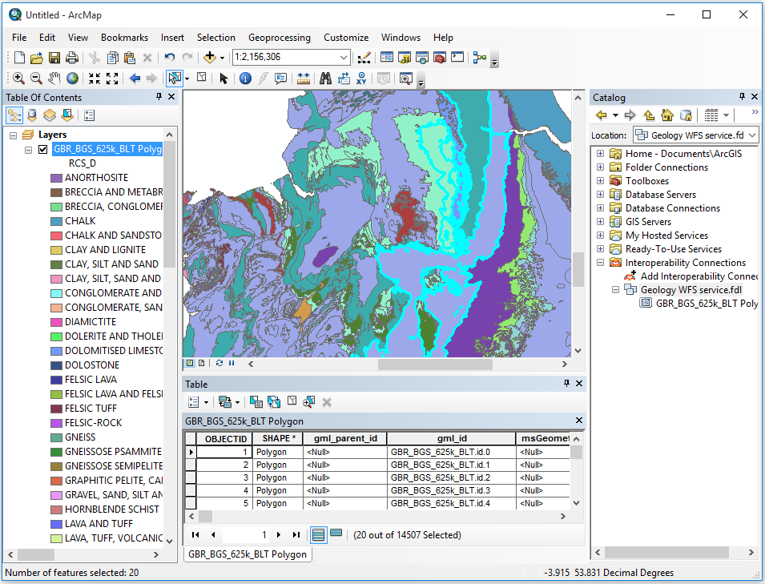

   Figure 13 - WFS layer displayed in ArcMap showing attributres and custom symbology

To export features from a WFS layer to ESRI proprietary formats, such as a **Shapefile**, right click on the layer and go to *Data > Export Data*. Note that you can export subsets of the layer by choosing only selected features or features within the view extent.

.. figure:: images/esri_map_exportProprietaryWfs.PNG
   :alt: Exporting a WFS layer to a proprietary format in ArcMap

   Figure 14 - Exporting a WFS layer to a proprietary format in ArcMap

To export features to an open format, like **GeoJSON**, you'll need to use the *Quick Export* tool, only available with the *Data Interoperability* license. If features are selected, this tool will only export selected features. You can also return feaures from a given extent by going to the tool's environments and defining an extent in the *Processing Extent* section.

.. figure:: images/esri_map_exportOpenWfs.PNG
   :alt: Exporting a WFS layer to an open format in ArcMap

   Figure 15 - Exporting a WFS layer to an open format in ArcMap

WCS Layers
"""""""""""

WCS layers operate in a similar way to other raster data but with a few less properties. For more information on available properties go to `Adding a WCS service to ArcMap <http://desktop.arcgis.com/en/arcmap/latest/map/web-maps-and-services/adding-a-wcs-service-to-arcmap.htm>`_.

.. figure:: images/esri_map_displayWcs.PNG
   :alt: Displaying WCS data in ArcMap

   Figure 16 - Displaying WCS data in ArcMap

To export a WCS layer, right click on it and go to *Data > Export Data*. The *Export WCS Data* dialog will allow you to set the extent, format or cell size of the exported data.

.. figure:: images/esri_map_exportWcs.png
   :alt: Displaying WCS data in ArcMap

   Figure 17 - Displaying WCS data in ArcMap

See: http://desktop.arcgis.com/en/arcmap/latest/map/web-maps-and-services/about-using-ogc-service-layers.htm

Using ArcPRO
^^^^^^^^^^^^

See: https://pro.arcgis.com/en/pro-app/help/data/services/ogc-services.htm

Using uDig
-----------

- Open uDig. The software can be obtained at: http://udig.refractions.net/
- Create a new map, or open an existing map to which you would like to add the web service
- On the upper menu bar, click Layer > Add...
- In the window that appears, click Web Map Server or Web Feature Server, as appropriate; click Next
- Paste the service endpoint in the URL field; click Next
- In the Resource Selection window that appears, select all layers you wish to add. When you are done, click Finish

Using Gaia
----------

Gaia: http://www.thecarbonproject.com/gaia.php

Gaia is a free desktop client provided by &#8216;The Carbon Project&#8217;; based on CarbonTools PRO; open-geospatial development tool-kit, and can access an array of geospatial sources such as the Open Geospatial Consortium (OGC) Web Mapping Service (WMS), Web Map Tile Service (WMTS), Web Coverage Service (WCS), and Web Feature Service (WFS). We note that the latest version is now 3.4.1 which adds support for WFS-T; but everything in relation to WMS mentioned below still stands.

Gaia 3.4 fully supports all WMS 1.1.1 requests and, GetCapabilities and GetMap requests for WMS 1.3.0.  It provides partial support for version 1.3.0 GetFeatureInfo requests.

Gaia is available both for Windows and Linux (using mono); here we describe using the Windows version.

To add a WMS to Gaia, use the Tools > Add Layer menu option

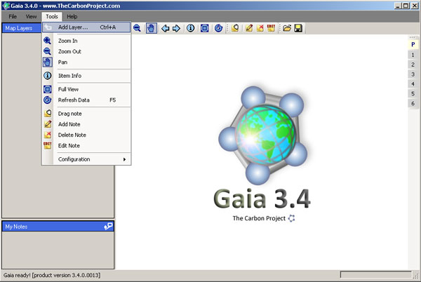

   Default view of Gaia 3.4, showing menu options to add WMS services

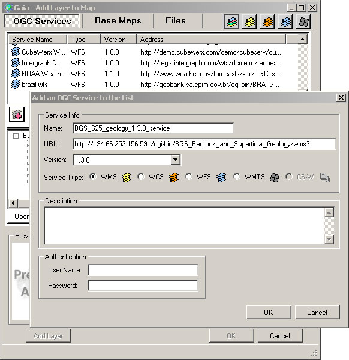

  Adding a new WMS service to the list of available services

Select the layer icon (red plus sign)

Give the service a name, and add the service URL (with or without request parameters), select the service type (wms), and version (by default Gaia selects version 1.1.1), and click OK.

This adds the service to the list of available services but doesn't add it to your map.  To add map layers from the service you need to continue.

The service layers will now be shown in the middle window, and if the service is not scale layered, a map will be shown in the preview window.  Highlighting an individual layer from the service (click on layer name) will give a preview of that layer, to help you determine whether the WMS provides the information you require.  You may further investigate the layer metadata, by clicking on the &#8216;Open Capabilities Analyzer&#8217; button.  When you are happy you have the correct map layer, click the 'Add Layer'; button.

.. figure:: images/gaia3.jpg
  :alt: Using the Capabilities Analyzer to review WMS metadata for a map layer

  Using the Capabilities Analyzer to review WMS metadata for a map layer

Note, you can force a change in the default behaviour of the service using the Parameters form options, for example, here we are requesting the map to be served as a 24-bit png.

Like the OneGeology Portal, Gaia supports all standard GIS tools (Zoom in, Zoom out, Pan, Move back and forward through previous map extents, Retrieve Feature Information).

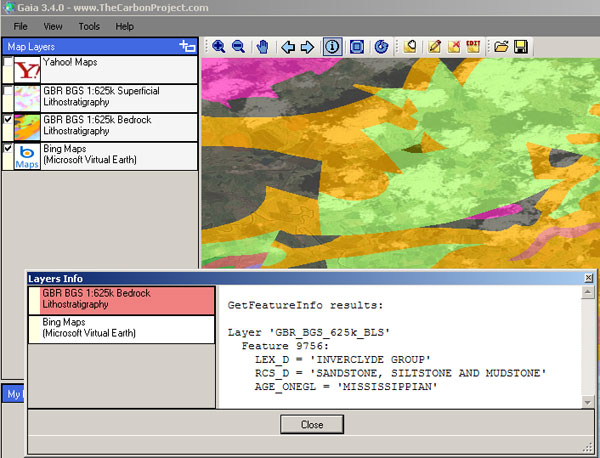

  GetFeatureInfo request response in Gaia

Double-clicking on the layer in the left hand menu, will bring up the map layer properties window, which allows you to change the layer opacity (transparency), and other parameters as required.  It will also reveal the GetMap request (query) that is being used to display that map layer, at that time.  You may copy and paste that request into any browser to show that map layer.

A GetMap request for a portion of the BGS bedrock lithostratigraphical data map layer. You can cut and paste this URL into any web browser and get a png format map image.

http://ogc.bgs.ac.uk/cgi-bin/BGS_Bedrock_and_Superficial_Geology/ows?REQUEST=GetMap&amp;SERVICE=WMS&amp;VERSION=1.3.0&amp;LAYERS=GBR_BGS_625k_BLS&amp;STYLES=default&amp;FORMAT=image/png;%20mode=24bit&amp;BGCOLOR=0xFFFFFF&amp;TRANSPARENT=TRUE&amp;CRS=EPSG:4326&amp;BBOX=54.0957778123079,-3.54949452254466,54.9267913615873,-2.51587849637481&amp;WIDTH=602&amp;HEIGHT=484&amp

The above parameters are specific to the version of the WMS (in this example &#8216;VERSION=1.3.0&#8217;), changing the version number alone, to review how the data might display for that version, will result in an error.

Note, if you are using Gaia at work (behind a corporate firewall) or otherwise need to go through a proxy to access the web, AND don&#8217;t get any map service showing, you should check that Gaia has picked up your proxy settings; see Tools > Configuration > Proxy Settings.

Using NASA World Wind
----------------------------

World Wind: http://worldwindcentral.com/wiki/Main_Page

NASA World Wind is a free client for viewing data produced by NASA.  It has two versions; a Java based version aimed at software developers for incorporating into their own software (for example Dapple) and a .NET version aimed at standard users.

Here we show you how you can use the .NET version to add and view any WMS service.

Note the .NET version of World Wind is quite picky about the graphics driver you have installed and may crash if your card is not supported, check the World Wind wiki page (above) for a list of supported graphics cards.

To add a WMS to use: Tools > Import WMS url to layer

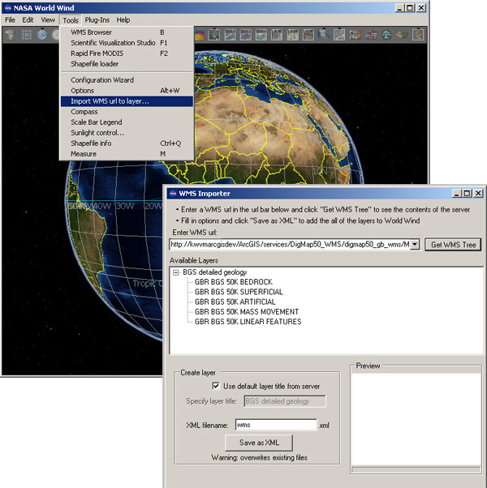

  Adding a WMS service to  the list of available WMS services in the .NET version  of NASA World Wind

In the WMS Importer pop-up add the service URL into the text box and click the &#8216;Get WMS Tree&#8217; button.  You should give the output a unique name (by default it will be called wms.xml) and then click the &#8216;Save as XML&#8217; button.

As with other software, this doesn&#8217;t display the WMS layer, but just adds it to the list of available layers, which are accessible through the Layer Manager.  You must select the layers in Layer Manager and then zoom to your area of interest.

  Adding available layers to the globe in .NET NASA World Wind

Using Dapple
-------------

Dapple: http://dapple.geosoft.com/

The latest release of Dapple (v.2.1.4) supports WMS version 1.3.0.  You must use this version (or higher when they become available) if you want to view any WMS service that supports version 1.3.0. because of a bug in earlier releases.

Note, Dapple doesn't yet support GetFeatureInfo request, so you will not be able to get any information about a map at a location, by clicking on that map.

Dapple is a data explorer designed to provide an open and optimal environment for visualizing, presenting, and sharing massive quantities of geoscientific data on desktop computers.  Dapple lets you browse, discover, and display graphically rich data from global and corporate spatial servers. The Dapple project is an open-source activity sponsored by Geosoft and derived from the NASA World Wind (http://worldwind.arc.nasa.gov/) open source project.

As with other GIS software, the first step to viewing a WMS map layer in Dapple is to add the WMS service to the list of available WMS services.  To do this, select the "Servers" menu option and then "Add WMS server"

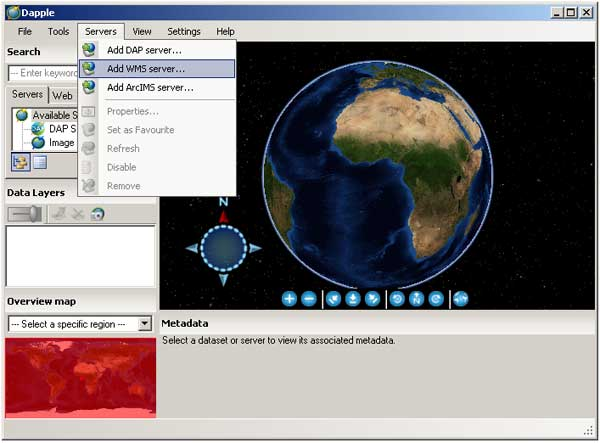

  Adding a WMS server to the list of available WMS services in Dapple

In the pop-up window, add the GetCapabilities URL of the service without any parameters; you can supply the "service = WMS" and "request=GetCapabilitie" parameters if you want, but if you supply the version parameter it will be ignored.

For example:

http://ogc.bgs.ac.uk/cgi-bin/BGS_Bedrock_and_Superficial_Geology/wms

The intention is to always use the highest WMS version supported by the service, but the downside is that you will not be able to use Dapple to test all your service outputs.

Dapple will add the service to the list of WMS servers and initially show just this new service and the data layers it can serve. If you left click on any of the layers in the Servers window, you will see the metadata associated with that layer in the Metadata window (beneath the map window).

There are several ways you can add a map layer to your map view: you can use the Tools menu option, you can left click-down and drag to the Data Layers window, or you can right-click on a highlighted layer and add the layer.  In each case the result is the same the layer is added to the data layers view window, and the map is drawn.  Remember, if you drag the layer, you will need to add it to the top of the list, or you might not see it.

.. figure:: images/dapple2.jpg
  :alt: Viewing map and metadata in Dapple

  Viewing map and metadata in Dapple

To view the legend of the active map layer you may click the link in the Metadata section, or you may right-click on any layer, either in the Servers view window or the Data Layers view window, and the legend will open either in browser window, or another application that is enabled to view the legend image type from a web location.

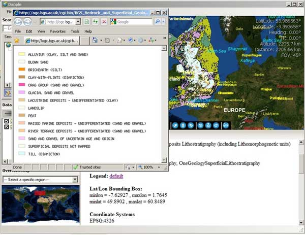

  Using the metadata legend link to view the legend information

Using Google Earth
-------------------

Google Earth: http://earth.google.co.uk/

Requires a PC with minimum 256MB memory and 3D-capable graphics card with 16MB of VRAM.

A simple way of viewing data in Google Earth is to use a KML file exported from the OneGeology Portal. You may also add a WMS directly, using the Add menu option and then ‘Image Overlay’.

.. figure:: images/googleEarth1.jpg
  :alt: Using the image overlay option in Google Earth to add a WMS

  Using the image overlay option in Google Earth to add a WMS

Give your service a name then select the ‘Refresh’ tab, and click on the ‘WMS parameters button. In the dialogue box, add the Service URL without parameters.

For example:

http://maps.bgs.ac.uk/ArcGIS/services/BGS_Detailed_Geology/MapServer/WMSServer?

Then use the Add button to add one or more of the service layers to your image overlay (each map layer added to your image overlay will be available to be selected/turned on or off later).

The URL field is populated automatically (but note that it doesn’t add the ‘styles’ parameter, and this may cause the map layer to not display correctly (See `Google Earth Issues_`)

.. figure:: images/googleEarth2.jpg
  :alt: Selecting WMS layers in Google Earth

  Selecting WMS layers in Google Earth

When you zoom into your area of interest Google Earth will tile your map.

.. figure:: images/googleEarth3.jpg
  :alt: WMS tiling in Google Earth

  WMS tiling in Google Earth

Google Earth Issues
^^^^^^^^^^^^^^^^^^^^

Problems displaying the map layer
""""""""""""""""""""""""""""""""""

When adding a WMS layer to Google Earth, you may get a Big Red Cross instead of the map layer you were expecting. This indicates there is an error with that layer. The error may lie either with the GetMap parameters sent by Google Earth to the WMS server, or in the WMS response.

When adding any WMS using the method described above, we have noted that the parameters that Google Earth automatically populates into its form (the Edit Image Overlay Link) are missing the required ‘styles’ parameter. MapServer WMS services do not seem to be affected by this omission, that is, they will serve a map using the default style, but we have noticed that ArcGIS WMS services cannot handle this error, and you will need to add the correct style value to your link. You may look at the GetCapabilities response to get the style or styles you want to be used, or you should just be able to specify a null value, and get the default style.

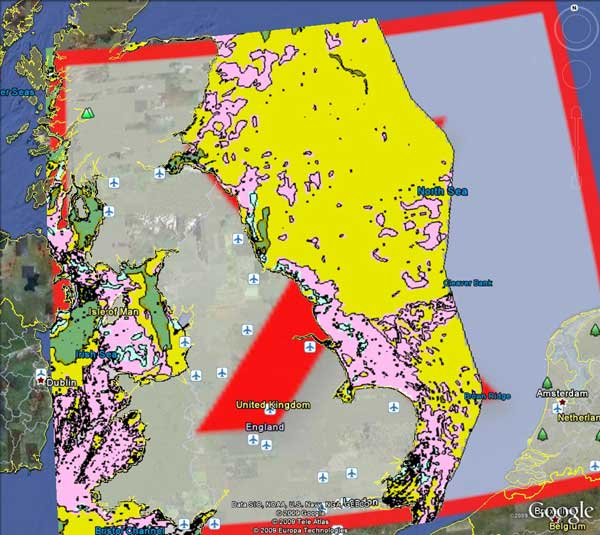

  Red cross showing a layer error in Google Earth

For example to view the BGS 50k Geology layer in Google Earth you need to use this link:

http://maps.bgs.ac.uk/ArcGIS/services/BGS_Detailed_Geology/MapServer/WMSServer?VERSION=1.1.1&REQUEST=GetMap&SRS=EPSG:4326&WIDTH=512&HEIGHT=512&LAYERS=1&TRANSPARENT=TRUE&FORMAT=image/gif&styles=

Problems displaying a map layer that spans the globe
"""""""""""""""""""""""""""""""""""""""""""""""""""""
Google Earth has a problem showing the full contents of a map layer that spans the whole globe. Specifically Google Earth seems to be unable to show coverage from such data layers at the poles and around the antimeridian (the 180th degree meridian). For example we are unable to get a map to display the whole of Russia.

The problem is illustrated below using the WORLD CGMW 1:25M Geologic Units layer. (http://mapsone.brgm.fr/1GmapserverFR/wms?map=/applications/mapserver/map%20files/Lithology_FR.map&REQUEST=GetMap&SERVICE=WMS&VERSION=1.1.1&LAYERS=WORLD_CGMW_25M_GeologicUnits&STYLES=default&FORMAT=image/png&BGCOLOR=0xFFFFFF&TRANSPARENT=TRUE&SRS=EPSG:4326&BBOX=-180,-137.242524916944,180,137.242524916944&WIDTH=602&HEIGHT=459)

There is currently no fix for this issue.

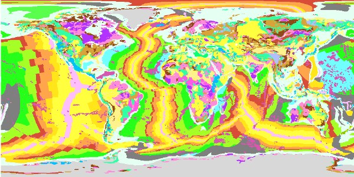

  GetMap response to the OneGeology WORLD CGMW 1:25M Geologic Units map layer showing a web map service with whole globe coverage

.. figure:: images/GE-hole-500.jpg
  :alt: The same OneGeology WORLD CGMW 1:25M Geologic Units map layer in Google Earth showing the display problem at the poles and the antimeridian

  The same OneGeology WORLD CGMW 1:25M Geologic Units map layer in Google Earth showing the display problem at the poles and the antimeridian

Using MapInfo Professional
--------------------------

MapInfo Professional allows you to view (GetMap) and query (GetFeatureInfo) a WMS service.  It currently doesn't support the display of legends (GetLegendGraphic)

To add a WMS service to the list of available WMS services
^^^^^^^^^^^^^^^^^^^^^^^^^^^^^^^^^^^^^^^^^^^^^^^^^^^^^^^^^^^

1. Select the File > Open Web Service > Open WMS menu option

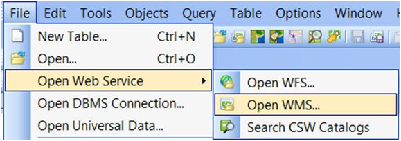

  Opening a Web Service in MapInfo Professional 11.5

2. In the Open WMS Table dialog, select the Servers button at the top right

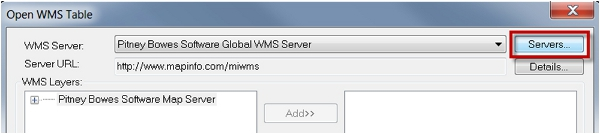

  Displaying existing WMS services

3. In the following WMS Servers List dialog, select the Add button at the top right of the dialog.

4. From within the OneGeology Portal, copy the desired layers Service URL:

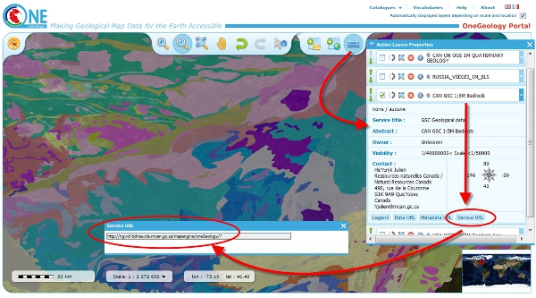

  Getting the service URL from the OneGeology Portal

5. Paste this Service URL into the Server URL field of the WMS Server Information dialog. The adjacent Test URL button can be used to validate this URL:

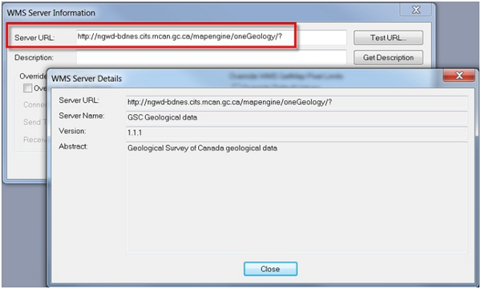

  Verifying a new WMS service

6. Press the Get Description button to auto-populate the Description from the server, or enter a name manually, then press OK.

.. figure:: images/MIPgetDescR.jpg
  :alt: Adding a new WMS service

  Adding a new WMS service

7. The WMS server will now appear in the Servers List. Press OK to return to the Open WMS Table dialog.

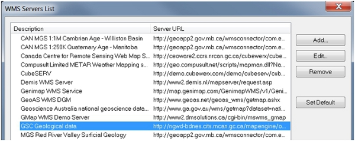

  Selecting an existing WMS service

To view WMS service layers
^^^^^^^^^^^^^^^^^^^^^^^^^^^

- Select the File > Open Web Service > Open WMS menu option.
- In the Open WMS Table dialog:
  - Ensure the desired WMS Server is selected from the drop down list</li>
  - Move the required WMS layers to the right selection window</li>
  - Choose an output name and directory for the resulting MapInfo Professional TAB file</li>
- Press OK; the data will now be opened in MapInfo Professional</li>

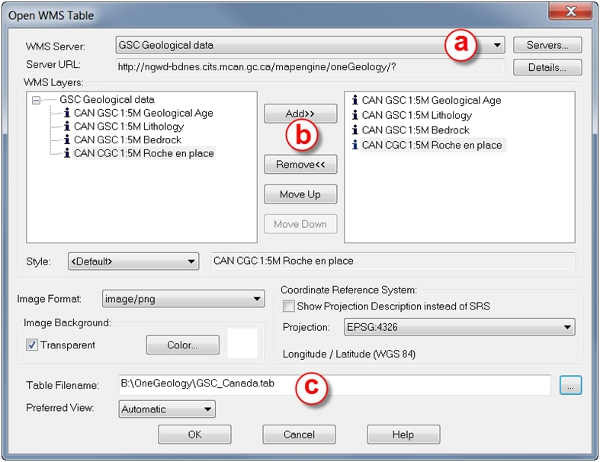

  Selecting WMS layers

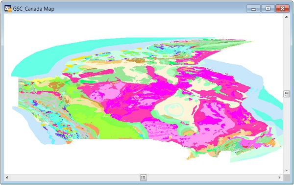

  Viewing the WMS data

To query WMS service layer
^^^^^^^^^^^^^^^^^^^^^^^^^^^

After making a WMS layer selectable (as for example "CAN CGC 1:5M Roche en place" in the above figure), the Info tool can be used. Information will be returned only from layers that are queryable. Layer that are queryable are identified by an Information icon ("i")
