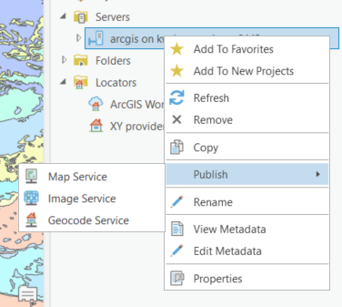
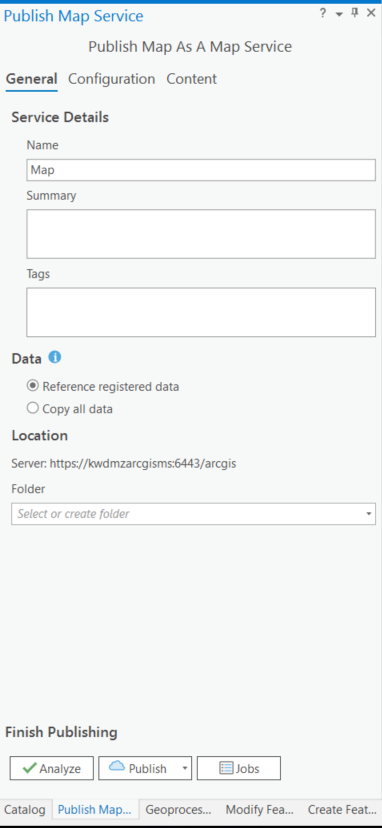
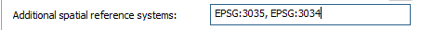
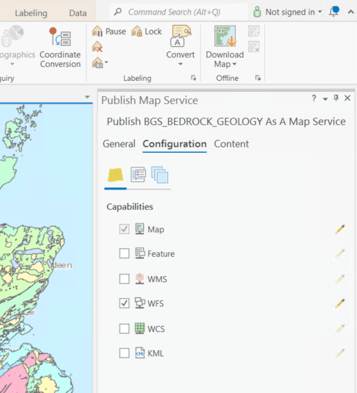
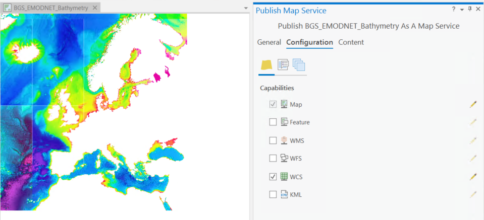
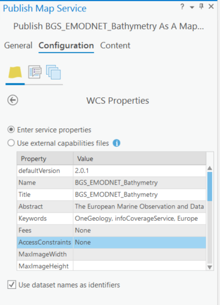
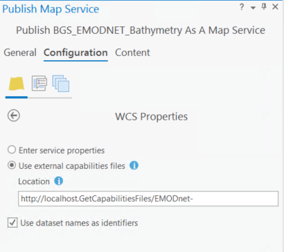

Using ArcGIS Pro
================

.. todo::

   * SLD Enabled WMS
   * Complex Feature WFS

The following notes are based on using ESRI ArcGIS Pro version 2.8.0 and ESRI ArcGIS server version 10.9.1.

WMS
---

Creating the service
^^^^^^^^^^^^^^^^^^^^

Prepare the map document
""""""""""""""""""""""""

Initial set up of WMS services is relatively straightforward and simply requires the creation of a map document in ArcGIS Pro (.aprx ) containing the data you want to add to the service.
It is important to pay attention to the layer names in the map document, since the individual service layer names will use the map document layer names. The service will also use the map document layer names for the respective layer titles in the GetCapabilities document.

.. figure:: images/esri/arcpro01.png
   :alt: Using ArcGIS Pro layer names in the service

   Figure 1 - Using ArcGIS Pro layer names in the service

Eg. an unmodified GetCapabilities (version 1.3.0) response for the above example would look like:

.. code-block:: xml

   <Layer>
   <Title>BGS_BEDROCK_GEOLOGY</Title>
   <CRS>CRS:84</CRS>
   <CRS>EPSG:4326</CRS>
   ...
   <Layer queryable="1">
      <Name>GBR_BGS_625k_TYPE</Name>
      <Title>GBR_BGS_625k_TYPE</Title>
      <Abstract></Abstract>
      <CRS>CRS:84</CRS>
      <CRS>EPSG:4326</CRS>
     ...
      
   </Layer>
   <Layer queryable="1">
      <Name>GBR_BGS_625k_PERIOD</Name>
      <Title>GBR_BGS_625k_PERIOD</Title>
      <Abstract></Abstract>
   ...

Publishing your WMS
"""""""""""""""""""

If you have not already established a connection to your ArcGIS server instance, add a new server connection.

* Go to *Insert> Connections > Add ArcGIS Server Connection*

.. figure:: images/esri/arcpro02.png
   :alt: Using ArcGIS Pro layer names in the service

   Figure 2 - Establishing an ArcGIS Server connection

Once you are happy with the layer names, the easiest way to publish your WMS is doing it directly from the Catalog pane:

* Right click the established server connection in the Catalog pane; go to *Publish > Map Service* 

   Figure 3 - Publish a Service via the ArcGIS Server connection

* A dialog will open letting you select the relevant *Project Map* 

* Select the Map that contains the layers you would like to serve (if there are more than one in your project)

* The *Publish a Service* dialog will open.
 

.. figure:: images/esri/arcpro05.png
   :alt: Select the Map containing the layers you would like to publish

   Figure 4 - Select the Map containing the layers you would like to publish

The service configurations are similar to the one you may know from ArcMap Desktop.

* On the Publish a Service dialog, choose a name for your map service. The name you enter will be part of the WMS url, so you must ensure that meets the OneGeology profile naming conventions.

   Figure 5 - Publish Map Service Dialog

* Select whether to *Use existing folder* or *Create new folder*. The folder name will also appear as part of the WMS url.
* Go to *Configuration* and select WMS. If you wish, you can unselect all other  configurations apart from Map.

.. figure:: images/esri/arcpro07.png
   :alt: Publish Map Service - Configuration

   Figure 6 - Publish Map Service  - Configuration

.. note::
    If you **do not** want to expose the data behind your WMS service, make sure that the **WFS** option is **unselected**.

.. figure:: images/esri/arcpro08.png
   :alt: Adding a new WMS service in ArcGIS

   Figure 7 - Adding a new WMS service in ArcGIS

* Edit the *WMS Properties*, specify the Operations that are allowed to be performed by the user.

* You will be presented with a form to edit your service level metadata (as below) or you may opt to use external capabilities. We suggest at this stage that you should use the form to fill in as much detail as possible, though you should note that you will eventually need to use external files to enter any layer level metadata and add missing service level metadata parameters; we can use the data you enter initially as the basis for these external static files.

* You will need to update the service with a link to the external Capabilities file in ArcGIS Server Manager once the service has been successfully published

* You also need to tick the *Use layer names from the map document* option; otherwise, the layer names will be given numbers instead. Again, you will need to ensure that the ArcGIS Pro layer names follow the naming guidelines.

* ArcGIS Server creates only one style named *default* for every layer, but allows you to do include additional styles for each layer using a SLD file. The default style matches the symbology set in the map document.

* Once you finish configuring your WMS, first click *Analyse* to identify any possible errors prior to publishing.

* If no errors are returned click *Publish* at the bottom of the Service Editor dialog to create your service.

Your new service will have a URL like below, with the folder name part being optional:

::

   https://[hostname]/ArcGIS/services/[folder name]/[map service title]/MapServer/WMSServer

Edit the GetCapabilities documents
^^^^^^^^^^^^^^^^^^^^^^^^^^^^^^^^^^

ArcGIS Server doesn’t create any static GetCapabilities XML documents, but does allow you to use external files. You will need to use such external files if you want to add any additional spatial reference systems, correct the keywords listing, change the LegendURL images, add better abstracts and layer titles, or add an INSPIRE extended capabilities section. We think to provide a fully compliant WMS it is highly likely that you will need to use a set of static files.

The first step to editing your files is to create them.

The quickest way to do this is to use the response documents from your initial service. You will need to have a file for all the WMS versions that you want your service to support. We require at least a version 1.3.0 document but you could also have a 1.1.1 response.

Your WMS version 1.1.1 GetCapabilities document is generated using a request like:

::

   https://[hostname]/ArcGIS/services/[folder name]/[map service title]/MapServer/WMSServer?service=WMS&request=GetCapabilities&version=1.1.1&

**Save this as [short service name]111.xml**

Your WMS version 1.3.0 GetCapabilities document is generated using a request like:

::

   https://[hostname]/ArcGIS/services/[folder name]/[map service title]/MapServer/WMSServer?service=WMS&request=GetCapabilities&version=1.3.0&

**Save this as [short service name]130.xml**

It doesn’t really matter what name you give these files, as long as you use the same name prefix for all files that belong to the same service.

You need to put these files on the server (or at a location available to your server), and make them browsable. These files only need to be browsable internally by the ArcGIS server.

Now go back to your map service and edit it using either `ArcGIS Server Manager <http://server.arcgis.com/en/server/latest/publish-services/windows/editing-service-properties-in-manager.htm>`_ or `ArcGIS Pro <https://pro.arcgis.com/en/pro-app/latest/help/sharing/overview/overwrite-a-map-service.htm>`_.

.. figure:: images/esri/arcpro09.PNG
   :alt: Setting up external capabilities files

   Figure 8 - Setting up external capabilities files

Select *WMS*, then select the *Use External capabilities files* option and in the *Specify the location and prefix* dialog add the web address to the folder containing the capabilities response documents plus your *[short service name]* prefix.

For example, for a service called BGS_BEDROCK_GEOLOGY, we may save our initial GetCapabilities response documents using a prefix “BEDROCK-“, giving us a file called BEDROCK-130.xml for our version 1.3.0 GetCapabilities response document, BEDROCK-111.xml for our version 1.1.1 GetCapabilities response document. We might then save these to a location on our web server such as *C:\\Inetpub\\wwwroot\\GetCapabilitiesFiles\\,* which would be browsable locally as *http://localhost/GetCapabilitiesFiles/*.  When we select the “Use External capabilities files” option, we then provide the web address and **prefix** as *http://localhost/GetCapabilitiesFiles/BEDROCK-*

Having created your files, you may then edit them as required. We would recommend you make a second copy of the files in case you make an error whilst editing.

INSPIRE
^^^^^^^

If you want your OneGeology service to comply to INSPIRE metadata standards, in addition to meet the requirements of the OneGeology profile, you need to ensure that the following conditions are fulfilled:

1. Layer name and layer title must follow INSPIRE naming conventions. For example the `D2.8.II.4 Data Specification on Geology–Technical Guidelines <http://inspire.ec.europa.eu/documents/Data_Specifications/INSPIRE_DataSpecification_GE_v3.0.pdf>`_ tell us (section 11.1 ~ Layers to be provided by INSPIRE view services) that any layer to do with lithology or age must have the name *GE.GeologicUnit* and title *Geologic Units*. See the `layer-naming <https://themes.jrc.ec.europa.eu/discussion/view/13952/layer-naming>`_ discussion on the INSPIRE Thematic Clusters Geology forum for fuller details.

2. Layers must support at least one of the INSPIRE coordinate systems. See `D2.8.I.1 INSPIRE Specification on Coordinate Reference Systems - Guidelines <http://inspire.ec.europa.eu/documents/Data_Specifications/INSPIRE_Specification_CRS_v3.0.pdf>`_.

3. Your GetCapabilities document must include the INSPIRE Extended Capabilities tag.

There are two ways of achieving these conditions using ESRI software. The first one is using a standard ArcGIS map document and standard ArcGIS Server tools, where you’ll need to modify layer names to make them compliant, change service properties to include required coordinate systems and modify the capabilities document to include the INSPIRE Extended Capabilities section. The second option is using the ArcGIS for INSPIRE extension, which provides tools and new services to ensure compliance with INSPIRE directives. If you want to go for the second option, there is an `ESRI OneGeology Grant  <https://onegeology.org/technical_progress/esriGrantOffer.html>`_ for OneGeology members.

ArcGIS Server
"""""""""""""

INSPIRE Layer Names
'''''''''''''''''''

In order to make your service INSPIRE compliant, you will need to configure the name of your layers (e.g. GE.GeologicUnit); however, this clashes with OneGeology naming standards. In this situation, it is desirable to create a group layer. For example, you may want to create a layer called GE.GeologicUnit to group all of your layers that are spatial objects of type GeologicUnit. The layer name and title rules set out in the OneGeology profile relate to the grouped (or child) layers, whereas the INSPIRE name and title relate to the group (or parent) layer.

If your INSPIRE service is only serving layers of one type, one way of applying group layering would be to use the root layer name and title (not service name and title) as the grouping layer. If, on the other hand, your INSPIRE service is serving layers of several types (e.g. GE.GeologicUnit and GE.GeologicFault), we believe the only option is for you to configure actual group layering.

To **add group layers to a new service** simply `add a group layer <https://pro.arcgis.com/en/pro-app/2.8/help/mapping/layer-properties/work-with-group-layers.htm>`_ to the map document that will create your service, rename it and place your layers inside. The WMS service published form this map document will keep the same group layer structure.

.. figure:: images/esri/arcpro10.png
   :alt: Adding group layers to the service

   Figure 9 - Adding group layers to the service

If you want **add group layers to an existing service**, open the map document that created the service, modify it as described above and publish it again as a WMS service; however, when publishing the service, make sure that you select the option “Overwrite an existing service”. This will save you having to delete the original service as well as having to type again all service properties.

Note that ArcGIS Server will generate only the *<Title>* tag of group layers in the GetCapabilities document. The content of this tag will be the same that you wrote in the map document. In order to comply with INSPIRE layer naming regulations for group layers, you will need to manually add the *<Name>* tag, filling it in with the adequate group layer name, by editing the GetCapabilities document using an external capabilities file.

Group layers created in ArcGIS Server will not have a style associated to them and the group layer itself will not display a map.

INSPIRE Coordinate Systems
''''''''''''''''''''''''''

ArcGIS Server always adds two coordinate systems: EPSG:4326 (or CRS:84 for version 1.3.0) and the coordinate system set on the map document creating the service. To add any additional coordinate systems go to your map service and edit it using either `ArcGIS Server Manager <http://server.arcgis.com/en/server/latest/publish-services/windows/editing-service-properties-in-manager.htm>`_ or `ArcGIS Pro <https://pro.arcgis.com/en/pro-app/latest/help/sharing/overview/overwrite-a-map-service.htm>`_.  On the *Publish a Service*  dialog go to *Capabilities > WMS* and, in the *Additional spatial reference systems* text box, type any well-known EPSG ID in the format indicated below.

   Figure 10 - Additional spatial reference systems option

INSPIRE extended capabilities
'''''''''''''''''''''''''''''

The extended capabilites section is inserted into your external GetCapabilities section, between the Exception element block and the first Layer element.

For example to add a scenario 1 INSPIRE extended capabilities section (where you have an external XML document or service that provides such an XML document containing metadata for your WMS service) you would insert a section like below:

.. code-block:: xml

   </Exception>
   <inspire_vs:ExtendedCapabilities xmlns:inspire_vs="http://inspire.ec.europa.eu/schemas/inspire_vs/1.0">
       <inspire_common:MetadataUrl xsi:type="inspire_common:resourceLocatorType">
           <inspire_common:URL>https://metadata.bgs.ac.uk/geonetwork/srv/eng/csw?
           &amp;REQUEST=GetRecordById&amp;ID=7822e848-822d-45a5-8584-56d352fd2170&amp;elementSetName=full&amp;OutputSchema=csw:IsoRecord&amp;version=2.0.2&amp;
           </inspire_common:URL>
           <inspire_common:MediaType>application/xml</inspire_common:MediaType>
       </inspire_common:MetadataUrl>
       <inspire_common:SupportedLanguages>
           <inspire_common:DefaultLanguage>
               <inspire_common:Language>eng</inspire_common:Language>
           </inspire_common:DefaultLanguage>
       </inspire_common:SupportedLanguages>
       <inspire_common:ResponseLanguage>
           <inspire_common:Language>eng</inspire_common:Language>
       </inspire_common:ResponseLanguage>
   </inspire_vs:ExtendedCapabilities>
   <Layer>

Alternatively, to add a scenario 2 INSPIRE extended capabilities section (where you have no external metadata document for your WMS service) you would insert a section like below:

.. code-block:: xml

   </Exception>
   <inspire_vs:ExtendedCapabilities xmlns:inspire_vs="http://inspire.ec.europa.eu/schemas/inspire_vs/1.0">
       <inspire_common:ResourceLocator>
           <inspire_common:URL>https://ogc2.bgs.ac.uk/cgi-bin/BGS_OGE_Bedrock_and_Surface_Geology_in3/ows?</inspire_common:URL>
       </inspire_common:ResourceLocator>
       <inspire_common:ResourceType>service</inspire_common:ResourceType>
       <inspire_common:TemporalReference>
           <inspire_common:DateOfLastRevision>2015-10-23</inspire_common:DateOfLastRevision>
       </inspire_common:TemporalReference>
       <inspire_common:Conformity>
           <inspire_common:Specification>
               <inspire_common:Title>-</inspire_common:Title>
               <inspire_common:DateOfLastRevision>2015-10-23</inspire_common:DateOfLastRevision>
           </inspire_common:Specification>
           <inspire_common:Degree>notEvaluated</inspire_common:Degree>
       </inspire_common:Conformity>
       <inspire_common:MetadataPointOfContact>
           <inspire_common:OrganisationName>William Smith</inspire_common:OrganisationName>
           <inspire_common:EmailAddress>enqiries@bgs.ac.uk</inspire_common:EmailAddress>
       </inspire_common:MetadataPointOfContact>
       <inspire_common:MetadataDate>2015-10-23</inspire_common:MetadataDate>
       <inspire_common:SpatialDataServiceType>view</inspire_common:SpatialDataServiceType>
       <inspire_common:MandatoryKeyword xsi:type='inspire_common:classificationOfSpatialDataService'>
           <inspire_common:KeywordValue>infoMapAccessService</inspire_common:KeywordValue>
       </inspire_common:MandatoryKeyword>
       <inspire_common:SupportedLanguages>
           <inspire_common:DefaultLanguage>
               <inspire_common:Language>eng</inspire_common:Language>
           </inspire_common:DefaultLanguage>
       </inspire_common:SupportedLanguages>
       <inspire_common:ResponseLanguage>
           <inspire_common:Language>eng</inspire_common:Language>
       </inspire_common:ResponseLanguage>
   </inspire_vs:ExtendedCapabilities>
   <Layer>

In addition (for both scenarios) you will need to **reference the inspire_common schema and namespace** in your root element, so it will become something like:

.. code-block:: xml

   <WMS_Capabilities
       xmlns:inspire_common="http://inspire.ec.europa.eu/schemas/common/1.0"
       xmlns="http://www.opengis.net/wms" xmlns:xsi="http://www.w3.org/2001/XMLSchema-instance"
       xmlns:esri_wms="http://www.esri.com/wms"
       version="1.3.0"
       xsi:schemaLocation="http://www.opengis.net/wms http://schemas.opengis.net/wms/1.3.0/capabilities_1_3_0.xsd
       http://inspire.ec.europa.eu/schemas/inspire_vs/1.0 http://inspire.ec.europa.eu/schemas/inspire_vs/1.0/inspire_vs.xsd
       http://www.esri.com/wms http://../arcgis/services/.../MapServer/WmsServer?version=1.3.0%26service=WMS%26request=GetSchemaExtension">

ArcGIS server issues
^^^^^^^^^^^^^^^^^^^^

* When using the SLD parameter to get an external SLD file, ArcGIS 10.0 expects the layer name and styles parameter to be to be sent as part of a GetMap request, even though this is not required by the WMS+SLD specification. A bug has been raised with ESRI on this issue (`NIM095568 <http://support.esri.com/en/bugs/nimbus/TklNMDk1NTY4>`_) back in version 10.0, but it’s still present.

.. todo::

   SLD Enabled WMS content.

Simple Feature WFS
------------------

Creating a simple feature WFS requires almost the same steps as creating a WMS. The only difference being that, when publishing the service, you need to select the WFS capability.

   Figure 20 - Enabling WFS capabilities in *Service Editor* dialog

After activating WFS, you'll have access to the properties of this capability. Some of these properties will coincide with WMS properties, but there will also be WFS specific properties, such us namespace, prefix or maximum number of features returned.

.. figure:: images/esri/arcpro12.PNG
   :alt: WFS service properties

   Figure 21 - WFS service properties

For more information on how to create a simple feature WFS service and how to edit its GetCapabilities document, go to the WMS section of this cookbook or to ESRI's documentation about `WFS services <http://server.arcgis.com/en/server/latest/publish-services/windows/wfs-services.htm>`_.

.. todo::

   Complex Feature WFS content.

WCS
---

Create a map document
^^^^^^^^^^^^^^^^^^^^^

In ArcGIS, a WCS can be created mainly through 3 routes: a map document with raster data, a raster dataset or a mosaic dataset. Publishing a mosaic dataset requires ArcGIS Image Server, so unless you have this extension enabled, the only way to publish multiple rasters at once on a single WCS will be through a map document; therefore we’re are going to focus on this route. For more information see the documentation on `WCS services <http://server.arcgis.com/en/server/latest/publish-services/windows/wcs-services.htm>`_ or `Publishing image services from ArcGIS Pro <https://enterprise.arcgis.com/en/server/latest/publish-services/windows/publishing-image-services-from-arcgis-pro.htm>`_.

Start by creating a map document and adding your rasters to it. Note that, if you have feature data in your map document, it'll be excluded from your WCS.

.. figure:: images/esri/arcpro_WCS_01.PNG
   :alt: Adding WCS data to your map document

   Figure 22 - Adding WCS data to your map document

   Figure 23 - Publishing a WCS service

Publish the WCS service
^^^^^^^^^^^^^^^^^^^^^^^

* In the Catalog Pane go to Servers > right Click the server you would like to publish to > Publish > Map Service… *to open the Publish Service* dialog.

* On the *Publish Service* dialog, add a name, summary and tags to your map service. The name you enter will be part of the WCS url. Click *Next >.*

* Select whether to *Use existing folder* or *Create new folder*. The folder name will also appear as part of the WCS url. Click *Continue*.

* In the *Publish Service* dialog, go to *Configuration* and select *WCS* under Capabilities.

* Now go to *Capabilities > WCS* to access the WCS properties

   Figure 24 - WCS service properties

* Fill in all relevant service-level and contact properties.

* Check *Use layer names from the map document* so that layer names/identifiers use the layer names given in the map document rather than numbers.

* Click *Analyse* to idnetify any errors with the service, then click *Publish* at the bottom of the *Publish Service* dialog to create your service.

Your new service will have a URL like below, with the folder name part being optional:

::

   http://[hostname]/ArcGIS/services/[folder_name]/[map service title]/MapServer/WCSServer

Edit the GetCapabilities document
^^^^^^^^^^^^^^^^^^^^^^^^^^^^^^^^^

ArcGIS server doesn't create any static GetCapabilities xml documents, but does allow you to use external files. You will need to use such external files if you want to add any supported CRS, add keywords and abstracts for coverages or modify coverage titles. Note that, independently of the supported CRSs added, ESRI WCSs will always support the over 6000 projections that come with the ArcGIS projection engine.

The quickest way to create your custom GetCapabilities document is to use the response documents from your initial service. You will need to have a file for all the WCS versions that you want your service to support.

Your WCS version 1.1.0 GetCapabilities document is generated using a request like:

::

   http://[hostname]/argis/services/[folder name]/[map service title]/MapServer/WCSServer?service=WCS&request=GetCapabilities&version=1.1.0&

**Save this as [short service name]110.xml**

Your WCS version 2.0.1 GetCapabilities document is generated using a request like:

::

   http://[hostname]/argis/services/[folder name]/[map service title]/MapServer/WCSServer?service=WCS&request=GetCapabilities&version=2.0.1&

**Save this as [short service name]201.xml**

It doesn't really matter what name you give these files, as long as you use the same name prefix for all files that belong to the same service.

You need to put these files on the server (or at a location available to your server), and make them browsable. These files only need to be browsable internally by the ArcGIS server.

Now go back to your map service and edit it using either `ArcGIS Server Manager <http://server.arcgis.com/en/server/latest/publish-services/windows/editing-service-properties-in-manager.htm>`_ or `ArcGIS Pro <https://pro.arcgis.com/en/pro-app/latest/help/sharing/overview/overwrite-a-map-service.htm>`_.

Go to *Capabilities > WCS*, then select the “Use External capabilities files” option and in the ‘Specify the location and prefix’ dialog add the web address to the folder containing the capabilities response documents plus your [short service name] prefix.

   Figure 25 - WCS service properties: external capabilities

For example, for a service called BGS_EMODnet_Bathymetry, we may save our initial GetCapabilities response documents using a prefix “EMODnet-“, giving us a file called EMODnet-201.xml for our version 2.0.1 GetCapabilities response document, EMODnet-110.xml for our version 1.1.0 GetCapabilities response document and so on. We might then save these to a location on our web server such as *C:\\Inetpub\\wwwroot\\GetCapabilitiesFiles\\* which would be browseable locally as *http://localhost/GetCapabilitiesFiles/*.  When we select the “Use External capabilities files” option, we then provide the web address and **prefix**
as *http://localhost/GetCapabilitiesFiles/EMODnet-*

Having created your files, you may then edit them as required. We would recommend you make a second copy of the files in case you make an error whilst editing.

We have found that, if you make a GetCapabilities request using external capabilities files, it always defaults to version 1.1.0, even if you specify a different version as a url parameter. For instance, *http://[my_server]s:6080/arcgis/services/[folder_name]/BGS_EMODnet_bathymetry/MapServer/WCSServer?request=GetCapabilities&service=WCS&version=2.0.1* will return the GetCapabilities document for version 1.1.0 (if available, otherwise you will get an error), even though we’ve created the version 2.0.1 of the document. The only exception is version 1.0.0, which does return the correct version of the GetCapabilities document if specified in the url.

For more information, see `Use external capabilities files with WCS Services <http://server.arcgis.com/en/server/latest/publish-services/windows/using-external-capabilities-files-with-wcs-services.htm>`_.
