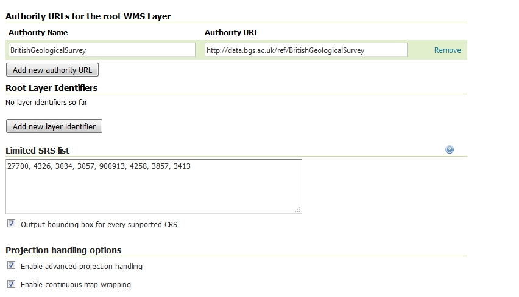
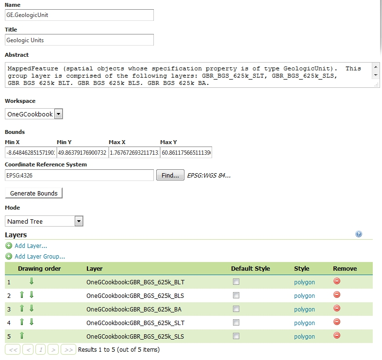

Using GeoServer
===============

GeoServer has extensive `documentation <https://docs.geoserver.org/stable/en/user/index.html>`_ which you should refer to in addition to this cookbook. References will be made to relevant parts rather than repeating too much of what is already there. There is also the `geoserver-users mailing list <https://geoserver.org/comm/>`_.

Introduction
------------

This section describes how to set up the different kinds of OneGeology compliant service described in :ref:`service_provision_service_types` using free and open source GeoServer software. GeoServer can be used to provide *all* the types of service that OneGeology service providers might need. There are also INSPIRE specific instructions on making your services INSPIRE compliant where relevant. This is entirely optional for OneGeology so you can ignore the INSPIRE sections if this is not of interest to you.

If you are going to use a PostGIS database as a data source you will also need to read :ref:`service_provision_data_preparation_postgis`.

Accompanying this guidance are some example data sets and GeoServer configuration that allow you to set up working services which you may find helpful to adapt for use with your own data.

Pre-requisites / System Requirements
^^^^^^^^^^^^^^^^^^^^^^^^^^^^^^^^^^^^

The guidance is technical and some assumptions are made about the reader's background knowledge:

* The reader is, or is working closely with, an expert in the geological data to be served.
* The reader has some familiarity with setting up web servers and preferably Java servlet containers.
* The reader is able to install software on their machine and can follow the appropriate installation instructions for GeoServer documented on the GeoServer website.

To set up production services you will need server equipment to run GeoServer. Estimating the level of hardware resources required to support a responsive service is a complex task depending on the amount of your data, its complexity and the demand that will be placed on your service by users. It is out of the scope of this document to give advice on these issues but you can find some assistance from the GeoServer web site and mailing list. To test setting up a service using the example in this guide a modern PC with Intel Core or equivalent processor and 4Gb RAM should certainly be adequate and you can probably get away with less.

The software required includes Java, a Java servlet container such as Apache Tomcat, and GeoServer itself. If you use one of the GeoServer packages that include Jetty then you won't need to install a servlet container separately. There are a lot of different versions and all these software packages are continuously updated. You may have conditions specific to your site which make particular versions preferable. For example, you may already have your data in a different database system such as Oracle Spatial rather than PostGIS. It isn't possible to cover all possible set ups here.

Further pre-requisites required only for particular service types are described under the appropriate section.

Software Installation
---------------------

The software used here all has extensive documentation and support forums and mailing lists. Here we will just point you to the appropriate places to download the software and get installation instructions.

Assumptions
^^^^^^^^^^^

You will need to have Java installed on the machine on which you are going to install GeoServer. See the `Java Considerations <http://docs.geoserver.org/stable/en/user/production/java.html#production-java>`_ section of the GeoServer manual for the current recommendations. If you want to try other versions of Java you may need to do extra work and be prepared to enter into technical discussions on the geoserver-users email list in order to get it working with these.

Ideally you will be familiar with deploying applications in a servlet container application such as `Apache Tomcat <http://tomcat.apache.org/>`_. If not, you can use one of the all-in-one installers that packages GeoServer already deployed in the `Jetty <https://www.eclipse.org/jetty/>`_ servlet container. Note that Tomcat and Jetty are the two most tested servlet containers used with GeoServer so, although you should be able to use others, there may be extra work involved and you may need to get advice from the geoserver-users email list.

Basic Installation
^^^^^^^^^^^^^^^^^^

* `Download <https://geoserver.org/release/stable>`_ and install GeoServer following whichever one of the `installation paths <https://docs.geoserver.org/stable/en/user/installation/index.html>`_ in the GeoServer manual suits your situation best. If you already have a servlet container application such as `Apache Tomcat <http://tomcat.apache.org/>`_ set up or you are familiar with how to set one up then you will probably wish to download the web archive (WAR) and deploy that in your servlet container. If you are not comfortable with configuring a servlet container then you will probably wish to use one of the installer programs.

* Run GeoServer at least once to check the installation has worked. If, for example, you are testing in a local instance of Tomcat on your own machine with default settings you should be able to visit http://localhost:8080/geoserver and click on the :guilabel:`Layer Preview` link to check that the example services shipped with GeoServer work properly. You will have to modify the preceding URL appropriately if you have deployed GeoServer on a different machine or port.

.. figure:: images/geoserver_welcome.jpeg

.. _service_provision_server_setup_geoserver_install_app_schema:

App-schema Plugin Installation
^^^^^^^^^^^^^^^^^^^^^^^^^^^^^^

You will need to install the app-schema plugin if you wish to set up a complex feature WFS or if you are setting up a simple feature WFS using one of the OneGeology recommended "Lite" schemas. If not, you can skip this step.

* `Download <httsp://geoserver.org/release/stable>`_  and install the app-schema plugin ``geoserver-*-app-schema-plugin.zip`` following the `application schema installation instructions <http://docs.geoserver.org/stable/en/user/data/app-schema/installation.html>`_. Follow the instructions at `WFS service settings <https://docs.geoserver.org/stable/en/user/data/app-schema/wfs-service-settings.html>`_.
* Check you can restart GeoServer without any errors being thrown.

INSPIRE Plugin Installation
^^^^^^^^^^^^^^^^^^^^^^^^^^^

If you are providing an INSPIRE download service you will need to provide the extra INSPIRE mandated metadata in the WFS GetCapabilities response. This is optional for OneGeology.

* `Download <http://geoserver.org/release/stable>`_ and install the INSPIRE plugin ``geoserver-*-inspire-plugin.zip`` following the `INSPIRE plugin installation instructions <https://docs.geoserver.org/stable/en/user/extensions/inspire/index.html>`_.

Database
^^^^^^^^

If you already have your data in a relational database system you will want to check the `Working with Databases <https://docs.geoserver.org/stable/en/user/data/database/index.html>`_ section of the GeoServer manual to see if your database is supported by GeoServer and follow the instructions for installation of any extensions that may be needed for this support. PostGIS support is built into the core GeoServer download.

If you want to try the example data or don't have a supported database system you should :ref:`install PostGIS <service_provision_data_preparation_postgis>`.

You may use a database on the same machine as GeoServer or you can have it on a separate machine which is accessible over a network from your GeoServer machine.

Common Setup
------------

.. todo::

   Need to decide whether to talk about workspaces which are more flexible for WMS, simple WFS and WCS but can't be used for complex WFS or just keep it simple and do everything under the single global service URL for everything. Describe the common service metadata like contact info etc. that will be set up similarly for all service types. Point to the sections of the GUI where the different metadata described in profile section can be entered. There is some common ground setting up file based data stores for all services or database based datastores for all services but probably clearer to repeat the data store setup under each service type section.

Logging in
^^^^^^^^^^

The Web Administration Interface is a browser-based tool for administering the server software remotely. To deploy a web service in the GeoServer environment, log in to the Web Administration Interface for the GeoServer instance you will be using to deploy your data as a web service. To access this tool, open a web browser and enter the web address into the navigation bar. GeoServer is usually installed such that the administrative interface can be accessed at a URL with the following address pattern:

**http://<host>:<port>/geoserver/web/**, **<port>** is usually **8080**, and <host> is the name or IP address of the server.

If you are testing in a local instance of Tomcat on your own machine with default settings this would be http://localhost:8080/geoserver/web/

The default account settings for GeoServer are as follows:

* Username: admin
* Password: geoserver

For security reasons, it is recommended that you change your password to something more secure as soon as possible. You will see warnings about changing your passwords and links to where to change them when you first log in. There is an overview of the web administration interface in the `GeoServer manual <https://docs.geoserver.org/latest/en/user/webadmin/index.html>`_.

Editing contact information metadata
^^^^^^^^^^^^^^^^^^^^^^^^^^^^^^^^^^^^

Within the GeoServer Web Administration Interface, click **Contact Information**, under `About & Status <https://docs.geoserver.org/latest/en/user/webadmin/index.html#about-status>`_. This brings you to a Contact Information form in which you can provide contact information for your GeoServer instance. The information entered here becomes part of service-level metadata for the web service that is accessed by the OGC GetCapabilities request. Consequently, Contact Information entered here should be as precise and comprehensive as possible.

This form allows you to enter the :ref:`service_provision_onegeology_profile_contact_information` and :ref:`service_provision_onegeology_profile_data_provider` required by the OneGeology profile.

.. note:: The information entered here is presented differently in the GetCapabilities responses for different types and versions of service.

Workspaces
^^^^^^^^^^

In GeoServer `workspaces <https://docs.geoserver.org/latest/en/user/data/webadmin/workspaces.html>`_ are used for organising data. For each workspace there are also `virtual services <https://docs.geoserver.org/latest/en/user/configuration/virtual-services.html>`_ created at different service URLs. So if you have an instance of GeoServer available at http://example.com/geoserver there will be a global service URL at http://example.com/geoserver/ows and, if you have a workspce called ws1, there will also be a virtual service URL at http://example.com/geoserver/ws1/ows. This allows some flexibility and control over making different data sets and services available for different purposes to different users. To start with we suggest you `create a new workspace <https://docs.geoserver.org/latest/en/user/data/webadmin/workspaces.html#add-a-workspace>`_ for your data and, if you are using any of the example data that accompany this guide then create a separate workspace for that as well. The URI you choose is not crucially important, we suggest you pick something under a domain you control to ensure uniqueness but it doesn't have to be a resolvable URI that responds if someone puts it in a browser. You can read the GeoServer documentation if you want to organise things further. However, note that, if you are going to supply simple or complex features through a WFS using standard application schemas such as GeoSciML this constrains how you set up your workspaces; see the relevant sections for more detail.

.. figure:: images/EditWS1.jpg
   :height: 451
   :width: 1036
   :alt: Edit a GeoServer Workspace

   Edit a GeoServer Workspace

Example Data
------------

To help you set up your services we provide :ref:`service_provision_data_preparation_exampledata` that you can use to get some working services running. It enables you to get some initial experience setting up a service. Your own services may be set up by customising the examples or you may use them to get some understanding of what is involved when setting up your own service. The following sections on how to set up different types of service say which of the example data sets can be used to test setting up those services.

.. _service_provision_server_setup_geoserver_simple_wms:

Simple WMS
----------

.. todo::

   Setting up the basic WMS copied mostly from existing cb, mentioning scanned image, shapefile, or single table/view db data source options. (Explicitly mention haven't looked at raster database?)

.. todo::

   Consider whether introducing GeoServer workspaces here is useful or overcomplicating...

   If not using workspaces change below image to global space screenshot and talk about enabling WMS there.

.. todo::

   Some of the data source and layer configuration is common to different service types WMS, WFS and WCS. This content originates when we were dealing with WMS only. Need to decide how to handle the common service bits and service specific bits. At the moment thinking of putting common and WMS specific bits here then in the later WFS and WCS sections referring back here for the common bits?

First you need to enable the WMS service. If you select :guilabel:`WMS` under the :guilabel:`Services` section of the left hand menu panel you will be presented with a screen like that below.

.. figure:: images/WMS-serviceProp1.jpg
   :height: 536
   :width: 1014
   :alt: Editing GeoServer WMS service properties (1)

   Editing GeoServer WMS service properties (1)

Check the :guilabel:`Enable WMS` box and also we recommend that you select the :guilabel:`strict CITE compliance` option. At the top of the page you can add various items of the service metadata required by the :ref:`service_provision_onegeology_profile` including :ref:`service_provision_onegeology_profile_service_title`, :ref:`service_provision_onegeology_profile_service_abstract`, :ref:`service_provision_onegeology_profile_fees`, :ref:`service_provision_onegeology_profile_access_constraints`, :ref:`service_provision_onegeology_profile_keywords` and :ref:`service_provision_onegeology_profile_online_resource`.

.. note:: The contents of Maintainer field aren't actually included in any part of the WMS GetCapabilities response

In the middle of the page you can configure a limited list of SRS for the service; it is recommended that you use this option otherwise you will get the full list of GeoServer supported coordinate reference systems (about 5800), which makes the **capabilities** document slow to parse.  Remember you must support EPSG:4326 for the portal.

   Editing GeoServer WMS service properties (2)

INSPIRE Extended Capabilities
^^^^^^^^^^^^^^^^^^^^^^^^^^^^^

If you are providing an INSPIRE view service you will need to provide the extra INSPIRE mandated metadata in the WMS GetCapabilities response. GeoServer enables you to configure a scenario 1 style extended capabilities section. All INSPIRE specific requirements are optional for OneGeology use but will work as OneGeology services.

As described in the `plugin documentation <https://docs.geoserver.org/latest/en/user/extensions/inspire/using.html>`_ you should find a section in the WMS service settings of the administration interface where you can choose a language and enter a service metadata URL. For guidance on what to enter in these settings see the `Technical Guidance for the implementation of INSPIRE View Services <https://inspire.ec.europa.eu/documents/technical-guidance-implementation-inspire-view-services-1>`_.

Check that the GetCapabilities responses contain your edited values.

.. note:: The plugin GUI only has two non-empty values for the Service Metadata Type: "Online ISO 19139 ServiceMetadata document" sets the MIME type to ``application/vnd.iso.19139+xml``, "CSW GetRecord by ID request" sets the MIME type to ``application/vnd.ogc.csw.GetRecordByIdResponse_xml``. If neither of these correspond to the actual MIME type of your metadata resource you could omit this element by choosing the blank option or work around it by manually editing the wfs.xml file inside the GeoServer data directory as documented in issue `GEOS-5157 <https://osgeo-org.atlassian.net/browse/GEOS-5157>`_ . As it isn't clear what a client would do with this information anyway, leaving it blank seems to be a good option.

Configuring a data store
^^^^^^^^^^^^^^^^^^^^^^^^

The next step is to use the Stores menu option to set up any sources of data for our service.

On the left side of the GeoServer `Web administration interface <https://docs.geoserver.org/latest/en/user/webadmin/index.html>`_, under the `Data <https://docs.geoserver.org/latest/en/user/webadmin/index.html#data>`_ section, click :guilabel:`Stores`. This will bring you to the `Stores <https://docs.geoserver.org/latest/en/user/data/webadmin/stores.html>`_ page. Once there, click `Add New Store <https://docs.geoserver.org/latest/en/user/data/webadmin/stores.html#add-a-store>`_, then choose the type of data source you wish to configure from the list of options.

GeoServer can use a variety of data sources as the basis of a WMS including many of those listed in the GeoServer `Data management <https://docs.geoserver.org/latest/en/user/data/index.html>`_ section. In the :ref:`service_provision_data_preparation_exampledata` the image file, shapefile, GeoPackage, GeoTIFF and PostGIS database all are suitable. You can look up how to set each of these up from the `WorldImage <https://docs.geoserver.org/latest/en/user/data/raster/worldimage.html>`_, `Shapefile <https://docs.geoserver.org/latest/en/user/data/vector/shapefile.html>`_, `GeoPackage <https://docs.geoserver.org/latest/en/user/data/vector/geopkg.html>`_, `GeoTIFF <https://docs.geoserver.org/latest/en/user/data/raster/geotiff.html>`_ and `PostGIS <https://docs.geoserver.org/latest/en/user/data/database/postgis.html>`_ sections of the GeoServer documentation.

Having set up one or more data sources you will need to create WMS layers that display that data.

.. _gs_wms_add_layers:

Adding layers to a workspace
^^^^^^^^^^^^^^^^^^^^^^^^^^^^

Having created a workspace and specified one or more data sources for your service, you will now associate this data with layers offered by the service in your workspace.

On the left side of the GeoServer `Web administration interface <https://docs.geoserver.org/latest/en/user/webadmin/index.html>`_, under the `Data <https://docs.geoserver.org/latest/en/user/webadmin/index.html#data>`_ section, click :guilabel:`Layers`. This will bring you to the `Layers <https://docs.geoserver.org/latest/en/user/data/webadmin/layers.html>`_ page. Once there, click `Add a new layer <https://docs.geoserver.org/latest/en/user/data/webadmin/layers.html#add-a-layer>`_, then choose the data source you wish to display as a layer from the drop down box.

Depending on the type of data source you have chosen there may be one or more resources listed that can be published as layers. For example, a shapefile data source would only have one resource listed but a database source could have several depending on the tables and views in the database. Select the resource for the data you want to display and click :guilabel:`Publish`.

.. note::

   If the resource has already been published the action will change to :guilabel:`Publish again`. You can create more than one layer from the same resource if you want to display it in different ways.

You will now be on the `Edit Layer <https://docs.geoserver.org/latest/en/user/data/webadmin/layers.html#data-webadmin-layers-edit-data>`_ page. This page has a large number of configuration options spread across different tabs. We will just describe a subset of them here.

The Data tab of the Edit Layer page
""""""""""""""""""""""""""""""""""""

The :guilabel:`Data` tab allows you to specify various items of layer metadata covered by the :ref:`service_provision_onegeology_profile` so it is very important to enter this information carefully for each layer in your web service. In particular you can configure the :ref:`Name and Title <service_provision_onegeology_profile_layer_names>`, :ref:`service_provision_onegeology_profile_layer_abstract`, :ref:`service_provision_onegeology_profile_layer_bbox`, :ref:`service_provision_onegeology_profile_layer_crs`, :ref:`service_provision_onegeology_profile_layer_keywords` and :ref:`service_provision_onegeology_profile_layer_metadata_url` or :ref:`service_provision_onegeology_profile_layer_data_url`.

GeoServer can compute the bounding box of your data from the data itself or you can enter the limits yourself manually if you think that is more appropriate for your dataset.

.. note::

   GeoServer may not be able to determine the coordinate reference system for some data sources. In this case you will need to enter the correct value in the :guilabel:`Declared SRS` box and choose :guilabel:`Force declared` for the :guilabel:`SRS handling` option. For example the image with world file from the example data has this problem as the coordinate reference system isn't included in the world file.

For further information on the other settings on this tab see the `GeoServer layers documentation <https://docs.geoserver.org/latest/en/user/data/webadmin/layers.html#edit-layer-data>`_.

The Publishing tab of the Edit Layer page
"""""""""""""""""""""""""""""""""""""""""

After populating the fields in the :guilabel:`Data` tab, click the :guilabel:`Publishing` tab.

This is where you will `select the styles <https://docs.geoserver.org/latest/en/user/data/webadmin/layers.html#wms-settings>`_ that can be used with your layer that will affect, for example, what colour different formations are shown in. This part of the interface only allows you to select the styles that can be used for your layer from a fixed list of available styles. If you want to set up your own styling GeoServer has `extensive customisable styling capabilities <https://docs.geoserver.org/latest/en/user/styling/index.html#styling>`_. This is a complex area so here we just point out that you can `upload an SLD file <https://docs.geoserver.org/latest/en/user/styling/webadmin/index.html#add-a-style>`_ to add to the list of available styles and you can `download some pre-made SLD files <https://github.com/OneGeology/styles>`_. These pre-made SLD files will colour your layers according to some standard colour schemes if your data includes appropriate age or lithology fields coded using CGI or INSPIRE standard vocabularies.

.. note:: If you have a pure image data source such as the one in the example data we recommend you use the default GeoServer :guilabel:`generic` style. Some styles can interfere with the image rendering (e.g. the :guilabel:`giant_polygon` style will result in a grey rectangle over your image area). You will probably also want to uncheck the :guilabel:`Queryable` Layer Settings checkbox as the information returned from image pixels in response to a GetFeatureInfo request is unlikely to be useful to clients.

Creating group layers
^^^^^^^^^^^^^^^^^^^^^

In some situations it is desirable to create a group layer, for example you may want to do this to comply with INSPIRE layer naming regulations to create a layer called GE.GeologicUnit to group all of your layers that are spatial objects of type GeologicUnit.

On the left side of the GeoServer **Web Administration Interface**, under **Data**, click **Layer Groups**. This will bring up the **Layer Groups** page.  Click the add new layer group link to add a new group layer; this opens a New Layer Group page.

.. figure:: images/GS-LayerGroups.jpg
   :height: 296
   :width: 854
   :alt: Create or edit a Group layer

   Create or edit a Group layer

Add the name, title, and abstract.  If you are following INSPIRE regulations note the name and title must be EXACTLY as in the technical guidelines.  You may enter anything in the abstract, though we suggest you provide as much information about the grouping as possible.  Select the workspace you want to use and enter the layers that you want to group; the layers must already be available in the workspace.  The layers will display on top of each other so when adding layers you may wish to chose a layer order, for example if you want to group layers that are point features on top of polygon features.  Note the drawing order is the inverse of what will appear, that is the first drawn layer will appear at the bottom of the resultant map image.

Now select the default projection system for the group and then click the Generate Bounds button, this will generate a bounding box based on the extents of all your listed layers, though you may add the bounding box manually if you wish.  To ensure that a user can see which layers are included in the group, you will also need to choose the *Named Tree* Mode (and not use the default Single mode).

   Group layer properties

The output of a grouped layer is shown below (excerpt from a GetCapabilities response).

.. figure:: images/GS-LayerGroupsOut1.jpg
   :height: 572
   :width: 899
   :alt: Group layer output

   Group layer output

.. _service_provision_server_setup_geoserver_sld_wms:

SLD enabled WMS
---------------

You don't have to configure anything special in GeoServer to have an SLD enabled WMS but for the purposes of having your layers work with the OneGeology Portal :ref:`use_portal_thematic_analysis` highlighting functionality your data will need to have the ``representativeAge_uri`` and ``representativeLithology_uri`` fields described in :ref:`service_provision_data_preparation_lite_geologicunitview` using appropriate CGI or INSPIRE vocabulary URIs.

If required you may disable this functionality in the Service metadata, by checking a box in the Dynamic styling section

.. _service_provision_server_setup_geoserver_simple_wfs:

Simple Feature WFS
------------------

With GeoServer if you have configured a data store and layer as described in the :ref:`service_provision_server_setup_geoserver_simple_wms` section and the data store is of a suitable type (not, for example, a pure image format or raster format) then you will already have done all the substantive work to create a simple feature WFS serving features with the same name as your layer name and with property elements named according to the fields in the underlying data store. In the :ref:`service_provision_data_preparation_exampledata` the shapefile, GeoPackage and PostGIS database all are suitable. To complete setting up the WFS service metadata select :guilabel:`WFS` from under the :guilabel:`Services` section at the left of the `web administration interface <https://docs.geoserver.org/latest/en/user/webadmin/index.html>`_. The service metadata here is very similar to that described for setting up a :ref:`service_provision_server_setup_geoserver_simple_wms` so refer to that for what to enter. WFS specific settings are described in the `GeoServer WFS documentation <https://docs.geoserver.org/latest/en/user/services/wfs/webadmin.html>`_.

.. note::

   Having WFS enabled will mean that users can download your data (for example, :ref:`use_qgis_simple_wfs`. If you **don't want this** then you should uncheck the :guilabel:`Enable WFS` checkbox. This can only be done at the global level or per workspace. You can't enable and disable WFS for specific layers.

If you want to promote interoperability while still having a simple data structure you could consider conforming to a standard schema such as GeoSciML-Lite or EarthResourceML-Lite and using standard IUGS-CGI or INSPIRE vocabularies for the applicable properties. Depending on your data source, it may be possible to produce features close to a simple feature application schema but there are a few issues that can make it difficult to produce schema valid output. You need to be able to make the names in the fields of your data source correspond to the names of properties in the output application schema. This will not be possible for a Shapefile where there is a 10 character limit on the length of field names and you may not be able to control the case of field names for some databases or you may not have access to alter your database or create appropriate views. Even when you can control the field names and case we have found problems where field names such as "name" and "description" will get assigned to gml:name properties when you might want them in the application schema namespace.

If you can't get schema valid features by manipulating your data source then you will need to :ref:`use the GeoServer Application Schema <service_provision_server_setup_geoserver_simple_app_schema>` extension. This is significantly more difficult to set up and the performance is also lower so you may wish to evaluate whether you can get *close enough* to the standard schema to be useful.

.. _service_provision_server_setup_geoserver_simple_app_schema:

Using application schemas extension
^^^^^^^^^^^^^^^^^^^^^^^^^^^^^^^^^^^

If you want your simple feature WFS to conform to a standard schema such as GeoSciML-Lite or EarthResourceML-Lite and your data store isn't sufficiently configurable then you will need to use the GeoServer Application Schema extension. The below documentation assumes you are using a Shapefile data store which will necessitate using this method because Shapefile field names are restricted to 10 characters in length whereas the Lite schemas have fields with longer names.

The Application Schema extension is not included by default so you need to follow the :ref:`service_provision_server_setup_geoserver_install_app_schema` instructions. Once the extension is installed, you will need to create a mapping file, and restart GeoServer to enable the new configuration.

Create mapping file
"""""""""""""""""""

The mapping file is an XML file that maps fields from the data source into the fields of the XML output schema. The example mapping file, below, uses field names in a shapefile that are the automatically truncated names generated by ESRI software mapping from the long field names to the valid Shapefile field names. If other field names are used in the shapefile (e.g. the recommended abbreviations in `Appendix K <https://onegeology.org/wmsCookbook/appendixK.html>`_), the strings in the sourceExpression/OCQL elements should be modified appropriately.

.. code-block:: xml

   <?xml version="1.0" encoding="UTF-8"?>
   <as:AppSchemaDataAccess
   xmlns:as="http://www.geotools.org/app-schema"
   xmlns:ogc="http://www.opengis.net/ogc"
   xmlns:xs="http://www.w3.org/2001/XMLSchema"
   xmlns:xsi="http://www.w3.org/2001/XMLSchema-instance"
   xsi:schemaLocation="http://www.geotools.org/app-schema
   http://ogc.bgs.ac.uk/mapping/AppSchemaDataAccess.xsd">
   <namespaces>
     <Namespace>
       <prefix>gsmlp</prefix>
       <uri>http://xmlns.geosciml.org/geosciml-portrayal/2.0</uri>
     </Namespace>
     <Namespace>
       <prefix>gml</prefix>
       <uri>http://www.opengis.net/gml</uri>
     </Namespace>
   </namespaces>
   <sourceDataStores>
     <DataStore>
       <id>shapefile</id>
       <parameters>
         <Parameter>
           <name>url</name>
           <value>
             file:/home/geoserver/downloads/shapefiles/GeologicUnitView.shp
           </value>
         </Parameter>
         <Parameter>
           <name>memory mapped buffer</name>
           <value>false</value>
         </Parameter>
         <Parameter>
           <name>create spatial index</name>
           <value>true</value>
         </Parameter>
         <Parameter>
           <name>charset</name>
           <value>ISO-8859-1</value>
         </Parameter>
       </parameters>
     </DataStore>
   </sourceDataStores>
   <targetTypes>
     <FeatureType>
       <schemaUri>
         http://schemas.usgin.org/files/geologic-units/2.0/GeoSciML.xsd
       </schemaUri>
     </FeatureType>
   </targetTypes>
   <typeMappings>
     <FeatureTypeMapping>
       <sourceDataStore>shapefile</sourceDataStore>
       <sourceType>GeologicUnitView</sourceType>
       <targetElement>gsmlp:GeologicUnitView</targetElement>
       <attributeMappings>
         <AttributeMapping>
           <targetAttribute>gsmlp:GeologicUnitView</targetAttribute>
           <idExpression>
             <OCQL>getId()</OCQL>
           </idExpression>
         </AttributeMapping>
         <AttributeMapping>
           <targetAttribute>gsmlp:identifier</targetAttribute>
           <sourceExpression>
             <OCQL>identifier</OCQL>
           </sourceExpression>
         </AttributeMapping>
         <AttributeMapping>
           <targetAttribute>gsmlp:name</targetAttribute>
           <sourceExpression>
             <OCQL>name</OCQL>
           </sourceExpression>
         </AttributeMapping>
         <AttributeMapping>
           <targetAttribute>gsmlp:description</targetAttribute>
           <sourceExpression>
             <OCQL>descriptio</OCQL>
           </sourceExpression>
         </AttributeMapping>
         <AttributeMapping>
           <targetAttribute>gsmlp:geologicUnitType</targetAttribute>
           <sourceExpression>
             <OCQL>geologicUn</OCQL>
           </sourceExpression>
         </AttributeMapping>
         <AttributeMapping>
           <targetAttribute>gsmlp:rank</targetAttribute>
           <sourceExpression>
             <OCQL>rank</OCQL>
           </sourceExpression>
         </AttributeMapping>
         <AttributeMapping>
           <targetAttribute>gsmlp:lithology</targetAttribute>
           <sourceExpression>
             <OCQL>lithology</OCQL>
           </sourceExpression>
         </AttributeMapping>
         <AttributeMapping>
           <targetAttribute>gsmlp:geologicHistory</targetAttribute>
           <sourceExpression>
             <OCQL>geologicHi</OCQL>
           </sourceExpression>
         </AttributeMapping>
         <AttributeMapping>
           <targetAttribute>gsmlp:observationMethod</targetAttribute>
           <sourceExpression>
             <OCQL>observatio</OCQL>
           </sourceExpression>
         </AttributeMapping>
         <AttributeMapping>
           <targetAttribute>gsmlp:positionalAccuracy</targetAttribute>
           <sourceExpression>
             <OCQL>positional</OCQL>
           </sourceExpression>
         </AttributeMapping>
         <AttributeMapping>
           <targetAttribute>gsmlp:source</targetAttribute>
           <sourceExpression>
             <OCQL>source</OCQL>
           </sourceExpression>
         </AttributeMapping>
         <AttributeMapping>
           <targetAttribute>gsmlp:geologicUnitType_uri</targetAttribute>
           <sourceExpression>
             <OCQL>geologic_1</OCQL>
           </sourceExpression>
         </AttributeMapping>
         <AttributeMapping>
           <targetAttribute>gsmlp:representativeLithology_uri</targetAttribute>
           <sourceExpression>
             <OCQL>representa</OCQL>
           </sourceExpression>
         </AttributeMapping>
         <AttributeMapping>
           <targetAttribute>gsmlp:representativeAge_uri</targetAttribute>
           <sourceExpression>
             <OCQL>represen_1</OCQL>
           </sourceExpression>
         </AttributeMapping>
         <AttributeMapping>
           <targetAttribute>gsmlp:representativeOlderAge_uri</targetAttribute>
           <sourceExpression>
             <OCQL>represen_2</OCQL>
           </sourceExpression>
         </AttributeMapping>
         <AttributeMapping>
           <targetAttribute>gsmlp:representativeYoungerAge_uri</targetAttribute>
           <sourceExpression>
             <OCQL>represen_3</OCQL>
           </sourceExpression>
         </AttributeMapping>
         <AttributeMapping>
           <targetAttribute>gsmlp:specification_uri</targetAttribute>
           <sourceExpression>
             <OCQL>specificat</OCQL>
           </sourceExpression>
         </AttributeMapping>
         <AttributeMapping>
           <targetAttribute>gsmlp:metadata_uri</targetAttribute>
           <sourceExpression>
             <OCQL>metadata_u</OCQL>
           </sourceExpression>
         </AttributeMapping>
         <AttributeMapping>
           <targetAttribute>gsmlp:genericSymbolizer</targetAttribute>
           <sourceExpression>
             <OCQL>genericSym</OCQL>
           </sourceExpression>
         </AttributeMapping>
         <AttributeMapping>
           <targetAttribute>gsmlp:shape</targetAttribute>
           <sourceExpression>
             <OCQL>the_geom</OCQL>
           </sourceExpression>
         </AttributeMapping>
       </attributeMappings>
     </FeatureTypeMapping>
   </typeMappings>
   </as:AppSchemaDataAccess>

Create this mapping file with the prefix and namespace binding, the connection parameters (data source here is a shapefile), the online location of the schema (XSD), and the field mapping.

You can find more documentation on the mapping file at https://docs.geoserver.org/stable/en/user/data/app-schema/mapping-file.html and information on configuring different kinds of data store at  https://docs.geoserver.org/stable/en/user/data/app-schema/data-stores.html.

Place the file in the GeoServer file location of the datastore. This will be somewhere like :samp:`data/workspaces/{workspace}/{store}/` where `workspace` is the name of your workspace, and `store` is the name of your data store.

Edit datastore.xml file
"""""""""""""""""""""""

This file is located in the same Data Store directory. To enable application-schemas, this file must indicate that the shapefile is no longer used for field names, but the mapping file instead. Example datastore.xml, after editing:

.. code-block:: xml

   <dataStore>
     <id>DataStoreInfoImpl--49e58162:140a6f913de:-8000</id>
     <name>ShearDisplacementStructureView</name>
     <enabled>true</enabled>
     <workspace>
       <id>WorkspaceInfoImpl--1739a454:14097568969:-7fe9</id>
     </workspace>
     <connectionParameters>
       <entry key="dbtype">app-schema</entry>
       <entry key="url">
       file:workspaces/gsmlp/ShearDisplacementStructureView/ShearDisplacementStructureViewAZGS.xml
       </entry>
       <entry key="namespace">http://xmlns.geosciml.org/geosciml-portrayal/2.0</entry>
     </connectionParameters>
     <__default>false</__default>
   </dataStore>

.. _service_provision_server_setup_geoserver_complex_wfs:

Complex Feature WFS
-------------------

.. note:: This documentation describes setting up complex features by manually editing configuration files for the app-schema extension. Since it was written the `Hale Studio <https://www.wetransform.to/products/halestudio/>`_ graphical data transformation engine has been given the capability to create GeoServer app-schema configuration files. We recommend that you investigate this tool.

This section describes selected parts of the configuration files from the example set. This should give you a good overview of the configuration files needed and what the different parts do. They produce valid GeoSciML v3.2, v4.1 and INSPIRE Annex II Geology theme features and so, hopefully will provide a good starting point to adapt for your own services. However, the mapping for your service from your source data may require some features not used in the example. For these cases you should refer to the `Working with Application Schemas <https://docs.geoserver.org/stable/en/user/data/app-schema/index.html>`_ section of the GeoServer manual which contains comprehensive documentation on the different kinds of mapping from source to output XML that are possible. (It uses GeoSciML v2 based examples.)

Because a single ``gsmlb:GeologicUnit`` can be observed at several distinct locations on the Earth's surface, several ``gsmlb:MappedFeature`` features may point via their ``gsmlb:specification`` property to the same ``gsmlb:GeologicUnit``.

.. include:: WFS_output_abbr_1G.literal

Versions of the cookbook example set and configurations since 2016-08-17 also include ``gsmlb:MappedFeature`` features pointing to ``gsmlb:ShearDisplacementStructure`` (faults).

Obtaining example configuration
^^^^^^^^^^^^^^^^^^^^^^^^^^^^^^^

Download the latest version of the example configuration files in data_625k.YYYY-MM-DD.zip from `<https://resources.bgs.ac.uk/OneGeology/wfscookbook/>`_ and expand it to a spare location on your server. Copy the files from this expanded directory to the matching locations in your GeoServer data directory. The main configuration files are inside the ``workspaces`` directory. The contents of the ``demo`` directory are some example requests which are documented below. Overwrite any files that already exist, although there shouldn't be any in a fresh installation (apart from the containing directories). Note that the web interface does not yet support app-schema store for layer administration so you will have to edit these files directly when configuring your service.

Copy the latest version of one of the files app-schema.cgi.YYYY-MM-DD.properties or app-schema.inspire.YYYY-MM-DD.properties from `<https://resources.bgs.ac.uk/OneGeology/wfscookbook/>`_ to ``WEB-INF/classes/app-schema.properties`` depending on whether you wish to use CGI or INSPIRE vocabularies for property values. (Don't forget to rename the file, removing the `.inspire` or `.cgi` and datestamp parts.)

Edit the database connection parameters appropriately for your installation of PostgreSQL. If you want to use a JNDI data connection configured in your servlet container then you will also need to edit the appropriate places in the ``datastore.xml`` files described in a subsequent section. So it will be easier for initial testing just to enter the host, database, user and password parameters.

Perform any configuration required by your servlet container, and then start the servlet.

One configuration item you may need to change is to increase the memory available for Java. The method depends on how you have installed GeoServer but if you get ``java.lang.OutOfMemoryError: Java heap space`` errors with the request below you will need to increase the memory with a directive such as ``-Xmx256M``. The details of tuning memory and other options of the Java Virtual Machine are complex and not dealt with in this cookbook. Some information is in the GeoServer User Manual under the `Running in a Production Environment <https://docs.geoserver.org/stable/en/user/production/index.html>`_ section.

If you have used the Windows Installer you can apply this by editing the file ``C:\Program Files (x86)\GeoServer 2.4.5\wrapper\wrapper.conf`` (The exact file location will depend on where you installed GeoServer and which version you are using.) Find the line ``wrapper.java.maxmemory=128`` and increase the value 128 (or whatever it happens to be) to something like 256.

If you are running in Apache Tomcat on Windows you can use the "Configure Tomcat" program that the Tomcat Windows installer provides. In the "Java" tab you can put a maximum memory value such as 256 (MB) in the Maximum Memory pool field.

* The first time GeoServer starts with the tutorial configuration, it will download all the schema (XSD) files it needs and store them in the ``app-schema-cache`` folder in the data directory. **You must be connected to the internet for this to work.**

Complex Feature Test requests
"""""""""""""""""""""""""""""

When GeoServer is running, test app-schema WFS in a web browser. You can query the feature types using these links. (Change ``localhost:8080`` in the examples below if you have deployed it at a different location.):

.. todo:: See if I can work out how to add longURL class to the below links. Otherwise need to re-add to html afterwards. rest class attribute lowerecases everything and doesn't get applied to link only.

* `http://localhost:8080/geoserver/wfs?service=WFS&version=2.0.0&request=GetFeature&namespaces=xmlns(gsmlb,http%3A%2F%2Fwww.opengis.net%2Fgsml%2F4.1%2FGeoSciML-Basic)&typeNames=gsmlb:MappedFeature&count=25 <http://localhost:8080/geoserver/wfs?service=WFS&version=2.0.0&request=GetFeature&namespaces=xmlns(gsmlb,http%3A%2F%2Fwww.opengis.net%2Fgsml%2F4.1%2FGeoSciML-Basic)&typeNames=gsmlb:MappedFeature&count=25>`_

* `http://localhost:8080/geoserver/wfs?service=WFS&version=2.0.0&request=GetFeature&namespaces=xmlns(gsmlb,http%3A%2F%2Fwww.opengis.net%2Fgsml%2F4.1%2FGeoSciML-Basic)&typeNames=gsmlb:GeologicUnit&count=25 <http://localhost:8080/geoserver/wfs?service=WFS&version=2.0.0&request=GetFeature&namespaces=xmlns(gsmlb,http%3A%2F%2Fwww.opengis.net%2Fgsml%2F4.1%2FGeoSciML-Basic)&typeNames=gsmlb:GeologicUnit&count=25>`_

From GeoServer 2.7 there is also support for WFS 2.0 paged queries such as below. The performance has been tuned so that you should be able to retrieve a small subset range of features anywhere within a large set of features matching a particular query.

* `http://localhost:8080/geoserver/wfs?service=WFS&version=2.0.0&request=GetFeature&namespaces=xmlns(gsmlb,http%3A%2F%2Fwww.opengis.net%2Fgsml%2F4.1%2FGeoSciML-Basic)&typeNames=gsmlb:MappedFeature&count=10&startindex=9 <http://localhost:8080/geoserver/wfs?service=WFS&version=2.0.0&request=GetFeature&namespaces=xmlns(gsmlb,http%3A%2F%2Fwww.opengis.net%2Fgsml%2F4.1%2FGeoSciML-Basic)&typeNames=gsmlb:MappedFeature&count=10&startindex=9>`_ - Get features 10 to 20 (startindex is 0 for first feature)

* `http://localhost:8080/geoserver/wfs?service=WFS&version=2.0.0&request=GetFeature&namespaces=xmlns(gsmlb,http%3A%2F%2Fwww.opengis.net%2Fgsml%2F4.1%2FGeoSciML-Basic)&typeNames=gsmlb:MappedFeature&count=10&startindex=9999 <http://localhost:8080/geoserver/wfs?service=WFS&version=2.0.0&request=GetFeature&namespaces=xmlns(gsmlb,http%3A%2F%2Fwww.opengis.net%2Fgsml%2F4.1%2FGeoSciML-Basic)&typeNames=gsmlb:MappedFeature&count=10&startindex=9999>`_ - Get features 10000 to 10010

(At the time of writing the response is not fully WFS 2.0 compliant as the returned collection only returns a link to retrieve the previous set of results, not to the next set of results. However, a client that can formulate the paged queries should be able to work these out itself.)

You can also obtain WFS responses by using the `Demo requests <http://localhost:8080/geoserver/web/?wicket:bookmarkablePage=:org.geoserver.web.demo.DemoRequestsPage>`_ page in the GeoServer web interface. You can select some of the example age and lithology queries that are supplied with the example data directory from the request drop-down list or put ``http://localhost:8080/geoserver/ows`` into the service URL section and try pasting in your own queries. Some of the examples are reproduced below with their names as listed on the demo queries page.

.. figure:: images/geoserver_demo_requests.jpeg

A query for mapped features showing outcrops of geologic units of a particular age

``WFS_getFeature1GCgiAge.xml`` (Use ``WFS_getFeature1GInspireAge.xml`` if you have chosen the INSPIRE configuration.)

.. literalinclude:: WFS_getFeature1GCgiAge.xml
      :language: xml

A OneGeology query for mapped features showing outcrops of geological units with particular lithologies

``WFS_getFeature1GCgiLith.xml`` (Use ``WFS_getFeature1GInspireLith.xml`` if you have chosen the INSPIRE configuration.)

.. literalinclude:: WFS_getFeature1GCgiLith.xml
      :language: xml

A bounding box query to retrieve mapped features with shapes that overlap the specified bounding box

``WFS_getFeature1GBBOX.xml``

.. literalinclude:: WFS_getFeature1GBBOX.xml
   :language: xml

.. note:: App-schema cannot be configured using the web interface, you will need to edit the configuration files directly. You will see the configured workspaces and stores appear in the web interface but not the layers (features). The properties that can be edited in the web interface are very limited.

INSPIRE Extended Capabilities
^^^^^^^^^^^^^^^^^^^^^^^^^^^^^

If you are providing an INSPIRE download service you will need to provide the extra INSPIRE mandated metadata in the WFS GetCapabilities response. GeoServer enables you to configure a scenario 1 style extended capabilities section. All INSPIRE specific requirements are optional for OneGeology use but will work as OneGeology services.

As described in the `plugin documentation <https://docs.geoserver.org/latest/en/user/extensions/inspire/using.html>`_ you should find a section in the WFS service settings of the administration interface where you can choose a language, enter a service metadata URL and type and add one or more spatial dataset identifiers. For guidance on what to enter in these settings see the `Technical Guidance for the implementation of INSPIRE Download Services <https://inspire.ec.europa.eu/documents/technical-guidance-implementation-inspire-download-services>`_.

Check that the GetCapabilities responses contain your edited values.

.. note:: The plugin GUI only has two non-empty values for the Service Metadata Type: "Online ISO 19139 ServiceMetadata document" sets the MIME type to ``application/vnd.iso.19139+xml``, "CSW GetRecord by ID request" sets the MIME type to ``application/vnd.ogc.csw.GetRecordByIdResponse_xml``. If neither of these correspond to the actual MIME type of your metadata resource you could omit this element by choosing the blank option or work around it by manually editing the wfs.xml file inside the GeoServer data directory as documented in issue `GEOS-5157 <https://osgeo-org.atlassian.net/browse/GEOS-5157>`_ . As it isn't clear what a client would do with this information anyway, leaving it blank seems to be a good option.

INSPIRE Pre-defined Dataset Download
^^^^^^^^^^^^^^^^^^^^^^^^^^^^^^^^^^^^

If you decide that you are going to provide an INSPIRE pre-defined dataset download service direct from your WFS rather than pre-generating the full datasets and just providing links to the download through ATOM then you can do this by creating a Stored Query such as the one below. The example data directory includes the CreateStoredQuery command in the Demos examples.

.. code-block:: xml

 <?xml version="1.0" encoding="UTF-8"?>
 <wfs:CreateStoredQuery
  xmlns:xsi="http://www.w3.org/2001/XMLSchema-instance"
  xsi:schemaLocation=
   "http://www.opengis.net/wfs/2.0
    http://schemas.opengis.net/wfs/2.0/wfs.xsd"
  xmlns:gsmlb="http://www.opengis.net/gsml/4.1/GeoSciML-Basic"
  xmlns:fes="http://www.opengis.org/fes/2.0"
  xmlns:wfs="http://www.opengis.net/wfs/2.0"
  xmlns:gml="http://www.opengis.net/gml/3.2"
  xmlns:xsd="http://www.w3.org/2001/XMLSchema"
  service="WFS"
  version="2.0.0">
  <wfs:StoredQueryDefinition
   id='http://inspire.ec.europa.eu/operation/download/GetSpatialDataSet'>
   <wfs:Parameter name='CRS' type='xsd:string'/>
   <wfs:Parameter name='DataSetIdCode' type='xsd:string'/>
   <wfs:Parameter name='DataSetIdNamespace' type='xsd:string'/>
   <wfs:Parameter name='Language' type='xsd:string'/>
   <wfs:Parameter name="count" type="xsd:integer"></wfs:Parameter>
   <wfs:QueryExpressionText
    returnFeatureTypes='gsmlb:MappedFeature'
    language='urn:ogc:def:queryLanguage:OGC-WFS::WFS_QueryExpression'
    isPrivate='false'>
    <wfs:Query typeNames='gsmlb:MappedFeature' srsName="${CRS}">
    </wfs:Query>
   </wfs:QueryExpressionText>
  </wfs:StoredQueryDefinition>
 </wfs:CreateStoredQuery>

This can then be invoked with a request like:

 `http://localhost:8080/geoserver/ows?service=WFS&version=2.0.0&request=GetFeature&storedquery_id=http://inspire.ec.europa.eu/operation/download/GetSpatialDataSet&DataSetIdCode=13603180&DataSetIdNamespace=http://data.bgs.ac.uk/id/dataHolding/&CRS=urn:ogc:def:crs:EPSG::4326&Language=eng&count=20& <http://localhost:8080/geoserver/ows?service=WFS&version=2.0.0&request=GetFeature&storedquery_id=http://inspire.ec.europa.eu/operation/download/GetSpatialDataSet&DataSetIdCode=13603180&DataSetIdNamespace=http://data.bgs.ac.uk/id/dataHolding/&CRS=urn:ogc:def:crs:EPSG::4326&Language=eng&count=20&>`_

app-schema.properties
^^^^^^^^^^^^^^^^^^^^^

This file (in the ``WEB-INF/classes`` directory) is not strictly required but is very useful for storing certain configuration parameters that will be re-used in different parts of the other configuration files and for storing configuration parameters like database usernames and passwords outside of the GeoServer data directory so that the latter can be copied freely. The `Property Interpolation <https://docs.geoserver.org/stable/en/user/data/app-schema/property-interpolation.html>`_ section of the GeoServer manual contains more information on how properties can be set and used in other parts of the configuration files. In the reference configuration files this contains database connection parameters, some commonly used URI values and the setting to turn on `joining <https://docs.geoserver.org/stable/en/user/data/app-schema/joining.html>`_. In fact with current versions of GeoServer (certainly pre-dating v2.4.5) joining is turned on by default and is the recommended setting. There may be some limited situations as described in the `joining documentation <https://docs.geoserver.org/stable/en/user/data/app-schema/joining.html>`_, however, when you need to switch this off. The cookbook example also uses property interpolation to set database column name prefixes to choose whether to use columns that include CGI URI values or INSPIRE URI values.

Data directory
^^^^^^^^^^^^^^

The example configuration files can be copied into an existing GeoServer data directory so that you can get a working service to try out up and running as quickly as possible. The parts relevant for configuration of a complex feature WFS are contained in the ``workspaces`` directory described in the next section. Other parts of your service configuration like service metadata, security etc. can be set up using the web interface. Thus, when you come to set up your own service, you will probably start with the default GeoServer data directory, configure service metadata etc. in the web interface, and copy the complex feature configuration files from the reference ``data/workspaces`` directory to your own data directory for editing there.

Workspace layout
^^^^^^^^^^^^^^^^

The files for configuring complex feature output are contained in the ``data/workspaces`` directory. Inside this directory there is a sub-directory for each namespace of features you will be serving and other namespaces that these features may use somewhere in their content. In the example this includes::

 workspaces
 ├── base
 ├── gco
 ├── ge
 ├── gmd
 ├── gml
 ├── gsml
 ├── gsmlb
 ├── gsmlem
 ├── gsmlga
 ├── gsmlgs
 ├── gsmlgu
 ├── gsmlu
 ├── swe
 └── xlink

These cover all the namespaces used by features in the example data set. If you use different application schemas or even additional GeoSciML packages such as boreholes, you will need to create similar directories for the namespaces used in those schemas. The ``gsmlb`` directory contains mappings to create MappedFeature, GeologicUnit and ShearDisplacementStructure features using the GeoSciML v4.1 Basic package. The ``ge`` and ``base`` directories contain mappings to create features conforming to the :ref:`inspire_geology_schema`. The other ``gsml*`` directories contain mappings using the older (and more complex) GeoSciML v3.2. The remaining directories are for namespaces that are imported by the others.

.. todo::

  I'm not quite sure where the prefix for the namespace is decided and what would happen if the schemas used more than one.
  I'm not sure if the examples without mapping files are only necessary if they are secondary namespaces and I'm not sure if the namespace.xml and workspace.xml files need to be defined for those with datastore and mapping files - are they redundant? They are only described in the documentation for secondary namespaces. They are created for simple feature stores in standard geoserver; are they used by UI?
  If namespace.xml and workspace.xml are used by all workspaces then describe them next as needing setting up for each namespace. Can these be set in the UI?
  Think about making example set have all namespaces used by GeoSciML even if not in features in example set as this will give a headstart for people creating them.

The example configuration defines 2 feature types to be served by the WFS. Their configurations are stored in data store sub-directories of the appropriate namespace directory and are named according to the pattern ``prefix_Feature`` for a feature ``prefix::Feature``::

 workspaces
 ├── base
 ├── gco
 ├── ge
 ├── gmd
 ├── gml
 ├── gsml
 ├── gsmlb
 │   └── gsmlb_GeologicUnit
 │   └── gsmlb_MappedFeature
 │   └── gsmlb_ShearDisplacementStructure
 ├── gsmlem
 ├── gsmlga
 ├── gsmlgs
 ├── gsmlgu
 ├── gsmlu
 ├── swe
 └── xlink

Each of the data store directories contains files similar to the following example for ``gsmlb::MappedFeature``::

 gsmlb_MappedFeature
 ├── AppSchemaDataAccess.xsd
 ├── datastore.xml
 ├── gsmlb_MappedFeature
 │   └── featuretype.xml
 └── gsmlb_MappedFeature.xml

The ``AppSchemaDataAccess.xsd`` file isn't used for the configuration, it is just provided as a convenience when you are editing a mapping file such as ``gsmlb_MappedFeature.xml`` to allow a validating XML editor to give you hints that you have the structure of the file correct. The following sections will describe the ``datastore.xml`` file which creates an application schema data store and specifies the mapping file described in the section after which contains the substantive portion of the configuration mapping source data fields to output in the complex feature types.

.. todo::

  There isn't a description of featuretype.xml, does this need creating?, what is it used by and is it configured by UI?

datastore.xml
^^^^^^^^^^^^^

Each data store configuration file ``datastore.xml`` specifies the location of a mapping file and triggers its loading as an app-schema data source. This file should not be confused with the source data store, which is specified inside the mapping file.

For ``gsmlb:MappedFeature`` the file is ``workspaces/gsmlb/gsmlb_MappedFeature/datastore.xml``

.. include:: datastore.literal

.. note:: Ensure that there is no whitespace inside an ``entry`` element.

For other feature types the pattern is the same where you replace the names and ids appropriately and change the namespace if necessary. The url entry is a file: URI pointing to the location of the mapping file relative to the GeoServer data directory. The dbtype entry will always be app-schema to define complex feature types.

Mapping files
^^^^^^^^^^^^^

Configuration of app-schema feature types is performed in mapping files e.g.

* ``workspaces/gsmlb/gsmlb_GeologicUnit/gsmlb_GeologicUnit.xml``

* ``workspaces/gsmlb/gsmlb_MappedFeature/gsmlb_MappedFeature.xml``

* ``workspaces/gsmlb/gsmlb_ShearDisplacementStructure/gsmlb_ShearDisplacementStructure.xml``

Namespaces
""""""""""

Each mapping file contains namespace prefix definitions. The below extract is from ``gsmlb_MappedFeature.xml``

.. code-block:: xml

 <namespaces>
  <Namespace>
   <prefix>gml</prefix><uri>http://www.opengis.net/gml/3.2</uri>
  </Namespace>
  <Namespace>
   <prefix>gsmlb</prefix><uri>http://www.opengis.net/gsml/4.1/GeoSciML-Basic</uri>
  </Namespace>
  <Namespace>
   <prefix>swe</prefix><uri>http://www.opengis.net/swe/2.0</uri>
  </Namespace>
  <Namespace>
   <prefix>xlink</prefix><uri>http://www.w3.org/1999/xlink</uri>
  </Namespace>
  <Namespace>
   <prefix>xsi</prefix><uri>http://www.w3.org/2001/XMLSchema-instance</uri>
  </Namespace>
 </namespaces>

Only those namespace prefixes used in the mapping file need to be declared although you may find it easier just to put all the namespaces used by your target schema in all of them.

Source data store
"""""""""""""""""

The data for this tutorial is contained in the PostGIS database set up in the previous section.

For this example, each feature type uses an identical source data store configuration. The ``Parameter`` elements contain values for various database connection parameters. Here we are using `property interpolation <https://docs.geoserver.org/stable/en/user/data/app-schema/property-interpolation.html>`_ so that these don't have to get changed in each mapping file if they change and so that the configuration files can be shared without exposing password information. The values of the interpolated variables (which have the form ``${name}``) should be defined in the ``WEB-INF/classes/app-schema.properties`` file. An example which you can use as a template to fill in with your own values is at https://resources.bgs.ac.uk/OneGeology/wfscookbook/app-schema.inspire.YYYY-MM-DD.properties. (Updated versions will have different dates instead of YYYY-MM-DD. The example service can be configured to use INSPIRE vocabulary values or IUGS-CGI vocabulary values by setting appropriate variables in this file.)

.. code-block:: xml

 <sourceDataStores>
  <DataStore>
   <id>datastore</id>
   <parameters>
    <Parameter>
     <name>dbtype</name><value>${cgi.dbtype}</value>
    </Parameter>
    <!--
    <Parameter>
     <name>jndiReferenceName</name><value>${cgi.jndi}</value>
    </Parameter>
    -->
    <Parameter>
     <name>host</name><value>${cgi.host}</value>
    </Parameter>
    <Parameter>
     <name>port</name><value>${cgi.port}</value>
    </Parameter>
    <Parameter>
     <name>database</name><value>${cgi.database}</value>
    </Parameter>
    <Parameter>
     <name>user</name><value>${cgi.user}</value>
    </Parameter>
    <Parameter>
     <name>passwd</name><value>${cgi.passwd}</value>
    </Parameter>
    <Parameter>
     <name>schema</name><value>${cgi.schema}</value>
    </Parameter>
    <Parameter>
     <name>Expose primary keys</name><value>true</value>
    </Parameter>
   </parameters>
  </DataStore>
 </sourceDataStores>

See `https://docs.geoserver.org/stable/en/user/data/app-schema/data-stores.html <https://docs.geoserver.org/stable/en/user/data/app-schema/data-stores.html>`_ for a description of how to use other types of data store.

Target types
""""""""""""

The XML Schemas which are required to define a feature type and its properties are specified in the ``targetTypes`` section. The type of the output feature is defined in ``targetElement`` in the ``typeMapping`` section. The below example is from ``gsmlb_MappedFeature.xml``

.. code-block:: xml

 <targetTypes>
  <FeatureType>
   <schemaUri>
    http://schemas.opengis.net/gsml/4.1/geoSciMLBasic.xsd
   </schemaUri>
  </FeatureType>
 </targetTypes>

In this case the schema is published, but because the OASIS XML Catalog is used for schema resolution, a private or modified schema in the catalog can be used if desired.

Mappings
""""""""

The ``typeMappings`` element begins with configuration elements. From ``gsmlb_MappedFeature.xml``

.. code-block:: xml

 <typeMappings>
  <FeatureTypeMapping>
   <sourceDataStore>datastore</sourceDataStore>
   <sourceType>mapped_feature_gu</sourceType>
   <targetElement>gsmlb:MappedFeature</targetElement>

* The mapping starts with ``sourceDataStore``, which gives the arbitrary identifier used above to name the source of the input data in the ``sourceDataStores`` section.

* ``sourceType`` gives the name of the source simple feature type. In this case it is the simple feature type ``mapped_feature_gu``, sourced from the table of the same name in the PostGIS database set up in the previous chapter. In versions of the cookbook example configuration since 2016-08-16 this has been changed to point to the view ``mapped_feature_all`` which includes both outcrop polygons of geologic units and linear fault traces.

* When working with databases ``sourceType`` is the name of a table or view. Database identifiers must be lowercase for PostGIS or uppercase for Oracle Spatial.

* ``targetElement`` is the name of the output complex feature type.

gml:id mapping
""""""""""""""

The first mapping sets the ``gml:id`` to be the feature id specified in the source simple feature property which comes from the database column of the same name.

.. code-block:: xml

 <AttributeMapping>
  <targetAttribute>gsmlb:MappedFeature</targetAttribute>
  <idExpression><OCQL>uuid</OCQL></idExpression>
 </AttributeMapping>

* ``targetAttribute`` is the XPath to the element for which the mapping applies, in this case, the top-level feature type.

* ``idExpression`` is a special form that can only be used to set the ``gml:id`` on a feature. In the tutorial database we have a column ``uuid`` suitable for use as a ``gml:id`` attribute value. If your database doesn't have such a column you may be able to use the special function ``getId()`` here instead. This will synthesise an id from the table or view name, a dot ".", and the primary key of the table. If this is not desirable, any other field or CQL expression can be used, if it evaluates to an `NCName <https://www.w3.org/TR/1999/REC-xml-names-19990114/#NT-NCName>`_. In versions of the cookbook example configuration since 2016-08-16 this uses the column ``mf_id``.

The above would generate output like

.. code-block:: xml

 <gsmlb:MappedFeature gml:id="bgsn_digmap20111213000014089_625k">
 ...

inspireId mapping
"""""""""""""""""

A common property that many INSPIRE themes will have is an inspireId. An example mapping for this property is contained in the ``workspaces/ge/ge_GeologicUnit/ge_GeologicUnit.xml`` file. The relevant section is reproduced below

.. code-block:: xml

   <AttributeMapping>
    <targetAttribute>ge:inspireId/base:Identifier/base:localId</targetAttribute>
    <sourceExpression><OCQL>bgs_namedrockunit_uri</OCQL></sourceExpression>
   </AttributeMapping>
   <AttributeMapping>
    <targetAttribute>ge:inspireId/base:Identifier/base:namespace</targetAttribute>
    <sourceExpression><OCQL>'http://data.bgs.ac.uk/'</OCQL></sourceExpression>
   </AttributeMapping>

Ordinary mapping
""""""""""""""""

Most mappings consist of a target and source. Here is a simple property with a text value from ``gsmlb_GeologicUnit.xml``

.. code-block:: xml

 <AttributeMapping>
  <targetAttribute>gml:description</targetAttribute>
  <sourceExpression>
   <OCQL>description</OCQL>
  </sourceExpression>
 </AttributeMapping>

* In this case, the value of ``gml:description`` is just the value of the ``description`` column in the ``geol_unit`` table.

* For a database, the field name is the name of the column (the table/view is set in ``sourceType`` above). Database identifiers must be lowercase for PostGIS or uppercase for Oracle Spatial.

* CQL expressions can be used to calculate content. Use caution because queries on CQL-calculated values prevent the construction of efficient SQL queries.

* Source expressions can be CQL literals, which are single-quoted.

The above would generate output like

.. code-block:: xml

 <gml:description>STRATHCLYDE GROUP - SEDIMENTARY ROCK CYCLES,
  STRATHCLYDE GROUP TYPE</gml:description>

Client properties
"""""""""""""""""

In addition to the element content, a mapping can set values of XML attributes on property elements. These are called "client properties" in GeoServer terminology. Here is one from ``gsmlb_CompositionPart.xml``

.. code-block:: xml

 <AttributeMapping>
  <targetAttribute>gsmlb:material/gsmlb:RockMaterial/gsmlb:lithology</targetAttribute>
  <ClientProperty><name>xlink:href</name><value>${dic.col.prefix}lithology_uri</value></ClientProperty>
  <ClientProperty><name>xlink:title</name><value>${dic.col.prefix}lithology_label</value></ClientProperty>
 </AttributeMapping>

* This mapping leaves the content of the ``gsmlb:lithology`` element empty but sets an ``xlink:href`` attribute to the value of the ``${dic.col.prefix}lithology_uri`` column and an ``xlink:title`` attribute to the value of the ``${dic.col.prefix}lithology_label`` column. Note that in this case the property attributes being set are nested two levels below the parent ``gsmlb:CompositionPart``. Note also that we are using property interpolation here to select the exact name of the database column to be used based on a variable set in the app-schema.properties file. This was useful so the example dataset can be configured to use vocabularies from different authorities but is less likely to be useful for your services.

* As can be seen from this example, multiple ``ClientProperty`` mappings can be set.

This would generate output like

.. code-block:: xml

   <gsmlb:lithology
    xlink:href=
     "http://resource.geosciml.org/classifier/cgi/lithology/clastic_mudstone"
    xlink:title="Mudstone"/>

Feature chaining
""""""""""""""""

In feature chaining, one feature type is used as a property of an enclosing feature type, by value or by reference. The following examples show the parts of the ``gsmlb_MappedFeature.xml`` and ``gsmlb_GeologicUnit.xml`` mapping files that put the gsmlb:GeologicUnit elements inside the gsmlb:specification properties of gsmlb:MappedFeature elements. In versions of the cookbook example since 2016-08-16 the below mapping has been commented out to be replaced by a more complex example described in the next section on Polymorphism.

In ``gsmlb_MappedFeature.xml``

.. code-block:: xml

 <AttributeMapping>
  <targetAttribute>gsmlb:specification</targetAttribute>
  <sourceExpression>
   <OCQL>lex_rcs</OCQL>
   <linkElement>gsmlb:GeologicUnit</linkElement>
   <linkField>FEATURE_LINK</linkField>
  </sourceExpression>
 </AttributeMapping>

In ``gsmlb_GeologicUnit.xml``

.. code-block:: xml

 <AttributeMapping>
  <targetAttribute>FEATURE_LINK</targetAttribute>
  <sourceExpression><OCQL>lex_rcs</OCQL></sourceExpression>
 </AttributeMapping>

* In this case from the mapping for ``gsmlb:MappedFeature``, we specify a mapping for its ``gsmlb:specification`` property.

* The ``linkElement`` specifies which feature (or other complex type) should be used as the value of the property.

* The ``link_specification`` field of the source ``gsmlb_MappedFeature`` simple feature is use as the "foreign key", which maps to the special ``FEATURE_LINK`` field in each ``gsmlb:GeologicUnit``.

* The mapping of the special ``FEATURE_LINK`` attribute in ``gsmlb_GeologicUnit.xml`` to the foreign key field of the underlying table means that every ``gsmlb:GeologicUnit`` with ``lex_rcs`` equal to the ``lex_rcs`` of the ``gsmlb:MappedFeature`` under construction is included as a ``gsmlb:specification`` property of the ``gsmlb:MappedFeature`` (by value).

Feature chaining has been used to construct the property ``gsmlb:specification`` of ``gsmlb:MappedFeature``. This property is a ``gsmlb:GeologicUnit``. The WFS response for ``gsmlb:MappedFeature`` combines the output of both feature types into a single response. The first ``gsmlb:MappedFeature`` has a ``gsmlb:specification`` property value of the ``gsmlb:GeologicUnit`` with the same ``lex_rcs`` code. The next time a mapped feature with the same ``lex_rcs`` code appears, rather than including the whole geologic unit inline again the property has an xlink:href attribute pointing to the first occurrence. The relationships between the feature instances are data driven.

Polymorphism
""""""""""""
In versions of the cookbook example since 2016-08-16 the above mapping with ``gsmlb:MappedFeature``'s pointing to ``gsmlb:GeologicUnit``'s has been extended so that ``gsmlb:MappedFeature/gsmlb:specification`` can contain or point to either a ``gsmlb:GeologicUnit`` as above or a ``gsmlb:ShearDisplacementStructure`` (representing a fault). Setting up an attribute to have different forms like this is described in the `Polymorphism <http://docs.geoserver.org/stable/en/user/data/app-schema/polymorphism.html>`_ section of the GeoServer manual. The cookbook example implements this by having a column ``feature_type`` in the ``mapped_feature_all`` view which indicates whether a row is related to an entry in the ``geol_unit`` table (for ``gsmlb:GeologicUnit`` features) or the ``fault`` table (for ``gsmlb:ShearDisplacementStructure`` features). It then uses the Recode function to switch between which feature type is the ``linkElement`` based on the value of this column.

.. code-block:: xml

   <AttributeMapping>
    <targetAttribute>gsml:specification</targetAttribute>
    <sourceExpression>
     <OCQL>specification_id</OCQL>
     <linkElement>Recode(feature_type, 'gu', 'gsmlb:GeologicUnit', 'sds', 'gsmlb:ShearDisplacementStructure')</linkElement>
     <linkField>FEATURE_LINK</linkField>
    </sourceExpression>
   </AttributeMapping>

.. _inspire_geology_schema:

INSPIRE Geology Theme Schema
""""""""""""""""""""""""""""

If you want to produce a service with data conforming to the INSPIRE Geology theme schema you can examine the configuration files in the ``ge`` and ``base`` directories which were created by copying those in the ``gsmlb`` directory and changing the namespaces and schema locations. The only parts which needed adding which couldn't be adapted from the GeoSciML configuration files were those adding mappings for inspireId properties. It should be fairly simple for you to copy your own mapping files from a GeoSciML configuration to produce an INSPIRE Geology theme schema configuration following a similar process.

.. _service_provision_server_setup_geoserver_wcs:

WCS
---

Exemplar data used in this cookbook
^^^^^^^^^^^^^^^^^^^^^^^^^^^^^^^^^^^

For the purposes of this cookbook we will use the Bathymetry Multi-colour 3-Band GeoTiffs supplied by the EMODnet project and available for download from the “Portal for Bathymetry” (https://portal.emodnet-bathymetry.eu/)

Metadata to be used in configuring your service and coverages (layers)
^^^^^^^^^^^^^^^^^^^^^^^^^^^^^^^^^^^^^^^^^^^^^^^^^^^^^^^^^^^^^^^^^^^^^^

Your coverage service and coverage (layer) metadata should follow the :ref:`service_provision_onegeology_profile`.

Whilst GeoServer can use a number of data formats as inputs for its WCS services at present you must use GeoTIFFs if you want to provide output in image/png or image/jpeg formats, such that the coverages can be viewed within the portal.

.. todo::

   Same question as WMS section about whether to describe individual workspace set up or just deal with single global service URL. There is a lot of overlap between this WCS content on setting up data stores, service etc. and the WMS section so think about whether can be made common section or needs repeating for each. Just pointing to GeoServer documentation sections might simplify it enough to make similarities clearer.

Stores
^^^^^^

The next step is to use the ‘Stores’ menu option to set up a Raster data source for each of our exemplar (EMODnet) GeoTIFFs.    To do this, go to the left hand menu ‘Stores’ option, and click the  ‘Add new store’ link.  Under the Raster Data Sources heading select ‘GeoTIFF - Tagged Image File Format with Geographic information’.  Select the newly created Workspace from the drop down list.

.. figure:: images/wcs_fig04.jpg

Add a Data Source name (recommended that you omit spaces here) which will become part of the identifier for your data in the service.   Use the Connection Parameters URL to link to the actual data.

In this example we have our EMODnet data on our server at::

   C:\1Gdata\Emodnet

The file protocol URL to access this path is::

   file://C:\1Gdata\Emodnet

So in this case to access our Tiff the URL is::

   file://C:\1Gdata\Emodnet\Aegean Sea - Levantine Sea [Multi Colour].tif

Remember to enable the data source by ticking the box.

When you save your store you should get an option to Publish your data source as a Layer.

.. figure:: images/wcs_fig05.jpg

You will need to repeat these steps to create a data source for all of the GeoTIFFs that you wish to make available in your service.

Layers
^^^^^^

If you didn’t Publish the data as part of the data source configuration, the final step is to create a layer using your data sources.  Select the Layers option in the left hand menu, then find the Workspace:Datasource name combination required from the drop down list.

.. figure:: images/wcs_fig06.jpg

That’s essentially it, as the information that you can add (as opposed to the information that is auto-populated) in the layer properties is not used in either the GetCapabilities or the DescribeCoverage response.

Service level metadata
^^^^^^^^^^^^^^^^^^^^^^

To configure service level metadata, choose the WCS option in the Services section of the Left hand menu.  Then select your workspace from the dropdown list.

.. figure:: images/wcs_fig07.jpg

To get your service to be available you must tick the Enable WCS option box.

To conform to the OneGeology WCS profile you must also tick the Strict CITE compliance option box.

Online Resource here is a link to your (or any other) web site (not your service), that provides information about your data.

Title must follow the WMS naming conventions

Abstract covers the service in general.  You may also add information about the individual layers.

Fees and Access Constraints for your service, if you have no constraints then you MUST explicitly state this using ‘none’.

Keywords can include a language code and reference a vocabulary.

For example in the example shown below we have a keyword only “OneGeology”, a keyword with vocabulary “infoCoverageAccessService [ISO]”, and a keyword with vocabulary and language code “marine geology (en) [GEMET]” .  The new keyword shown in the form will become (when the Add Keyword button is clicked) “Meeresgeologie (de) [GEMET]”

The GEMET keywords come from http://www.eionet.europa.eu/gemet/en/themes/

.. figure:: images/wcs_fig08.jpg

Finally you need to configure a limited list of projection systems that your service will provide, REMEMBER the service must support EPSG:4326.

.. figure:: images/wcs_fig09.jpg

The above list gives the following in the GetCapabilities response::

   <wcscrs:crsSupported>http://www.opengis.net/def/crs/EPSG/0/27700</wcscrs:crsSupported>
   <wcscrs:crsSupported>http://www.opengis.net/def/crs/EPSG/0/3034</wcscrs:crsSupported>
   <wcscrs:crsSupported>http://www.opengis.net/def/crs/EPSG/0/3413</wcscrs:crsSupported>
   <wcscrs:crsSupported>http://www.opengis.net/def/crs/EPSG/0/3857</wcscrs:crsSupported>
   <wcscrs:crsSupported>http://www.opengis.net/def/crs/EPSG/0/4258</wcscrs:crsSupported>
   <wcscrs:crsSupported>http://www.opengis.net/def/crs/EPSG/0/4326</wcscrs:crsSupported>
   <wcscrs:crsSupported>http://www.opengis.net/def/crs/EPSG/0/404000</wcscrs:crsSupported>

INSPIRE Extended Capabilities
^^^^^^^^^^^^^^^^^^^^^^^^^^^^^

If you are providing an INSPIRE download service you will need to provide the extra INSPIRE mandated metadata in the WCS GetCapabilities response. GeoServer enables you to configure a scenario 1 style extended capabilities section. All INSPIRE specific requirements are optional for OneGeology use but will work as OneGeology services.

As described in the `plugin documentation <http://docs.geoserver.org/latest/en/user/extensions/inspire/using.html>`_ you should find a section in the WCS service settings of the administration interface where you can choose a language, enter a service metadata URL and type and add one or more spatial dataset identifiers. For guidance on what to enter in these settings see the `Technical Guidance for the implementation of INSPIRE Download Services using Web Coverage Services (WCS) <https://inspire.ec.europa.eu/id/document/tg/download-wcs>`_.

Check that the GetCapabilities responses contain your edited values.

.. note:: The plugin GUI only has two non-empty values for the Service Metadata Type: "Online ISO 19139 ServiceMetadata document" sets the MIME type to ``application/vnd.iso.19139+xml``, "CSW GetRecord by ID request" sets the MIME type to ``application/vnd.ogc.csw.GetRecordByIdResponse_xml``. If neither of these correspond to the actual MIME type of your metadata resource you could omit this element by choosing the blank option or work around it by manually editing the wfs.xml file inside the GeoServer data directory as documented in issue `GEOS-5157 <https://osgeo-org.atlassian.net/browse/GEOS-5157>`_ . As it isn't clear what a client would do with this information anyway, leaving it blank seems to be a good option.

Troubleshooting
^^^^^^^^^^^^^^^

.. figure:: images/wcs_fig10.jpg

If you start getting error messages when using GeoServer, you will probably need to increase the JAVA permgen space.  This can occur when you are serving lots of raster data. See http://osgeo-org.1560.x6.nabble.com/Session-times-out-when-adding-new-stores-or-layers-td4910354.html

GeoServer troubleshooting
-------------------------

.. todo::

   Currently this just has content from old WMS cookbook. Should review issues and make an up-to-date list

Q: I made a change in the database on my server and now the service is not working
   A: Try clearing the cache and reloading GeoServer on the Server Status page. If that doesn’t work, try hard restarting the service through Apache Tomcat.
Q: Can I use a replicated Feature Class to create a service on GeoServer?
   A: No.
Q: I set up my services under three separate workspaces. When I connected to the WMS in ArcCatalog, all the layers appeared as one bundle. Is there a way to separate them out so I can add them individually?
   A: Yes.

Though setting up your services under different workspaces seems to imply that they can be accessed as discrete services, GeoServer defaults to providing one capabilities document containing the information for all of the services set up on your instance of GeoServer. To access workspaces individually, you will need customize your Get request to specify the desired workspace.

For example: a Geological Survey might run three services on GeoServer:

* GeologicUnitView
* FaultView
* ContactView

To perform a GetCapabilities request for GeologicUnitView, your GetCapabilities request will appear as follows:

\http://services.a.survey.gov/geoserver/GeologicUnitView/ows?service=WMS&request=GetCapabilities&

This URL opens the WMS **capabilities document** for the GeologicUnitView workspace only. A generic form of the service endpoint for the request is as follows:

\http://[host server]/geoserver/[Workspace Name]/ows?

Q: Is it possible to configure GeoServer so that I do not need to use PostGIS?
   A: Try installing the ArcSDE plug-in for GeoServer. To do this, you will need to download the extension from GeoServer’s website. Make sure to match the versions of the extension and GeoServer.  If you can get it to work, you should be able to connect to other SDE databases running on, for instance, MS SQL or Oracle.
Q: All of my data are in Shapefiles. Can I deploy a shapefile as a GeoSciML-Lite service?
   A: The problem you will run into is the truncation of field names that occurs in shapefiles. Ideally you will have a full version of the data in PostGIS. As mentioned in the above document, to be compliant with GeoSciML-Lite, you will need to make sure there is no truncation in field names; they must be an exact match for the GeoSciML-Lite schema. To map table fields to XML elements with different names you will have to use the `Application Schema extension <https://docs.geoserver.org/stable/en/user/data/app-schema/index.html>`_ for GeoServer.
