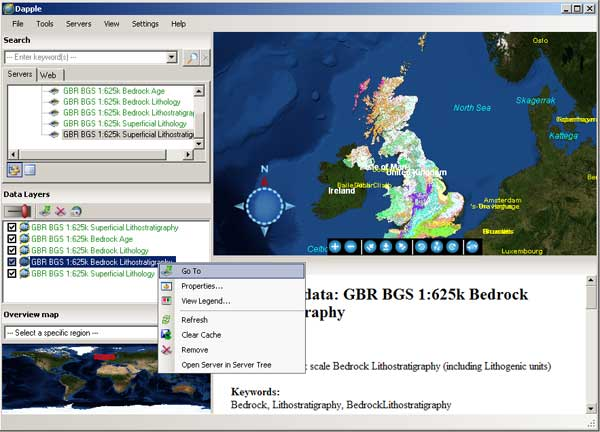

Using Dapple
-------------

.. todo::

   Dapple: This is still available (https://download.cnet.com/Dapple/3000-2379_4-75841105.html), might be worth keeping as is GeoSoft, and BGS is partnering with GeoSoft on ODA work.  Version is still the same, and still works as documented.  Only issue is on install, also needed to add DirectX End-User Runtime (https://www.microsoft.com/en-gb/download/details.aspx?id=35). Current content at http://onegeology.org/howto/1_4_5.html

Dapple: http://dapple.geosoft.com/

The latest release of Dapple (v.2.1.4) supports WMS version 1.3.0.  You must use this version (or higher when they become available) if you want to view any WMS service that supports version 1.3.0. because of a bug in earlier releases.

Note, Dapple doesn't yet support GetFeatureInfo request, so you will not be able to get any information about a map at a location, by clicking on that map.

Dapple is a data explorer designed to provide an open and optimal environment for visualizing, presenting, and sharing massive quantities of geoscientific data on desktop computers.  Dapple lets you browse, discover, and display graphically rich data from global and corporate spatial servers. The Dapple project is an open-source activity sponsored by Geosoft and derived from the NASA World Wind (http://worldwind.arc.nasa.gov/) open source project.

As with other GIS software, the first step to viewing a WMS map layer in Dapple is to add the WMS service to the list of available WMS services.  To do this, select the "Servers" menu option and then "Add WMS server"

.. figure:: images/dapple1.jpg
  :alt: Adding a WMS server to the list of available WMS services in Dapple

  Adding a WMS server to the list of available WMS services in Dapple

In the pop-up window, add the GetCapabilities URL of the service without any parameters; you can supply the "service = WMS" and "request=GetCapabilitie" parameters if you want, but if you supply the version parameter it will be ignored.

For example:

http://ogc.bgs.ac.uk/cgi-bin/BGS_Bedrock_and_Superficial_Geology/wms

The intention is to always use the highest WMS version supported by the service, but the downside is that you will not be able to use Dapple to test all your service outputs.

Dapple will add the service to the list of WMS servers and initially show just this new service and the data layers it can serve. If you left click on any of the layers in the Servers window, you will see the metadata associated with that layer in the Metadata window (beneath the map window).

There are several ways you can add a map layer to your map view: you can use the Tools menu option, you can left click-down and drag to the Data Layers window, or you can right-click on a highlighted layer and add the layer.  In each case the result is the same the layer is added to the data layers view window, and the map is drawn.  Remember, if you drag the layer, you will need to add it to the top of the list, or you might not see it.

  Viewing map and metadata in Dapple

To view the legend of the active map layer you may click the link in the Metadata section, or you may right-click on any layer, either in the Servers view window or the Data Layers view window, and the legend will open either in browser window, or another application that is enabled to view the legend image type from a web location.

.. figure:: images/dapple3.jpg
  :alt: Using the metadata legend link to view the legend information

  Using the metadata legend link to view the legend information
