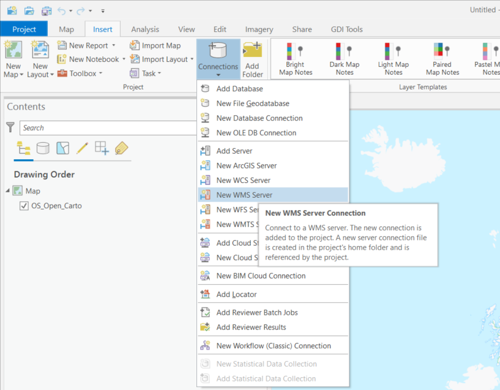
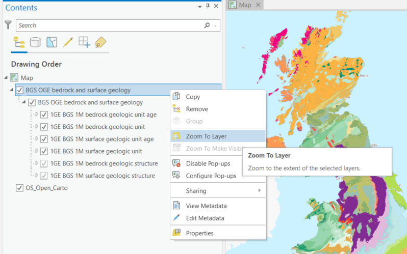
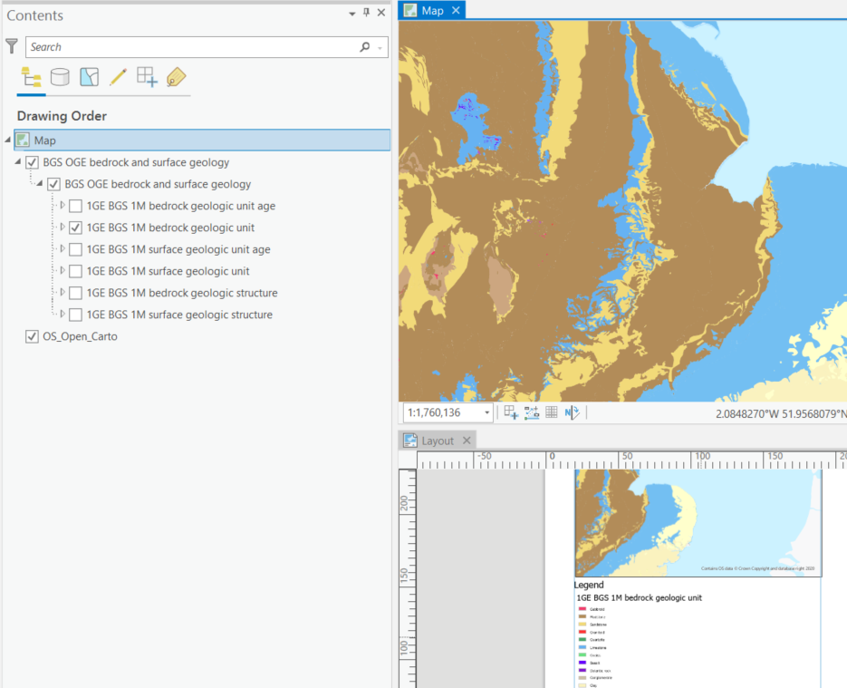
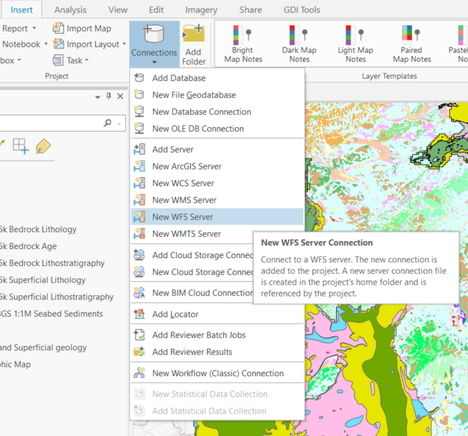
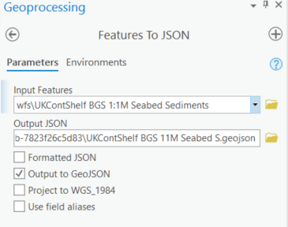

Using ArcGIS Pro
----------------
The ArcGIS software package comes with several applications. Here we'll briefly show how to use **ArcGIS Pro** to view and WMS, WFS, WCS and OGC service connections.

The following notes are based on ESRI ArcGIS Pro version 2.6.

ArcGIS Pro replaces the use of ArcMap. It integrates ArcCatalog and works in conjunction with ArcGIS Online. The latest version of ArcMap (10.8.2) will be in Extended Support until Feb 2024. From MArch 2024 onward we reocmmend using solely ArcGIS Pro for your Esri services.

WMS Service Connection
""""""""""""""""""""""

To add a WMS service to your list of available WMS services, on the *Insert* tab, select  *Connections  > New WMS Server* option, and then add the Service URL (without parameters). You may select to use the default service version (which would normally be the highest version) or you may force a specified version depending on your needs.

   Figure 1 - Adding a WMS service to the list of available services in ArcGIS Pro

WMS layers in ArcMap behave differently than other ESRI native layers. For instance, they are arranged in hierarchical entries which can't be rearranged. This tipically includes

::

	- Service name
	    - Group layer
	        - Actual layers

However there can be multiple or even nested group layers. Also, the only way to get information about feature attributes in a WMS layer is through the *Identify* tool, as shown in the previous section.

If the map is scale layered (layers are shown greyed out) you may use the *Zoom to Make Visible* option. This zooms into the layer to the scale cited in the layer below which the layer will be visible, that is you need to zoom in a little bit further using the zoom tool to be able to view the map.

If you are going to provide scale layered data, it is suggested that you also provide an outline coverage map viewable at all scales to allow users to pan around the area of interest, without needing to zoom in first.

   Figure 2 - Reviewing available WMS service layers in ArcGIS Pro

WMS Services can be viewed and added to Layout views including Legends in order to be exported as map frames.

   Figure 3 - Adding a WMS Service layer & Legend to a Layout view in ArcGIS Pro

To view or alter the legend of a wms layer select the laye rin the *Table of Contents*. Navigate to the top ribbon under *Layer > Appearance > select Symbology*

.. figure:: images/using_arcpro_wms_symbology.PNG
   :alt: Viewing and editing layer legend via the Symbology tab in ArcGIS Pro

   Figure 4 - Viewing and editing layer legend via the Symbology tab in ArcGIS Pro

You may use the layer *Symbology Dialogue* to save a copy of the legend. To do so use the *Legend URL* or right click on the legend image and go to *Save As*. If your layer presents multiple styles, they will be available in the drop down menu of this dialogue.

.. figure:: images/using_arcpro_wms04.PNG
   :alt: Saving a WMS legend graphic to file in ArcGIS Pro

   Figure 5 - Saving a WMS legend graphic to file in ArcGIS Pro

For more information about WMS layers go to `Using WMS services layers <https://pro.arcgis.com/en/pro-app/latest/help/data/services/use-wms-services.htm>`_

WFS Service Connection
""""""""""""""""""""""
A WFS Service connection is established in ArcGIS Pro in the same manner as described above for the WMS.

On the *Insert* tab, select  *Connections  > New WFS Server* option, and then add the Service URL (without parameters). You may select to use the default service version (which would normally be the highest version) or you may force a specified version depending on your needs.

   Figure 4 - Connecting to a WFS service in ArcGIS Pro

WFS layers behave in ArcGIS Pro like any other type of vector layer. You can, for instance, identify individual features, see feature attributes in the *Attribute Table*, join the layer to other dataset or apply symbology.

.. figure:: images/esri_map_wfs_display.PNG
   :alt: WFS layer displayed in ArcMap showing attributes and custom symbology

   Figure 13 - WFS layer displayed in ArcMap showing attributres and custom symbology

To export features from a WFS layer to ESRI proprietary formats, such as a **Shapefile**, right click on the layer and go to *Data > Export Data*. Note that you can export subsets of the layer by choosing only selected features or features within the view extent.

.. figure:: images/esri_wfs_export.PNG
   :alt: Exporting a WFS layer to a proprietary format in ArcMap

   Figure 14 - Exporting a WFS layer to a proprietary format in ArcMap

To export features to an open format, like **GeoJSON**, you'll need to use the *GeoProcessing Tool: Features to JSON*. If features are selected, this tool will only export selected features. 

   Figure 15 - Exporting a WFS layer to GeoJSON format in ArcGIS Pro

.. todo:: 
      
   WCS Layer, issue with displaying WCS Layers in ArcGIS Pro
   Layers load int he catalog, but cannot be added to the map.
   https://community.esri.com/t5/arcgis-pro-questions/problem-connecting-to-a-wcs-server-with-arcgis-pro/td-p/595071
.. WCS Layers
.. """""""""""

.. WCS layers operate in a similar way to other raster data but with a few less properties. For more information on available properties go to `OGC Service Layers in ArcGIS Pro <https://pro.arcgis.com/en/pro-app/2.8/help/data/services/ogc-services.htm>`_.

.. .. figure:: images/using_arcpro_wcs01.PNG
..    :alt: Adding WCS data to ArcGIS Pro

..    Figure 16 - Adding WCS data to ArcGIS Pro

.. To export a WCS layer, right click on it and go to *Data > Export Data*. The *Export WCS Data* dialog will allow you to set the extent, format or cell size of the exported data.

.. .. figure:: images/using_arcpro_wcs02.PNG
..    :alt: Displaying WCS data in ArcGIS Pro

..    Figure 17 - Displaying WCS data in ArcGIS Pro

.. See: http://desktop.arcgis.com/en/arcmap/latest/map/web-maps-and-services/about-using-ogc-service-layers.htm

