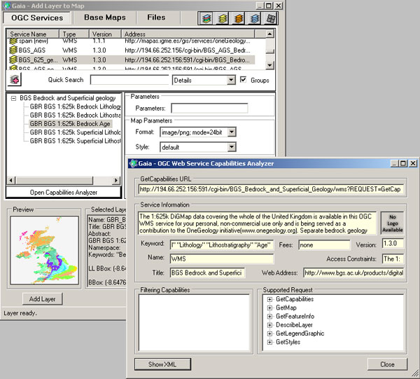

Using Gaia
----------

.. todo::

   Gaia: Looks like same version as before but links changed? (http://www.thecarbonproject.com/Products/Gaia), now version 3.4.2.  Also supports version 1.1.0 WFS so perhaps worth documenting? Current content at http://onegeology.org/howto/1_4_2.html

Gaia: http://www.thecarbonproject.com/gaia.php

Gaia is a free desktop client provided by &#8216;The Carbon Project&#8217;; based on CarbonTools PRO; open-geospatial development tool-kit, and can access an array of geospatial sources such as the Open Geospatial Consortium (OGC) Web Mapping Service (WMS), Web Map Tile Service (WMTS), Web Coverage Service (WCS), and Web Feature Service (WFS). We note that the latest version is now 3.4.1 which adds support for WFS-T; but everything in relation to WMS mentioned below still stands.

Gaia 3.4 fully supports all WMS 1.1.1 requests and, GetCapabilities and GetMap requests for WMS 1.3.0.  It provides partial support for version 1.3.0 GetFeatureInfo requests.

Gaia is available both for Windows and Linux (using mono); here we describe using the Windows version.

To add a WMS to Gaia, use the Tools > Add Layer menu option

.. figure:: images/gaia1.jpg
   :alt: Default view of Gaia 3.4, showing menu options to add WMS services

   Default view of Gaia 3.4, showing menu options to add WMS services

.. figure:: images/gaia2.jpg
  :alt: Adding a new WMS service to the list of available services

  Adding a new WMS service to the list of available services

Select the layer icon (red plus sign)

Give the service a name, and add the service URL (with or without request parameters), select the service type (wms), and version (by default Gaia selects version 1.1.1), and click OK.

This adds the service to the list of available services but doesn't add it to your map.  To add map layers from the service you need to continue.

The service layers will now be shown in the middle window, and if the service is not scale layered, a map will be shown in the preview window.  Highlighting an individual layer from the service (click on layer name) will give a preview of that layer, to help you determine whether the WMS provides the information you require.  You may further investigate the layer metadata, by clicking on the &#8216;Open Capabilities Analyzer&#8217; button.  When you are happy you have the correct map layer, click the 'Add Layer'; button.

  Using the Capabilities Analyzer to review WMS metadata for a map layer

Note, you can force a change in the default behaviour of the service using the Parameters form options, for example, here we are requesting the map to be served as a 24-bit png.

Like the OneGeology Portal, Gaia supports all standard GIS tools (Zoom in, Zoom out, Pan, Move back and forward through previous map extents, Retrieve Feature Information).

.. figure:: images/gaia4.jpg
  :alt: GetFeatureInfo request response in Gaia

  GetFeatureInfo request response in Gaia

Double-clicking on the layer in the left hand menu, will bring up the map layer properties window, which allows you to change the layer opacity (transparency), and other parameters as required.  It will also reveal the GetMap request (query) that is being used to display that map layer, at that time.  You may copy and paste that request into any browser to show that map layer.

A GetMap request for a portion of the BGS bedrock lithostratigraphical data map layer. You can cut and paste this URL into any web browser and get a png format map image.

http://ogc.bgs.ac.uk/cgi-bin/BGS_Bedrock_and_Superficial_Geology/ows?REQUEST=GetMap&amp;SERVICE=WMS&amp;VERSION=1.3.0&amp;LAYERS=GBR_BGS_625k_BLS&amp;STYLES=default&amp;FORMAT=image/png;%20mode=24bit&amp;BGCOLOR=0xFFFFFF&amp;TRANSPARENT=TRUE&amp;CRS=EPSG:4326&amp;BBOX=54.0957778123079,-3.54949452254466,54.9267913615873,-2.51587849637481&amp;WIDTH=602&amp;HEIGHT=484&amp

The above parameters are specific to the version of the WMS (in this example &#8216;VERSION=1.3.0&#8217;), changing the version number alone, to review how the data might display for that version, will result in an error.

Note, if you are using Gaia at work (behind a corporate firewall) or otherwise need to go through a proxy to access the web, AND don&#8217;t get any map service showing, you should check that Gaia has picked up your proxy settings; see Tools > Configuration > Proxy Settings.

