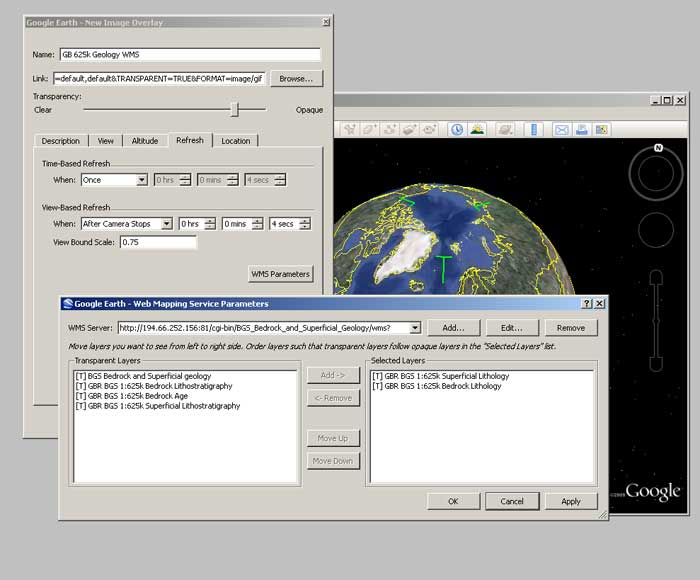
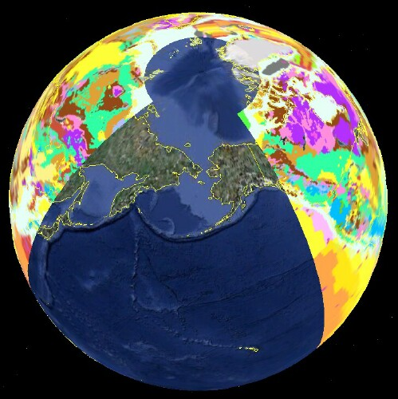

Using Google Earth
-------------------

.. todo::

   Google Earth: Check software updates and if issues still exist. Also check if same affects World Wind. Current content at http://onegeology.org/howto/1_4_6.html

Google Earth: http://earth.google.co.uk/

Requires a PC with minimum 256MB memory and 3D-capable graphics card with 16MB of VRAM.

A simple way of viewing data in Google Earth is to use a KML file exported from the OneGeology Portal. You may also add a WMS directly, using the Add menu option and then ‘Image Overlay’.

.. figure:: images/googleEarth1.jpg
  :alt: Using the image overlay option in Google Earth to add a WMS

  Using the image overlay option in Google Earth to add a WMS

Give your service a name then select the ‘Refresh’ tab, and click on the ‘WMS parameters button. In the dialogue box, add the Service URL without parameters.

For example:

http://maps.bgs.ac.uk/ArcGIS/services/BGS_Detailed_Geology/MapServer/WMSServer?

Then use the Add button to add one or more of the service layers to your image overlay (each map layer added to your image overlay will be available to be selected/turned on or off later).

The URL field is populated automatically (but note that it doesn’t add the ‘styles’ parameter, and this may cause the map layer to not display correctly (See `Google Earth Issues_`)

  Selecting WMS layers in Google Earth

When you zoom into your area of interest Google Earth will tile your map.

.. figure:: images/googleEarth3.jpg
  :alt: WMS tiling in Google Earth

  WMS tiling in Google Earth

Google Earth Issues
^^^^^^^^^^^^^^^^^^^^

Problems displaying the map layer
""""""""""""""""""""""""""""""""""

When adding a WMS layer to Google Earth, you may get a Big Red Cross instead of the map layer you were expecting. This indicates there is an error with that layer. The error may lie either with the GetMap parameters sent by Google Earth to the WMS server, or in the WMS response.

When adding any WMS using the method described above, we have noted that the parameters that Google Earth automatically populates into its form (the Edit Image Overlay Link) are missing the required ‘styles’ parameter. MapServer WMS services do not seem to be affected by this omission, that is, they will serve a map using the default style, but we have noticed that ArcGIS WMS services cannot handle this error, and you will need to add the correct style value to your link. You may look at the GetCapabilities response to get the style or styles you want to be used, or you should just be able to specify a null value, and get the default style.

.. figure:: images/googleEarth4.jpg
  :alt: Red cross showing a layer error in Google Earth

  Red cross showing a layer error in Google Earth

For example to view the BGS 50k Geology layer in Google Earth you need to use this link:

http://maps.bgs.ac.uk/ArcGIS/services/BGS_Detailed_Geology/MapServer/WMSServer?VERSION=1.1.1&REQUEST=GetMap&SRS=EPSG:4326&WIDTH=512&HEIGHT=512&LAYERS=1&TRANSPARENT=TRUE&FORMAT=image/gif&styles=

Problems displaying a map layer that spans the globe
"""""""""""""""""""""""""""""""""""""""""""""""""""""
Google Earth has a problem showing the full contents of a map layer that spans the whole globe. Specifically Google Earth seems to be unable to show coverage from such data layers at the poles and around the antimeridian (the 180th degree meridian). For example we are unable to get a map to display the whole of Russia.

The problem is illustrated below using the WORLD CGMW 1:25M Geologic Units layer. (http://mapsone.brgm.fr/1GmapserverFR/wms?map=/applications/mapserver/map%20files/Lithology_FR.map&REQUEST=GetMap&SERVICE=WMS&VERSION=1.1.1&LAYERS=WORLD_CGMW_25M_GeologicUnits&STYLES=default&FORMAT=image/png&BGCOLOR=0xFFFFFF&TRANSPARENT=TRUE&SRS=EPSG:4326&BBOX=-180,-137.242524916944,180,137.242524916944&WIDTH=602&HEIGHT=459)

There is currently no fix for this issue.

.. figure:: images/world-cgmwR.jpg
  :alt: GetMap response to the OneGeology WORLD CGMW 1:25M Geologic Units map layer showing a web map service with whole globe coverage

  GetMap response to the OneGeology WORLD CGMW 1:25M Geologic Units map layer showing a web map service with whole globe coverage

  The same OneGeology WORLD CGMW 1:25M Geologic Units map layer in Google Earth showing the display problem at the poles and the antimeridian
