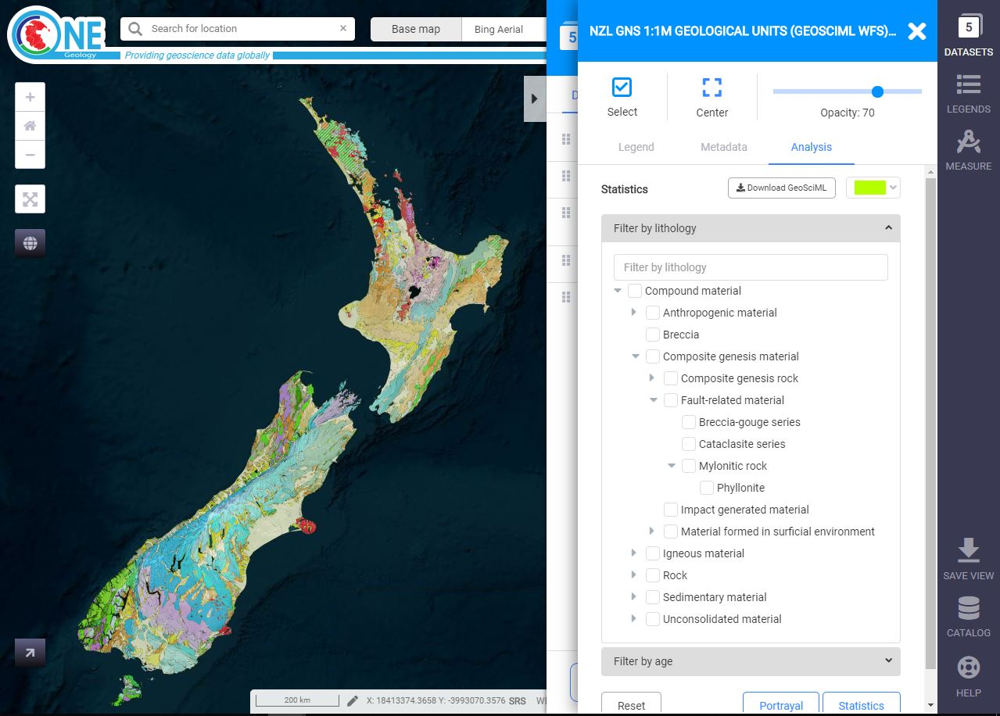
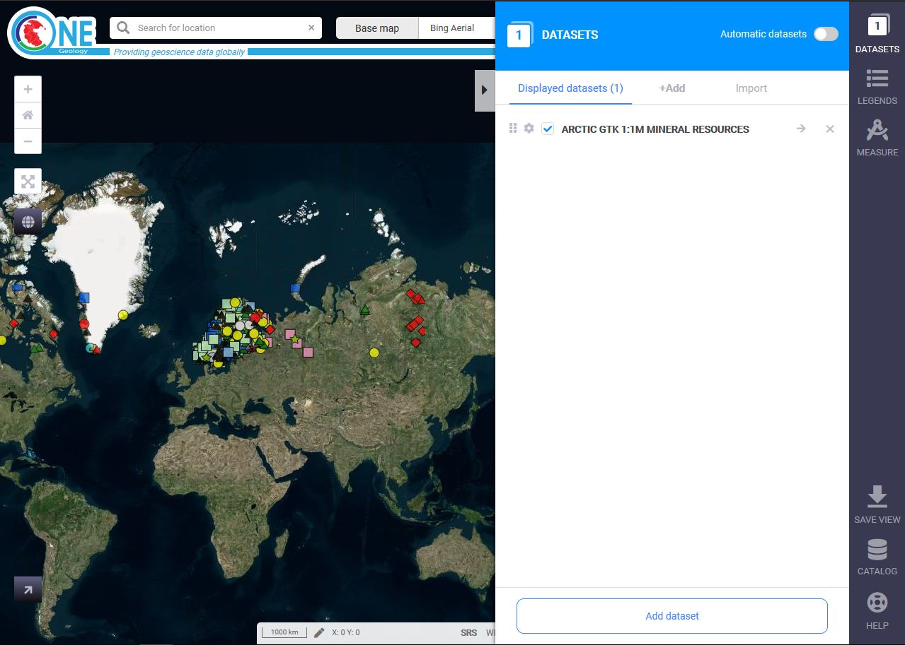
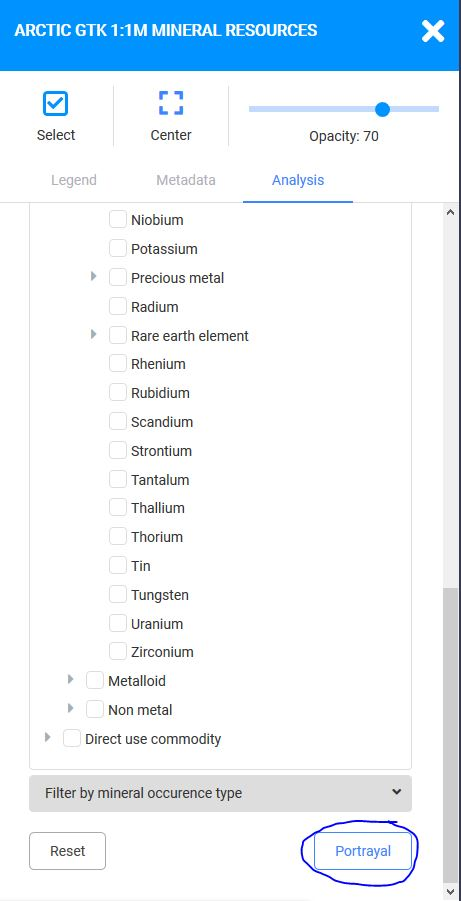
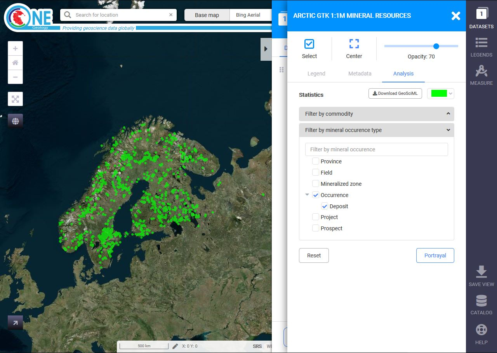
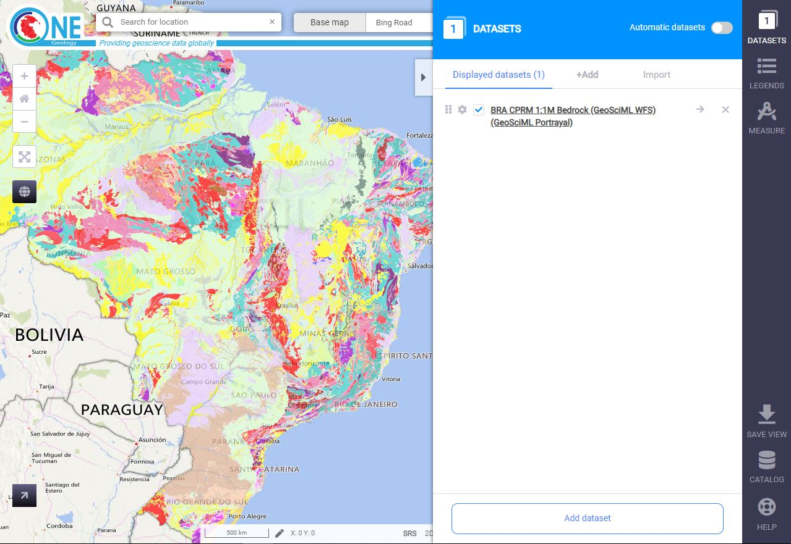
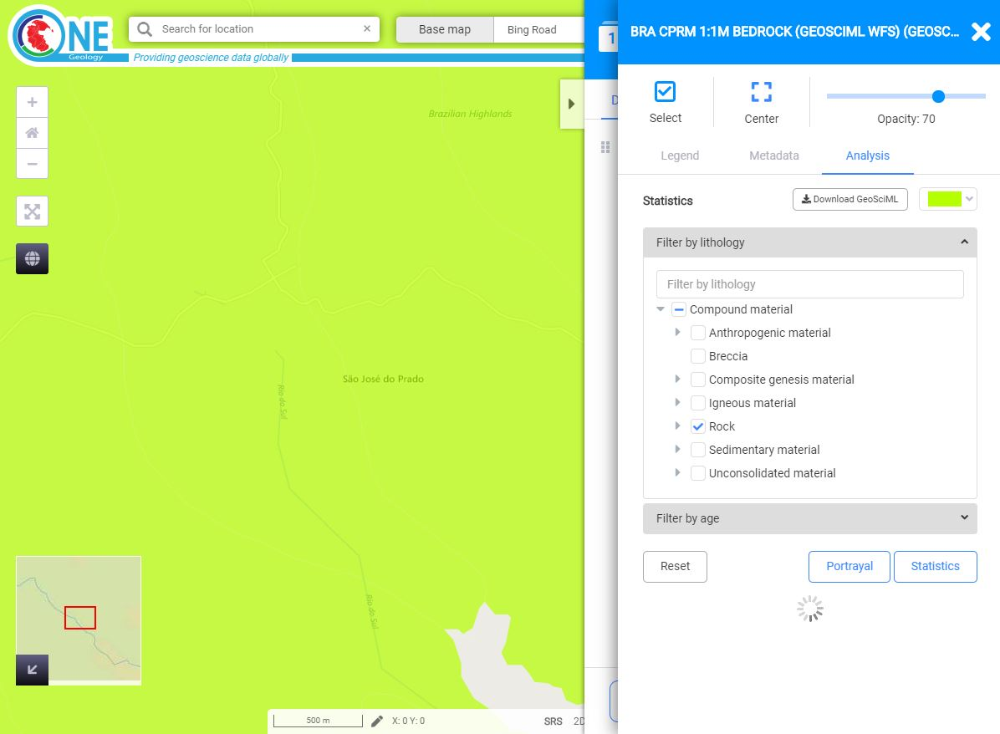

Using the OneGeology Portal
===========================

.. todo::
   Need to consider whether we can actually maintain detailed instructions on more than a couple of examples. And should we? Should be able just to point to software's own documentation on using OGC services. Maybe just make a list with pointer to home page, specific documentation package may have for OGC services (should be standard stuff these days) and any gotchas/special considerations we have noticed for particular examples. The target audience for this section could include a range of levels of IT and geological knowledge and include people just using the services and service providers who also need to understand how their services can be made use of.

.. todo::

   Below introductory paragraph should probably point to some general OneGeology introduction elsewhere on www.onegeology.org to explain the range of data and purpose of OneGeology. We may need to get it written if it doesn't exist right now. We want to refer to purpose, kinds of data that are available or will be in future. This page is where the kinds of viewing, data query etc. that can be done will be introduced.

.. todo::

   List the other parts of onegeology.org that will link directly to here. At the moment a sidebar sub-menu "Technical detail for participants" -> "How to use a OneGeology service" and some links from other pages. Also the page https://onegeology.org/portal/portal_uses.html has links to various client pages but it all seems a bit of a repetitive anomaly and something that should be entirely replaced by content here.

The OneGeology portal allows you to discover all the services that have been registered with OneGeology. You can view all those that return image output on a map of the world and can query the data behind those that provide that ability. Also some services allow you to highlight areas satisfying some simple query criteria on the age or lithology of mapped geological units.

The Portal has the following functions:

- Zoom
- Pan
- Get Information tool
- Help menu
- multi-layer map view,
- opacity selection,
- legend viewer,
- details of provider organisation / geological survey
- web link URL to the provider survey
- brief description of the data layer
- conditions of use information for each layer

Viewing data registered in the OneGeology Portal
-------------------------------------------------

The OneGeology Portal is found at: https://portal.onegeology.org/ and is accessible as either an English (the default) or French language service.

You will need to use Internet Explorer 6 and above, Firefox 2 and above or recent versions of Safari, Opera, and Chrome. You will need to enable JavaScript and allow pop-ups.

   .. todo::

      Need to find an updated link for Blue Marble

When you open the OneGeology Portal you get a map of the world, the `Blue Marble: Next Generation+Topo+Bathy (Terra/MODIS) <http://visibleearth.nasa.gov/view_detail.php?id=7105>`_. By default you now also get some automatically selected geology map layers, depending on the scale you are zoomed into. For example, at full map extent you now get the ‘*World CGMW 1:50M Geological Units Onshore*’ map.

.. figure:: images/newsiteR.jpg
      :width: 600
      :alt: Default display of the OneGeology Portal, with automatically selected geology layers

      Default display of the OneGeology Portal, with automatically selected geology layers image

You may at any time turn off the automatically selected layers by unticking the option ‘*Automatically displayed layers depending on scale and location*’ in the top right of the browser window.

The overview window in the bottom right corner of the map indicates the area of the globe you are currently looking at in the map window, by means of a red outline map superimposed on the global map. For example in the above map the red outline is shown for the whole globe, but in the below map the red box is located in the Southern Ocean.

.. figure:: images/overviewWinr.jpg
      :width: 600
      :alt: The overview window shows where you are on the globe

      The overview window shows where you are on the globe

.. figure:: images/AddLayer.jpg
      :width: 600
      :alt: Click the Add OneGeology map layers icon to open the OneGeology Portal catalogue map layer listing

      Add OneGeology map layers icon

To view any other registered geology maps you need to click on the ‘*Add OneGeology map layers*’ icon to open the OneGeology Portal catalogue listing.

.. figure:: images/newsiteAddLayersR.jpg
      :width: 600
      :alt: OneGeology Portal catalogue map layers listed by Geographic area. Use the options in this window to control which maps are displayed, and how they are displayed

      OneGeology Portal catalogue map layers listed by Geographic area. Use the options in this window to control which maps are displayed, and how they are displayed

Click on the + buttons to expand the levels. Select a map by clicking on the box to the left of the map you wish to view. A tick will appear.

Select all the map layers you wish to view at this time before closing the catalogue listing. The selected maps should then be visible. You can add other layers later on if you desire.

You may navigate around the map using the GIS tools found at the top of the page. The functions of these tools is as follows (from left to right):

.. figure:: images/IconsGIS.jpg
      :height: 915
      :alt: GIS tools

      GIS tools

* Zoom in — click on this image and then click on the world background map to zoom in centred on the clicked location. Click and drag a rectangle to zoom to a specific area.
* Zoom out — click on this image and then click on the world background map to zoom out centred on the clicked location. Click and drag a rectangle to zoom out from a specific area
* View full global extent — click this image to start again with a view of the full world background map.
* Pan by clicking and dragging the map to move — click this image and then click and drag on the map to move to a different area (north, west, etc)
* Return back to previous map view
* If you have gone back to a previous view, you may use this tool to go forward.
* Use this tool to get more information about the active map layers (this is termed a GetFeatureInfo request). Select the tool and click the map to open up a new window with detailed information about the geology at that point. The information returned and format of the information varies from map to map and layer to layer dependant upon how much information the provider organization wishes to display and the capabilities of the service.

.. figure:: images/GetFInfoR.jpg
      :alt: Example of information that may be retrieved using the information tool
      :width: 600

      Example of information that may be retrieved using the information tool

.. figure:: images/ViewProps.jpg
      :width: 50
      :height: 50
      :alt: Active Layers Properties icon

      Active Layers Properties icon

To view metadata about the map layers and to change the way the layers are displayed you need to Click on the ‘*Active Layers Properties*’ icon. This will open a list of all the map layers that you have selected to be viewed in the OneGeology Portal; it will now also display all the map layers that have been automatically selected.

   .. figure:: images/activelayers1r.jpg
      :width: 600
      :alt: Active layers in a OneGeology Portal session

      Active layers in a OneGeology Portal session

Within this dialogue menu you can manage the individual layers in the following ways (looking at the icons from left to right):

   .. figure:: images/activelayers1detail.jpg
      :width: 500
      :alt: Tools to manage the active layers

      Tools to manage the active layers

   * Move the map layer up (so it lies above other layers and may obscure them), and move the map layer down (so it lies beneath other layers and may be obscured by them).  In the figure we can see that we cannot move the SUR TNO 1M SLT further up because the up away is greyed out.
   * Show or hide the map layer.
   * Change the opacity of the map layer (use the slider rule to change the % value to make underlying maps visible) so that it is possible to see through a layer to underlying layers where they overlap
   * Zoom to the extent of the map layer to make that particular map layer fill the centre of the map browser.
   * Delete the map layer from the view (you can add it back again later).

Note the *i* icon has no actual function, it just exists to inform you whether the layer is queryable, that is whether you can perform a GetFeatureInfo request on it and get back some information.  Note too, in the above figure that one of the layers is shown to be greyed out.  A greyed out layer indicates that the layer (such as PER INGEMMET 1:1M Faults, is not visible at the selected map scale.  Finally note we can show or hide all the automatically selected layers by unticking the ‘*Automatically displayed layers depending on scale and location*’ option at the top of the dialogue window.

   .. figure:: images/9.jpg
      :width: 600
      :alt: Layer viewed with 30% opacity
      :figclass: right

      Layer viewed with 30% opacity

   .. figure:: images/8.jpg
      :width: 600
      :alt: Layer viewed with 100% opacity
      :figclass: left

      Layer viewed with 100% opacity

To find out further information about any map layer you can click the arrow to right of the layer title; inforamtion found here is extracted from the service GetCapabilites response document and includes information such as:

   * The data owner
   * The service title
   * The legend of the map layer
   * Information about the layer data and other digital data services of the data provider
   * TC211/ISO 19115:2003 or FGDC metadata for the layer
   * The service URL (you can use this URL to view the OneGeology WMS layer in any WMS client as described in later sections).

   .. figure:: images/GetCapInfoR.jpg
      :width: 600
      :alt: Example of GetCapabilities data that may be obtained from the Active Layer properties dialogue, with pop-up legend from the Legend link

      Example of GetCapabilities data that may be obtained from the Active Layer properties dialogue, with pop-up legend from the Legend link

   .. figure:: images/GetCapInfoR2.jpg
      :width: 600
      :alt: Example of GetCapabilities data that may be obtained from the Active Layer properties dialogue, with pop-up legend from the Legend link

      Example of GetCapabilities data that may be obtained from the Active Layer properties dialogue, with pop-up legend from the Legend link

   This (above) information is harvested automatically by the OneGeology Portal client software from the GetCapabilities response document of the WMS.

Go To Function
^^^^^^^^^^^^^^

   .. figure:: images/searchlocation.jpg
      :width: 500
      :alt: The Go To icon

      The Go To icon

   Click in the Search Location box to to enter a place name, select from returned options area to zoom to.

   In the first example (below) we enter Dominica in the ‘Search Location’ text box.  This opens a drop down window that shows all the matches for Dominica in the OneGeology Portal gazeteer.  Select the place name you want by clicking on it and the OneGeology Portal will zoom to that location.  Note the OneGeology Portal only zooms to the area, it doesn’t necessarily open any available geology layers in that area.

   .. figure:: images/gotodomTr.jpg
      :width: 600
      :alt: Using the Go To functionality to zoom to an area (the Dominican Republic) by entering a search string

      Using the Go To functionality to zoom to an area (the Dominican Republic) by entering a search string ~ Dominica

Viewing layers in different projections
^^^^^^^^^^^^^^^^^^^^^^^^^^^^^^^^^^^^^^^

   The portal allows you to select other projections to view the map layers.  The projections supported by the portal are:

   EPSG:3031
     Antarctic Polar Stereographic (WGS84) https://epsg.org/crs_3031/WGS-84-Antarctic-Polar-Stereographic.html
   EPSG:3034
     Lambert Conformal Conic (ETRS89) https://epsg.org/crs_3034/ETRS89-extended-LCC-Europe.html
   EPSG:3413
     NSIDC Sea Ice Polar Stereographic North (WGS84) https://epsg.org/crs_3413/WGS-84-NSIDC-Sea-Ice-Polar-Stereographic-North.html
   EPSG:3857
     Web Mercator (WGS84) https://epsg.org/crs_3857/WGS-84-Pseudo-Mercator.html
   EPSG:4258
     2D Latitude / Longitude (ETRS89) https://epsg.org/crs_4258/ETRS89.html
   EPSG:4326
     2D Latitude / Longitude (WGS84) https://epsg.org/crs_4326/WGS-84.html

   The default projection to view layers in the portal is *2D Latitude / Longitude (WGS84)* or EPSG:4326.  All layers in the portal **must** support this projection as part of their service.  To select another projection you must use the list at the bottom of the main portal window.  The current projection is shown in bold in the list, so for example in the below figure the active projection at the time of clicking the list was **NSIDC Sea Ice Polar Stereographic North (WGS84)**.

   .. figure:: images/ChangingProjection.jpg
      :width: 403
      :height: 162
      :alt: Projections are selected from the list at the bottom of the main portal window

      Projections are selected from the list at the bottom of the main portal window

   Whilst all layers in the portal must support 2D Latitude / Longitude (WGS84), other projections are optional.  When you choose to change to any projection other the default, you should expect that some layers will not support the newly selected projection; layers that do not support the selected projection are deselected (so the portal will not make any requests to them for map layers) and shown in the active layers properties window with a yellow warning triangle.

   .. figure:: images/LayersWithoutProjectionRequested.jpg
      :width: 400
      :alt: Active layers that do not support the projection are deselected and shown with a warning triangle

      Active layers that do not support the projection are deselected and shown with a warning triangle

   In many cases viewing the OneGeology layers in the default projection is sufficient, but in some cases, for example when you are dealing with layers close to the poles, a differnt projection better shows the data.  For example compare the two images below showing map layers for Antarctica and surrounding regions.  In the first example we have the default projection that shows Antarctica as a distorted strip of land at the  bottom of the flattened globe.

   .. figure:: images/defaultViewSouthernHemisphere.jpg
      :width: 600
      :alt: Map layers from the Southern hemisphere showing in the the standard 2D Latitude / Longitude (WGS84) ~ EPSG:4326 projection

      Map layers from the Southern hemisphere showing in the the standard 2D Latitude / Longitude (WGS84) ~ EPSG:4326 projection

   In the second example, we have the same map layers shown in *the Antarctic Polar Stereographic (WGS84)* projection that shows Antarctica as it should be, as a single land mass.  Note that the portal uses a different backdrop for this projection than that used for the default projection, namely the `Landsat Image Mosaic of Antarctica (LIMA). <https://lima.usgs.gov>`_ Note too that this LIMA backdrop does not extend much further than the Antarctica land mass, so whilst there are map layers that support this projection other than Antarctica, for example the Falkland Islands (Malvinas) layers, there is currently no backdrop for these map layer extents.

   .. figure:: images/Antarctic-projection-example2.jpg
      :width: 600
      :alt: Map layers from the Southern hemisphere showing in the Antarctic Polar Stereographic (WGS84) ~ EPSG:3031 projection

      Map layers from the Southern hemisphere showing in the Antarctic Polar Stereographic (WGS84) ~ EPSG:3031 projection

   Examples of other map layers in other projections are shown below:

   NSIDC Sea Ice Polar Stereographic North (WGS84)

   .. figure:: images/NSIDC-projection-exampleCropped.jpg
      :width: 600
      :alt: Map layer displayed in NSIDC Sea Ice Polar Stereographic North (WGS84) projection

      Map layer displayed in NSIDC Sea Ice Polar Stereographic North (WGS84) projection

   Web Mercator (WGS84)

   .. figure:: images/SphericalMercator-example.jpg
      :width: 600
      :alt: Map layers displayed in Web Mercator (WGS84) projection

      Map layers displayed in Web Mercator (WGS84) projection

   2D Latitude / Longitude (ETRS89)

   .. figure:: images/ETRS89-2D-example.jpg
      :width: 600
      :alt: Map layers displayed in 2D Latitude / Longitude (ETRS89) projection

      Map layers displayed in 2D Latitude / Longitude (ETRS89) projection

Note that when using the ETRS-89 based projections you will not be able to zoom out (or pan the map) wider than than the intended extent of the projection.

Reviewing external map data
----------------------------

   You may also use the OneGeology Portal client to review other WMS services, either as check of your own service before requesting that it is added to the OneGeology Portal catalogue, or to view any other data services that you discover.

   You add additional WMS services using the ‘Add external layers’ option and adding the service URL (without any request parameters).

   .. figure:: images/ViewExternals1r.jpg
      :width: 400
      :alt: Using the Add external layers functionality.  Use this to review your own map service before requesting it to be formally added to the OneGeology Portal

      Using the Add external layers functionality.  Use this to review your own map service before requesting it to be formally added to the OneGeology Portal

   Select the layers you want to display in the OneGeology Portal by ticking the boxes on the left of the layer name.  You can also select the WMS version (i.e. either version 1.3.0 or version 1.1.1) you would like to view (or test), by using the radio buttons on the right of the layer name.

   A service or layer added using the external layers functionality is only visible to you, and is only available for your active session.

Exporting to Keyhole Markup Language (KML)
------------------------------------------

   *KML* is a file format used to display geographic data in an Earth browser such as Google Earth, Google Maps. It is an XML–based language schema for expressing geographic annotation and visualization on existing or future Web-based, two-dimensional maps and  three-dimensional Earth browsers. KML was developed for use with Google Earth, which was originally named Keyhole Earth Viewer. It was created by Keyhole Inc, which was acquired by Google in 2004, but is now an internationally recognized standard by the Open Geospatial Consortium (OGC) in it’s version 2.2 form.

   You may export the contents of any active map service to KML to allow you to view those layers in Google Earth (or other applications that support the KML format).

   * Click the Save KML context button
   * Enter a file name of your choice that you will save the KML as, and click OK.

   .. figure:: images/Save2KML1r.jpg
      :width: 400
      :alt: Using the Export to KML option to view your map in Google Earth

      Using the Export to KML option to view your map in Google Earth

   Once the KML file has been created you can save it or choose to immediately open the data in Google Earth.

Creating and using Web Map Context (WMC) documents
--------------------------------------------------

   Saving your current OneGeology Portal view as a Web Map Context document is an easy way to save your personal data view and allows you to open the same view again at a later date.  This avoids the need to keep adding layers to the view each time you enter the OneGeology Portal. This is most useful if viewing a large number of layers at any one time.

   This also allows you to share your map session with other people, either by giving them a copy of the file, or by making the file available on a public web server.

   ‘\ `Web Map Context Documents <https://www.ogc.org/standard/wmc/>`_\ ’ is an OGC specification and any WMC document created in the OneGeology Portal should be usable in a number of client software applications.

Saving your context file
^^^^^^^^^^^^^^^^^^^^^^^^^^^^^

   * Click the Save WMC context button to create a WMC document
   * Enter a file name of your choice that you will save the WMC as, and click OK.

   Note when naming your Web Map Context document(which is in XML format) you should provide only the name and not the file ending, for example, if you name a file ‘*IrelandGeology*’ in the dialog box the resultant file will be called ‘*IrelandGeology.xml*’. If you do add a file ending you will still get an .xml file suffix, for example if you name your file ‘*IrelandGeology.wmc*’ the resultant file will be called ‘*IrelandGeology.wmc.xml*’

   .. figure:: images/Save2wmcR.jpg
      :width: 400
      :alt: Using the Save WMC context option to save your map settings

      Using the Save WMC context option to save your map settings

   This will create a Web Map Context document containing all the geology maps you currently have added to the OneGeology Portal and the Blue Marble base layer, but will not currently add any of the layers that were automatically selected.

Opening a Web Map Context file in the OneGeology Portal
^^^^^^^^^^^^^^^^^^^^^^^^^^^^^^^^^^^^^^^^^^^^^^^^^^^^^^^^

   To open a Web Map Context document in the OneGeology Portal, you need to select the ‘*Load a WMC context*’ menu option (folder icon)

   You have the choice to ‘*Load a Context file (WMC)*’ that you have already saved on your PC, or to use a ‘*Context URL*’, that is a Web Map Context file that has been made available on some web server (as in this figure example).  You also have the option to keep the layers that are already loaded in you map, or to just view the layers in the context file (which is the default option).  Note that currently you still get the automatically selected layers showing, even if you chose not to keep the layers already added.

   .. figure:: images/loadWMC.jpg
      :width: 400
      :alt: Loading a Web Map Context document

      Loading a Web Map Context document

   When you have made your selection, click the ‘*Load*’ button to load the context file and view the saved map session.

   Alternatively you can use the external Web Map Context URL as a parameter value to append to the OneGeology Portal URL, to automatically open the map session captured in context file.  This functionality is particularly useful if you want to provide a link to the OneGeology Portal (on a website or in an email to someone) with your map automatically showing.

   To do this you need to send a request like:

   `f |url| <https://portal.onegeology.org/?language=eng&method=addExternalContext&url=https://ogc.bgs.ac.uk/wmc/IrelandGeologyEdited-wmc.xml>`_

   .. |url| raw:: html

      https://portal.onegeology.org/? 
      language=eng&amp; 
      method=addExternalContext&amp; 
      url=https://ogc.bgs.ac.uk/wmc/IrelandGeologyEdited-wmc.xml

Opening a WMC file in other clients
^^^^^^^^^^^^^^^^^^^^^^^^^^^^^^^^^^^^

   Other clients are known to support Web Map Context documents, for example we could load the example file (https://ogc.bgs.ac.uk/wmc/IrelandGeologyEdited-wmc.xml) in an OpenLayers client like the one at http://openlayers.org/dev/examples/wmc.html.  Here we need to copy the contents of the file into the form window and click on the ‘*read as new map*’ button to view our map.

   .. figure:: images/WMConOLr.jpg
      :width: 600
      :alt: Using a OneGeology Portal WMC document in an OpenLayers client

      Using a OneGeology Portal WMC document in an OpenLayers client

Known issues
^^^^^^^^^^^^

   If when you load your Web Map Context file you get an error, you should check that the file has the correct XML header, this is because some browsers are known to add an additional XML line at the top of the document when creating the file.  So if you see the following lines at the top of your document:

   .. code-block:: xml

      <?xml version="1.0" encoding="utf-8" ?>
        <?xml version="1.0"?>

   You will need to edit it so that is appears as:

   .. code-block:: xml

      <?xml version="1.0" encoding="utf-8" ?>

.. _use_portal_thematic_analysis:

Analysis tools
---------------

We may use ‘*Open Layer Details*’ (in "Datasets" tab click on dataset name or arrow next to name)  to discover further information about the layers in a map session.  Information that may be revealed in this dialogue is that the layer is available for ‘*Analysis*’, as in the below example.

.. figure:: images/ThematicAnal.jpg
   :width: 600
   :alt: Layer properties dialogue, showing analysis functionality is available in an active layer.

   Layer properties dialogue, showing analysis functionality is available in an active layer.

The analysis tool has two principal functions.  

1. Alternative portrayal of WMS/WFS services, where supported. Allowing highlighting of specific lithologies or ages.  
2. Statistical analysis of map features available in an associated GeoSciML WFS, (Supported v4.0 and v3.2);

Click on the ‘*Analysis*’ button to show the options available for the layer.  For example for the New Zealand service layer, "NZL GNS 1:1M Geological Units (GeoSciML WFS)", there is a *Portrayal* service and *Statistics* functionality enabled.

.. figure:: images/ThematicAnalysisSelection.jpg
   :width: 600
   :alt: Analysis options tab

   Analysis options tab

Portrayal Services
^^^^^^^^^^^^^^^^^^^
GeoSciML
"""""""""

The analysis tool offers you two ways to filter your map, you can filter by lithology or you can filter by age via nested hierarchical dropdowns. 

The initial view shows the top level filters, simply "Filter by lithology" and "Filter by age".

If we select "Filter by lithology" we will see a search bar and heirarchical nested GeoSciML vocablary, starting at "*Compound material*"

   The portrayal analysis query builder window

The values for the lithology filter options are taken from the `CGI Simple Lithology controlled vocabulary <http://resource.geosciml.org/static/vocabulary/cgi/201211/simplelithology.html>`_.

In the age filter window the initial view shows the ‘*Phanerozoic*’ and ‘*Precambrian*’ options.
These options reflect the structure of the underlying controlled vocabularies.

The values for the age filter options come from the ICS 2012 Geologic timescale vocabularies, for example, `Phanerozoic <http://resource.geosciml.org/classifier/ics/ischart/Phanerozoic>`_ or `Precambrian <http://resource.geosciml.org/classifier/ics/ischart/Precambrian>`_.

In any window you can refine your selection by drilling down into the hierarchy, and then clicking on an option box to make your filter selection. 

In the below figure example, we have expanded the lithology view options by first clicking on the arrow to the left of the text ‘*Compound material*’ option.  We can continue to expand the hierarchy until we reach a term we would like to query. In this case "Sand". Select the term you would like to query by clicking on the checkbox on the terms left.  

.. figure:: images/ThematicAnalysisQueryBuilderSearch.jpg
   :width: 400
   :alt: Selection of "Sand" from the controlled vocabularies

   Selection of "Sand" from the controlled vocabularies

As well as drilling down through the hierarchy progressively to find the term you wish to filter by, you can also search for terms directly by entering the search term in the box at the top of the respective Age and Lithology window. This will expand the hierarchy and highlight all terms contain all or part of that search text. 

Its also possible to select higher level terms such as "Composite genesis material", this will automaticallu also select all subordinate terms in the hierarchy (See below). 

.. figure:: images/ThematicAnalysisSelectionByAge.jpg
   :width: 400
   :alt: Selection of "Composite genesis material" from the controlled vocabularies

   Selection of "Composite genesis material" from the controlled vocabularies

In this (above) example we have selected the New zealand WFS service ‘*NZL GNS 1:1M Geological Units (GeoSciML WFS)*’ layer, which has GeoSciML-Portrayal attribution.  We then decided to filter by lithology, looking to view only those geology polygons that are attributed as belonging to the "Composite genesis material" class (by ticking the checkbox to the left of the term).  Then we select a colour (red from the dropdox at the top of the tab) with which to apply to all the polygons that match the lithology criteria, and click the "Portrayal" button at the bottom of the analysis tab.

The analysis tool generates an external SLD file like the one below: 

    .. code-block:: xml

       <sld:StyledLayerDescriptor
       version="1.0.0"
       xmlns="http://www.opengis.net/ogc"
       xmlns:sld="http://www.opengis.net/sld"
       xmlns:ogc="http://www.opengis.net/ogc"
       xmlns:gml="http://www.opengis.net/gml"
       xmlns:xsi="http://www.w3.org/2001/XMLSchema-instance"
       xsi:schemaLocation="http://www.opengis.net/sld
         http://schemas.opengis.net/sld/1.0.0/StyledLayerDescriptor.xsd">
         <sld:NamedLayer>
           <sld:Name>US-DE_DGS_100k_Surficial_Geology</sld:Name>
             <sld:UserStyle>
               <sld:FeatureTypeStyle>
                 <sld:Rule>
                   <ogc:Filter>
                     <ogc:Or>
                       <ogc:PropertyIsEqualTo>
                         <ogc:PropertyName>representativeAge_uri</ogc:PropertyName>
                         <ogc:Literal>
                           http://resource.geosciml.org/classifier/ics/ischart/Pleistocene
                         </ogc:Literal>
                       </ogc:PropertyIsEqualTo>
                       <ogc:PropertyIsEqualTo>
                         <ogc:PropertyName>representativeAge_uri</ogc:PropertyName>
                         <ogc:Literal>
                           http://resource.geosciml.org/classifier/ics/ischart/Calabrian
                         </ogc:Literal>
                       </ogc:PropertyIsEqualTo>
                       <ogc:PropertyIsEqualTo>
                         <ogc:PropertyName>representativeAge_uri</ogc:PropertyName>
                         <ogc:Literal>
                           http://resource.geosciml.org/classifier/ics/ischart/Gelasian
                         </ogc:Literal>
                       </ogc:PropertyIsEqualTo>
                       <ogc:PropertyIsEqualTo>
                         <ogc:PropertyName>representativeAge_uri</ogc:PropertyName>
                         <ogc:Literal>
                           http://resource.geosciml.org/classifier/ics/ischart/Ionian
                         </ogc:Literal>
                       </ogc:PropertyIsEqualTo>
                       <ogc:PropertyIsEqualTo>
                         <ogc:PropertyName>representativeAge_uri</ogc:PropertyName>
                         <ogc:Literal>
                           http://resource.geosciml.org/classifier/ics/ischart/UpperPleistocene
                         </ogc:Literal>
                       </ogc:PropertyIsEqualTo>
                     </ogc:Or>
                   </ogc:Filter>
                 <sld:PolygonSymbolizer>
                   <sld:Fill>
                     <sld:CssParameter name="fill">#3366FF</sld:CssParameter>
                   </sld:Fill>
                 </sld:PolygonSymbolizer>
               </sld:Rule>
             </sld:FeatureTypeStyle>
           </sld:UserStyle>
         </sld:NamedLayer>
       </sld:StyledLayerDescriptor>

When this external customized SLD file has been generated for our lithology  filter selection, the OneGeology Portal then makes a new `GetMap request referencing this SLD <http://maps.dgs.udel.edu/geoserver/DGS_Surficial_and_Contact_Geology/wms?service=WMS&TRANSPARENT=TRUE&version=1.3.0&request=GetMap&STYLES=&EXCEPTIONS=INIMAGE&FORMAT=image/png&CRS=EPSG%3A4326&SLD=http%3A%2F%2Fogc.bgs.ac.uk%2Fsld%2F20130628_1372432351566_OpenLayers.Layer.WMS_991.sld&SAVEDLAYERS=US-DE_DGS_100k_Surficial_Geology&BBOX=39.57931760121924,-75.79289049774037,39.784397224903465,-75.45691470533502&WIDTH=1250&HEIGHT=763&>`_ for our area of selection like:

  .. code-block:: text

      http://maps.dgs.udel.edu/geoserver/DGS_Surficial_and_Contact_Geology/wms?
        SERVICE=WMS&
        TRANSPARENT=TRUE&
        VERSION=1.3.0&
        REQUEST=GetMap&
        STYLES=&
        EXCEPTIONS=INIMAGE&
        FORMAT=image/png&
        CRS=EPSG%3A4326&
        SLD=http://portal.onegeology.org/slds/20130628_1372432351566_OpenLayers.Layer.WMS_991.sld&
        SAVEDLAYERS=US-DE_DGS_100k_Surficial_Geology&
        BBOX=39.57931760121924,-75.79289049774037,39.784397224903465,-75.45691470533502&
        WIDTH=1250&
        HEIGHT=763&

The resultant custom map (with the GeoSciML-Portrayal filter for "Composite genesis material" polygons applied) is shown below:

      .. figure:: images/ThematicAnalysisSelectionByAgeResult.jpg
         :width: 600
         :alt: "Composite genesis material" geology polygons

         "Composite genesis material" geology polygons

Similarly, we could filter for some other GeoSciML-Portrayal attribution in the map, such as age, or a combination of lithology and age.

EarthResourceML-Lite
"""""""""""""""""""""

You can perform similar portrayal actions to the above on services which are using using EarthResourceML-Lite (ERML) such as the layer "Arctic GTK 1:1M Mineral Resources". 

   ERML layer "Arctic GTK 1:1M Mineral Resources" displayed

In this case the analysis tool again offers you two ways to filter your map, by commodity or by mineral occurence type via nested hierarchical dropdowns. 

.. figure:: images/ERML2.JPG
   :width: 600
   :alt: ERML layer analysis tab highlighted

   ERML layer analysis tab highlighted

The initial view shows the top level filters, "Filter by commodity" and "Filter by mineral occurence type".

.. figure:: images/ERML3.JPG
   :width: 400
   :alt: ERML Analysis tab detail

   ERML Analysis tab detail

If we select "Filter by commodity" we will see a search bar and heirarchical nested ERML vocablary, starting at "*Produced commodity*"

The values for commodity and mineral occurence type options are taken from the `CGI EarthResourceML-Lite - version 2.0.1 controlled vocabulary <http://resource.geosciml.org/vocabulary/earthresourceml/2016/>`_.

In the below figure example, we have expanded the commodity view options by clicking on the arrow to the left of the text ‘*Produced Commodity*’ then ‘*Metal*’ then ‘*Base metal*’.  We can continue to expand the hierarchy until we reach a term we would like to query. In this case "Copper". Select the term you would like to query by clicking on the checkbox on the terms left.  

.. figure:: images/ERML4.JPG
   :width: 600
   :alt: ERML Analysis tab - selection of commodity - Copper

   ERML Analysis tab - selection of commodity - Copper

As well as drilling down through the hierarchy progressively to find the term you wish to filter by, you can also search for terms directly by entering the search term in the box at the top of the respective commodity or mineral occurence type window. This will expand the hierarchy and highlight all terms contain all or part of that search text. 

Selecting higher level terms such as "Metal", will automatically also select all subordinate terms in the hierarchy. 

In this example we have selected the "Arctic GTK 1:1M Mineral Resources" web service, which has ERML-Portrayal functionality.  We then decided to filter by commodity, looking to view only those points that are attributed as belonging to the "Copper" class (by ticking the checkbox to the left of the term).  Then we select a colour (orange from the dropdox at the top of the tab) with which to apply to all the points that match the commodity criteria, and click the "Portrayal" button at the bottom of the analysis tab.

   ERML Analysis tab - selection of commodity - Copper. Portrayal button location.

The resultant custom map with the ERML-Portrayal filter for "Copper" points applied is shown below:

.. figure:: images/ERML6.JPG
   :width: 600
   :alt:  ERML Analysis results of Copper selection.

   ERML Analysis results of Copper selection

An example of the same process results using the ERML-Portrayal filter for "Occurrence" (which includes "Deposit") points applied is shown below:

   ERML Analysis results of deposit selection.

Statistics
^^^^^^^^^^^

The statistics functionality of the analysis tool are coupled to a WFS associated with a WMS Layer, this is usually as identified by the presence of a **GeoSciML32_wfs_age_or_litho_queryable** keyword in the layer metadata

The process is similar portrayal actions descibed above. 

In this example we are going to use the layer  "BRA CPRM 1:1M Bedrock (GeoSciML WFS) (GeoSciML Portrayal)". 

   BRA CPRM 1:1M Bedrock (GeoSciML WFS) (GeoSciML Portrayal) layer with statistics capability.

If the OneGeology Portal detects that your selected layer has an associated GeoSciML v3.2 WFS, then when you open the analysis window you will see the "Statistics" button at the bottom of the tab, next to the "Portrayal" button. 

.. figure:: images/STATS2.JPG
   :width: 600
   :alt: BRA CPRM 1:1M Bedrock (GeoSciML WFS) (GeoSciML Portrayal) layer analysis window

   BRA CPRM 1:1M Bedrock (GeoSciML WFS) (GeoSciML Portrayal) layer analysis window

:: 

  The statistics function is only able to work when zoomed in to quite small areas; precisely this is when the spatial resolution is less than 0.0015 (e.g. a pixel shows less than 0.0015 degrees latitude of the ground surface), we recommend zooming onto the area you are interested in until the scale bar is 500 m or smaller. When viewing the map if you are not zoomed in far enough you will see a red pop up error in the lower left of the canvas.

  If you get this error it's recommended you refresh the portal, and then zoom in further to the area of interest.::

.. figure:: images/STATS3.JPG
   :width: 600
   :alt: Appropriate zoom for statistical analysis

   Appropriate zoom for statistical analysis. 

Make your filter selection, by age or lithology, in the same way as described for the GeoSciML-Portrayal section. In the below example we have first selected the ‘Rock’ option and applied a green portrayal filter. 

   GeoSciML portrayal results of "Rock" selection.

If we now click the "Statistics" button we will see the results below. 

.. figure:: images/STATS5.JPG
   :width: 600
   :alt: Statistics results shown below filter options and buttons.

   Statistics results shown below filter options and buttons.

.. figure:: images/STATS6.JPG
   :width: 600
   :alt: Statistics results detail shown below filter options and buttons.

   Statistics results detail shown below filter options and buttons.

The statistical analysis can be run on any of the attributes in the dataset in the canvas extent using the the "Please choose a field:" dropdowns, such as OlderNamedAge or  CompositionPart. 

.. figure:: images/STATS7.png
   :width: 600
   :alt: Alternative statistics results.

   Alternative statistics results.   

.. figure:: images/STATS8.JPG
   :width: 600
   :alt: Alternative statistics results.

   Alternative statistics results.
