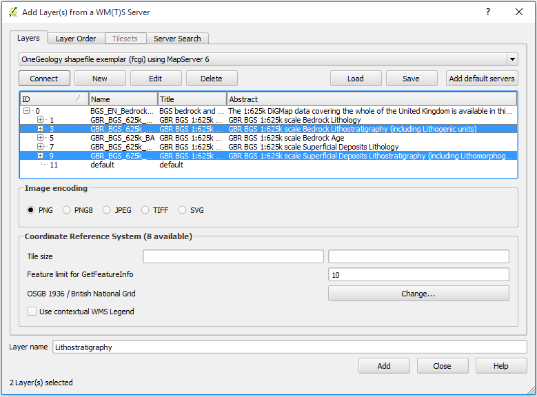
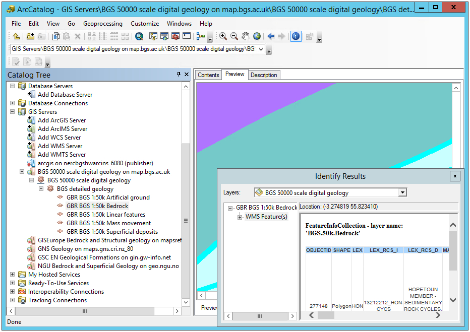
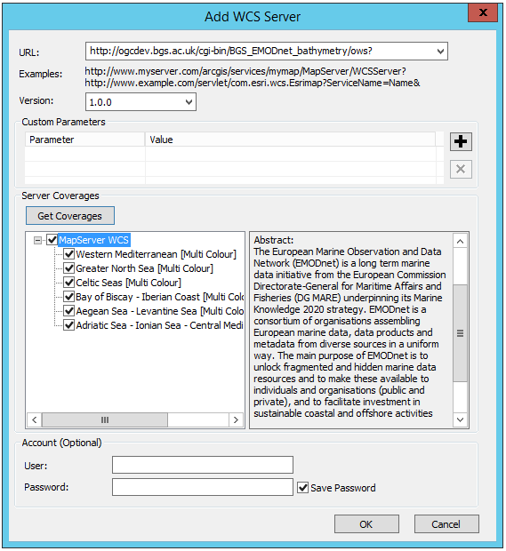
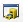
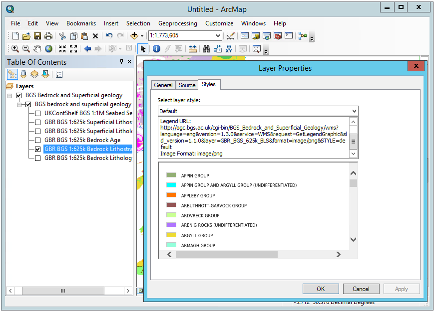
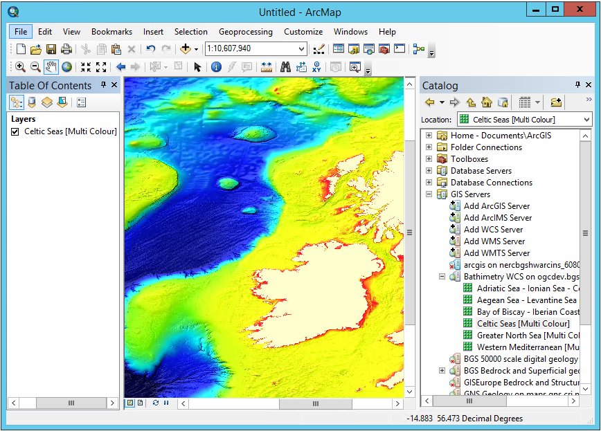

OneGeology Portal
=================

The portal will collate the web services provided by member organisations.

- The portal can be accessed using most internet browsers.
- Basic map data is called a WMS (Web Map Service)
- OneGeology aims to use Free and Open Source software wherever possible.
- The data is “served” directly from the provider organisation.
- The provider organisation retains full ownership and responsibility and is able to change or modify data whenever necessary.

The Portal has the following functions:

- Zoom
- Pan
- Get Information tool
- Help menu
- multi-layer map view,
- opacity selection,
- legend viewer, 
- details of provider organisation / geological survey
- web link URL to the provider survey
- brief description of the data layer
- conditions of use information for each layer

Using the OneGeology Portal
--------

.. todo::
   Currently taken WMS cookbook 1.4 text removing over-technical detail. Needs to have a general intro to the different kinds of service (WMS, WFS and WCS) service and what sort of things you might be able to  do with them. Probably not covering the kinds of data (traditional geol map, boreholes, minerals) in this section? Should make a generic list of the sorts of functionality a client may provide so can refer to this under each item. Need to consider whether we can actually maintain detailed instructions on more than a couple of examples. And should we? Should be able just to point to software's own documentation on using OGC services. Maybe just make a list with pointer to home page, specific documentation package may have for OGC services (should be standard stuff these days) and any gotchas/special considerations we have noticed for particular examples. The target audience for this section could include a range of levels of IT and geological knowledge and include people just using the services and service providers who also need to understand how their services can be made use of.

.. todo::

   Below introductory paragraph should probably point to some general OneGeology introduction elsewhere on www.onegeology.org to explain the range of data and purpose of OneGeology. We may need to get it written if it doesn't exist right now. We want to refer to purpose, kinds of data that are available or will be in future. This page is where the kinds of viewing, data query etc. that can be done will be introduced.

.. todo::

   List the other parts of www.onegeology.org that will link directly to here. At the moment a sidebar sub-menu "Technical detail for participants" -> "How to use a OneGeology service" and some links from other pages. Also the page http://onegeology.org/portal/portal_uses.html has links to various client pages but it all seems a bit of a repetitive anomaly and something that should be entirely replaced by content here.

The OneGeology portal allows you to discover all the services that have been registered with OneGeology. You can view all those that return image output on a map of the world and can query the data behind those that provide that ability. Also some services allow you to highlight areas satisfying some simple query criteria on the age or lithology of mapped geological units.

OneGeology makes data from geological data providers around the world accessible to those who would like to see and use it. The majority of this data is the type that is portrayed on traditional geological maps. There are increasing amounts with different geologically related types of data such as geophysics, boreholes and hydrogeology. This data is made available by means of Open GeoSpatial Consortium `OGC <http://www.opengeospatial.org>`_ standard web services that can be accessesed by a number of free and commercial clients. Currently OneGeology makes use of three OGC standards: Web Map Service `WMS <http://www.opengeospatial.org/standards/wms>`_, Web Feature Service `WFS <http://www.opengeospatial.org/standards/wfs>`_ and Web Coverage Service `WCS <http://www.opengeospatial.org/standards/wcs>`_. These different service standards define different kinds of capability for examining the data. 

WMS provides the ability to see a map image projected to its correct geographical location in a number of map projections. This will usually be accompanied by a legend which explains the symbology used in the map. Commonly, many WMS also provide the ability to select a point on the map and get a summary in text or other format of data values for that point. The majority of OneGeology services are WMS. A small number of these WMS also provide the ability to change the symbology of the map depending on the underlying data (e.g. to highlight formations of a particular age). These are called `SLD <http://www.opengeospatial.org/standards/sld>`_ enabled WMS.

WFS provide the ability to query a service based on spatial and other criteria and return the matching data in a `GML <http://www.opengeospatial.org/standards/gml>`_ format and maybe other formats as well. It assumes the data has been structured as a collection of features with spatial and other, possibly complex properties. OneGeology is focussed on two standard formats for data exchange: `GeoSciML <http://www.geosciml.org>`_ and `ERML <http://www.earthresourceml.org/>`_. The data available from a given WFS may be visually portrayed in one or more related WMS layers.

WCS also provices the ability to return matching data based on spatial and other criteria but the data is structured as coverages where values of some fixed set of properties are defined for each point over some spatial domain. Although theoretically different kinds of division of spatial domain are possible, currently all coverages are based on regular grids. The properties are also simple whether numerical or categorical. As image formats generally specify colour values at regular grid cells then a WCS may return coverages that can be viewed as an image directly as well as data formats that need to be processed by some application.

In simple terms, currently WFS are used for spatial data stored in some vector format and WCS for data stored in a raster gridded format.

.. todo::

   Should we also mention the CSW for searching metadata about the services in the above list?

Using the data from OneGeology on other platforms
------------

The following pages show how you may access services using these OGC standards (including those not part of OneGeology) in a number of popular desktop software clients and web based browser applications. We concentrate first on the web based portal provided by OneGeology itself and then cover other commonly available clients.

.. todo::

   Should we expand the above WMS, WFS and WCS introductions to say generically what you could do with each in a general client before treating the specific clients? Then for each client we say: CSW yes/no -> how, WMS yes/no -> how, WFS yes/no -> how, WCS yes/no -> how. Having covered standard things like "you need the service URL" we just say where you put it, and for GetFeatureInfo how you do it in particular client etc.

.. toctree::
   :maxdepth: 1

   portal
   qgis
   esri

The documentation for the following clients has not been updated for several years so may not be up-to-date.

* `Using NASA World Wind </howto/1_4_4.html>`_
* `Using Google Earth </howto/1_4_6.html>`_
* `Using Gaia </howto/1_4_2.html>`_
* `Using Dapple </howto/1_4_5.html>`_
* `Using MapInfo </howto/1_4_8.html>`_
* `Using uDig </howto/1_4_9.html>`_

.. todo::

   NASA World Wind: Check software updates (HTTP/Central/.NET version doesn't appear to have been updated, 1.4 is still latest) Java SDK version is being updated (https://github.com/NASAWorldWind/WorldWindJava/releases/), but not sure if this is something you can just install and run, rather than  use to build something. Current content http://onegeology.org/howto/1_4_4.html
   Google Earth: Check software updates and if issues still exist. Also check if same affects World Wind. Current content at http://onegeology.org/howto/1_4_6.html
   Gaia: Looks like same version as before but links changed? (http://www.thecarbonproject.com/Products/Gaia), now version 3.4.2.  Also supports version 1.1.0 WFS so perhaps worth documenting? Current content at http://onegeology.org/howto/1_4_2.html
   Dapple: This is still available (https://download.cnet.com/Dapple/3000-2379_4-75841105.html), might be worth keeping as is GeoSoft, and BGS is partnering with GeoSoft on ODA work.  Version is still the same, and still works as documented.  Only issue is on install, also needed to add DirectX End-User Runtime (https://www.microsoft.com/en-gb/download/details.aspx?id=35). Current content at http://onegeology.org/howto/1_4_5.html
   MapInfo: Can anyone check whether this is up-to-date? Current content at http://onegeology.org/howto/1_4_8.html
   uDig: Current content at http://onegeology.org/howto/1_4_9.html is pretty minimal. Is there any point maintaining a specific page?

* `Using QGIS <https://github.com/OneGeology/OneGeology_Docs/blob/master/PORTAL.rst#qgis>`_
* Using ESRI

  * `Using ArcMap <https://github.com/OneGeology/OneGeology_Docs/blob/master/PORTAL.rst#ArcMap>`_
  * `Using ArcPRO <https://github.com/OneGeology/OneGeology_Docs/blob/master/PORTAL.rst#ArcPRO>`_
  
QGIS
^^^^^^^^^^^^

.. todo::

   * Update screenshots to version 3 when available
   * Metasearch CSW plugin

Quantum GIS (QGIS) is a user friendly Open Source Geographic Information System (GIS) licensed under the `GNU General Public License <http://www.gnu.org/copyleft/gpl.html>`_ (http://www.gnu.org/copyleft/gpl.html). QGIS is an official project of the `Open Source Geospatial Foundation (OSGeo) <http://www.osgeo.org/>`_ (http://www.osgeo.org/). It runs on Linux, Unix, Mac OSX, and Windows and supports numerous vector, raster, and database formats and functionalities.

The current stable version of QGIS (QGIS 2.18) is available for download from https://www.qgis.org/en/site/forusers/download.html

Quantum GIS (QGIS) supports WMS versions 1.3.0 (and lower) with GetCapabilities, GetMap, GetFeatureInfo, GetLegendGraphic, layer transparency, and provides a metadata browser for the service.

Using QGIS to view WMS
----------------------

.. figure:: qgis/qgis_addWMS.png
   :alt: QGIS menu option for adding a WMS 

   Figure 1 - QGIS menu option for adding a WMS

.. |wmsBtn| image:: qgis/qgis_btnWMS.png

To add a WMS layer from the menu, choose *Layer > Add Layer > Add WMS/WMTS Layer*. Alternatively, click on the |wmsBtn| button on the *Manage Layers Toolbar*. In the *Add Layer(s) from a WM(T)S Server* pop-up box click the *New* button, and then in the *Create a new WMS connection* pop-up add a name for your service, such as OneGeology shapefile exemplar (fcgi) using MapServer 6 and the service URL (with no parameters) as below and then click 'OK'.

We recommend using no parameters (above), so that you get the latest version of the WMS service. If you are testing your own system and you want to test a particular version you can add that version as a parameter; such as:

::

	http://ogc.bgs.ac.uk/fcgi-bin/exemplars/BGS_Bedrock_and_Superficial_Geology/wms?version=1.1.1&

.. figure:: qgis/qgis_addNewWMSService.png
   :alt: Adding a new WMS Service

   Figure 2 - Adding a new WMS Service

As with most other clients at this stage all you’ve done is add the WMS service to the list of available WMS services. To add a layer you need to select the WMS service from the *Add Layer(s) from a WM(T)S Server* pop-up box, and click ‘Connect’. This will show you a list of the layers being served from the WMS service.

If you are behind a firewall, you may also need to add information about your proxy server. This is done through the *Settings > Options* menu in the *Network* section.

Click on the layer you want and click ‘Add’, this will add that layer in the background, but keep the pop-up window to allow you to add another layer. Press *Ctrl* and click again on a selected layer to deselect it.

.. figure:: qgis/qgis_selectWMSLayers.png
   :alt: Selecting layers

   Figure 3 - Selecting layers

Note, if you select several layers (using *Ctrl* or *Shift* keys) and then click Add, QGIS will show those selected WMS layers as a single ‘derived’ layer in the GIS. In this example we have joined the bedrock lithostratigraphy and the superficial lithostratigraphy geology layers to create a single layer which we name ‘Lithostratigraphy’. Note you can rename any WMS layer to one that suits your needs, change the layer CRS, and change the layer image encoding (the default is png).

   Figure 4 - Creating derived layers

If the selected layer is set to be queryable in the WMS service, you may use the identify tool to retrieve information on any feature in the map.

.. figure:: qgis/qgis_WMSIdentify.png
   :alt: WMS feature identification

   Figure 5 - WMS feature identification

You may right click on any layer in the layer list and go to *Properties* to get the metadata for that layer and the serivce that serves it.

.. figure:: qgis/qgis_WMSMetadataProperties.png
   :alt: Layer properties metadata

   Figure 6 - Layer properties metadata

Using QGIS to access simple feature WFS
---------------------------------------

.. |wfsBtn| image:: qgis/qgis_btnWFS.png

To add a WFS layer you need to go through a similar process as you do to add a WMS layer, that is, you must first add the WFS service by clicking on the |wfsBtn| tool on the *Manage Layers Toolbar*, then connect to the service, then select the layer you want to add. Even if the WFS service URL is the same as a WMS connection you already have listed you will need to add the WFS service URL.

.. figure:: qgis/qgis_addNewWFSService.png
   :alt: Adding a new WFS service

   Figure 7 - Adding a new WFS service

When you add a WFS layer you can choose to request all the features of that layer, or you may choose to request only those features that overlap the current extent, depending on whether the option *Only request features overlapping the view extent* is enabled. This will allow you to download and add to your map only the features relevant to your area of interest. However, if you change your extent by panning or zooming the map, new features will be fetched for your new view extent. 

.. figure:: qgis/qgis_addWFSLayer.png
   :alt: Adding a new WFS service

   Figure 7 - Adding a new WFS service

Below we have zoomed to the full extent of the WFS layer, therefore all features for that layer have been returned. Individual feature attributes can be inspected by using the *Identify* tool or by opening the *Attribute Table*.

.. figure:: qgis/qgis_WFSIdentify.PNG
   :alt: Identifying WFS features

   Figure 8 - Identifying WFS features

When we view a WFS service, it should be noted that we actually download a representation of the data itself, not an image. We can therefore save a copy of that data for re-use elsewhere. Simple right click on the layer and go to *Save As*. Exporting formats include **ESRI Shapefile** and **GeoJSON**. Exported data can be limited to selected features or to features in the current map extent.

.. figure:: qgis/qgis_wfsExport.PNG
   :alt: Exporting WFS layer

   Figure 9 - Exporting WFS layer

Using QGIS to view WCS
----------------------

.. |wcsBtn| image:: qgis/qgis_btnWCS.png

Adding a WCS layer is again a similar process than adding a WMS layer: 

* Add the WCS service by clicking on the |wcsBtn| button on the *Manage Layers Toolbar*
* Connect to the service
* Select the layer you want to add

.. figure:: qgis/qgis_addNewWCSService.png
   :alt: Creating a connection to a WCS service

   Figure 10 - Creating a connection to a WCS service

Only one layer can be selected at a time. After selecting it, and choosing your favourite format, click 'Add'. Repeat this process if you wand to add more layers and then click 'Close'.

.. figure:: qgis/qgis_addNewWCSService.png
   :alt: Adding a WCS layer

   Figure 11 - Adding a WCS layer

Your layer(s) should now be displaying on the map. 

.. figure:: qgis/qgis_displayWcsLayer.png
   :alt: Displaying a WCS layer

   Figure 12 - Displaying a WCS layer

WCS layers can be exported as rasters. To do so, right click on the layer and go to *Save As*. You can choose to crop the exported raster by specifying an extent or getting the current map extent.

.. figure:: qgis/qgis_exportWCSLayer.png
   :alt: Exporting a WCS layer

   Figure 13 - Exporting a WCS layer

See: https://docs.qgis.org/testing/en/docs/user_manual/working_with_ogc/ogc_client_support.html
  
ESRI ArcMap
^^^^^^^^^^^^

The ArcGIS software package comes with several applications. Here we'll briefly show how to use **ArcCatalog** to setup OGC service connections and how to use **ArcMap** to deal with OGC layers.

The following notes are based on ESRI ArcGIS server version 10.5 (SP1).

Using ArcCatalog 
----------------

WMS Service Connection
^^^^^^^^^^^^^^^^^^^^^^

To add a WMS service to your list of available WMS services, on the *Catalog Tree* window, you use the *GIS servers > Add WMS Server* option, and then add the Service URL (without parameters). You may select to use the default service version (which would normally be the highest version) or you may force a specified version depending on your needs.

.. figure:: esri/esri_catalog_addingWms.png
   :alt: Adding a WMS service to the list of available services in ArcCatalog

   Figure 1 - Adding a WMS service to the list of available services in ArcCatalog

You will be able to preview the service layers in ArcCatalog; however, if the map service is scale layered (only visible at certain scales), you won't be able to see the map until you have zoomed in to an appropriate scale. Similarly, if the layers are queryable, you will be able to use the information tool to retrieve feature information.

You will not be able to view the legend graphics in ArcCatalog.

   Figure 2 - Reviewing available WMS services in ArcCatalog

The above screen-shot shows a number of WMS (GIS Servers) listed in the left hand menu. These are services that have previously been added to ArcCatalog. To retrieve layer name information, preview, and do GetFeatureInfo requests, you must first double-click on the layer name. This will re-query the service and retrieve only active layers at the time of your query.

WFS Service Connection
^^^^^^^^^^^^^^^^^^^^^^

This functionality is only available with a `Data Interoperability <http://desktop.arcgis.com/en/arcmap/latest/extensions/data-interoperability/what-is-the-data-interoperability-extension-.htm>`_ license. A free alternative to get hold of the data in the WFS would be downloading the features in the WFS using QGIS and then exporting them as an ESRI Shapefile (see section *Using QGIS to view WFS*).

If you do have a Data Interoperability license, on the *Catalog Tree* window go to *Interoperability Connections > Add Interoperability Connection* to open the *Interoperability Connection* dialog. In the dialog, select WFS as format and enter the WFS url in the *Dataset* option.

.. figure:: esri/esri_catalog_connectingWfs.png
   :alt: Connecting to a WFS service in ArcCatalog

   Figure 3 - Connecting to a WFS service in ArcCatalog

Before clicking *OK*, go to *Parameters* and select the *Feature Types* to download. *Feature Types* aren't selected by default, so you'll need to do this step if you want to see any layer in your WFS connection. The *WFS Parameters* dialog also allows you to set many other options, as shown in the picture below. Once you're happy with your settings click *OK* to close this dialog and *OK* again to create the WFS connection.

.. figure:: esri/esri_catalog_parametersWfs.png
   :alt: WFS Parameters dialog

   Figure 4 - WFS Parameters dialog

When you create a connection, you might see that multiple versions of your layer have been created in different geometries. Refresh your connection (right click on layer and go to *Refresh*) and only the relevant geometry will be kept. 

.. figure:: esri/esri_catalog_allGeometriesWfs.png
   :alt: WFS connection showing all available geometries

   Figure 5 - WFS connection showing all available geometries

You can preview and identify individual features in a layer from a WFS connection by selecting the layer and going to the *Preview* tab.

.. figure:: esri/esri_catalog_reviewingWfs.png
   :alt: Previewing and identifying a WFS layer

   Figure 6 - Previewing and identifying a WFS layer

WCS Service Connection
^^^^^^^^^^^^^^^^^^^^^^

Adding a WCS service to your list of available WCS services is identical than doing it for a WMS service: on the *Catalog Tree* window go to *GIS servers > Add WMS Server* option and then add the Service URL (without parameters). You may select to use the default service version (which would normally be the highest version) or you may force a specified version depending on your needs.

   Figure 7 - Adding a WCS service to the list of available services in ArcCatalog

Your WCS will now be available within the list of GIS Servers.

.. figure:: esri/esri_catalog_reviewingWcs.png
   :alt: Previewing WCS layers in ArcCatalog

   Figure 7 - Previewing WCS layers in ArcCatalog

Using ArcMap
------------

.. |addDataBtn| image:: esri/esri_map_addDataBtn.PNG

In ArcMap you can use the *Add Data* button (|addDataBtn|) to add an WMS, WFS or WCS layer or simply drag-and-drop a layer from the *Catalog* window. This window is the equivalent to the *Catalog Tree* window in ArcCatalog and can be enabled by pressing |addCatalogBtn|. OGC service connections are usually created in ArcCatalog before the data is used in ArcMap; however, the connections can also be set at the time of adding the data.

.. figure:: esri/esri_map_addingData.PNG
   :alt: Adding data to ArcMap

   Figure 8 - Adding data to ArcMap

WMS Layers
^^^^^^^^^^

WMS layers in ArcMap behave differently than other ESRI native layers. For instance, they are arranged in hierarchical entries which can't be rearranged. This tipically includes

::

	- Service name
	    - Group layer
	        - Actual layers

However there can be multiple or even nested group layers. Also, the only way to get information about feature attributes in a WMS layer is through the *Identify* tool, as shown in the previous section.	

If the map is scale layered (layers are shown greyed out) you may use the *Zoom to Make Visible* option. This zooms into the layer to the scale cited in the layer below which the layer will be visible, that is you need to zoom in a little bit further using the zoom tool to be able to view the map.

If you are going to provide scale layered data, it is suggested that you also provide an outline coverage map viewable at all scales to allow users to pan around the area of interest, without needing to zoom in first.

.. figure:: esri/esri_map_zoomVisibleWms.PNG
   :alt: Accessing the Zoom to make visible tool in ArcMap for scale layered data

   Figure 9 - Accessing the *Zoom to make visible* tool in ArcMap for scale layered data

There are two ways you can view the legend for any layer. First off you can use the ‘Add WMS legend to map’ option, which will overlay a large copy of the legend on top of your map window. You will probably need to move or resize this legend graphic in order to see your map.

.. figure:: esri/esri_map_addLegendWms.PNG
   :alt: Adding a WMS legend to a map in ArcMap

   Figure 10 - Adding a WMS legend to a map in ArcMap

The legend will scale to the initial scale of your map and will not redraw (rescale) if you change the scale of your map view.

.. figure:: esri/esri_map_lgndDisplayWms.PNG
   :alt: WMS legend displayed on the map layer in ArcMap

   Figure 11 - WMS legend displayed on the map layer in ArcMap

Alternatively, you may use the layer properties dialogue to save a copy of the legend. To do so use the *Legend URL* or right click on the legend image and go to *Save As*. If your layer presents multiple styles, they will be available in the drop down menu of this dialog.

   Figure 12 - Saving a WMS legend graphic to file in ArcMap

For more information about WMS layers go to `Using WMS service layers <http://desktop.arcgis.com/en/arcmap/latest/map/web-maps-and-services/using-wms-service-layers.htm>`_ 

WFS Layers
^^^^^^^^^^

WFS layers behave in ArcMap like any other type of vector layer. You can, for instance, identify individual features, see feature attributes in the *Attribute Table*, join the layer to other dataset or apply symbology. 

.. figure:: esri/esri_map_wfs.PNG
   :alt: WFS layer displayed in ArcMap showing attributres and custom symbology

   Figure 13 - WFS layer displayed in ArcMap showing attributres and custom symbology

To export features from a WFS layer to ESRI proprietary formats, such as a **Shapefile**, right click on the layer and go to *Data > Export Data*. Note that you can export subsets of the layer by choosing only selected features or features within the view extent.

.. figure:: esri/esri_map_exportProprietaryWfs.PNG
   :alt: Exporting a WFS layer to a proprietary format in ArcMap

   Figure 14 - Exporting a WFS layer to a proprietary format in ArcMap

To export features to an open format, like **GeoJSON**, you'll need to use the *Quick Export* tool, only available with the *Data Interoperability* license. If features are selected, this tool will only export selected features. You can also return feaures from a given extent by going to the tool's environments and defining an extent in the *Processing Extent* section.

.. figure:: esri/esri_map_exportOpenWfs.PNG
   :alt: Exporting a WFS layer to an open format in ArcMap

   Figure 15 - Exporting a WFS layer to an open format in ArcMap

WCS Layers
^^^^^^^^^^

WCS layers operate in a similar way to other raster data but with a few less properties. For more information on available properties go to `Adding a WCS service to ArcMap <http://desktop.arcgis.com/en/arcmap/latest/map/web-maps-and-services/adding-a-wcs-service-to-arcmap.htm>`_.

   Figure 16 - Displaying WCS data in ArcMap

To export a WCS layer, right click on it and go to *Data > Export Data*. The *Export WCS Data* dialog will allow you to set the extent, format or cell size of the exported data.

.. figure:: esri/esri_map_exportWcs.png
   :alt: Displaying WCS data in ArcMap

   Figure 17 - Displaying WCS data in ArcMap
  
See: http://desktop.arcgis.com/en/arcmap/latest/map/web-maps-and-services/about-using-ogc-service-layers.htm
  
ArcPRO
^^^^^^^^^^^^
  
See: https://pro.arcgis.com/en/pro-app/help/data/services/ogc-services.htm
