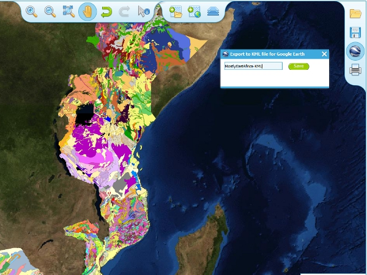

.. _use_portal_kml:

Exporting to Keyhole Markup Language (KML)
==========================================

*KML* is a file format used to display geographic data in an Earth browser such as Google Earth, Google Maps. It is an XML–based language schema for expressing geographic annotation and visualization on existing or future Web-based, two-dimensional maps and  three-dimensional Earth browsers. KML was developed for use with Google Earth, which was originally named Keyhole Earth Viewer. It was created by Keyhole Inc, which was acquired by Google in 2004, but is now an internationally recognized standard by the Open Geospatial Consortium (OGC) in it’s version 2.2 form.
   
You may export the contents of any active map service to KML to allow you to view those layers in Google Earth (or other applications that support the KML format).

* Click the Save KML context button
* Enter a file name of your choice that you will save the KML as, and click OK.

   Using the Export to KML option to view your map in Google Earth

Once the KML file has been created you can save it or choose to immediately open the data in Google Earth.

