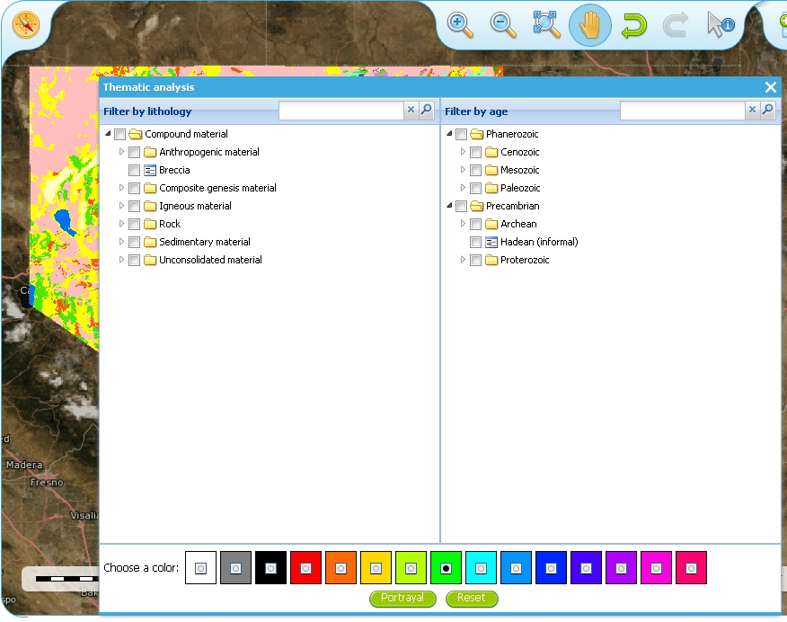
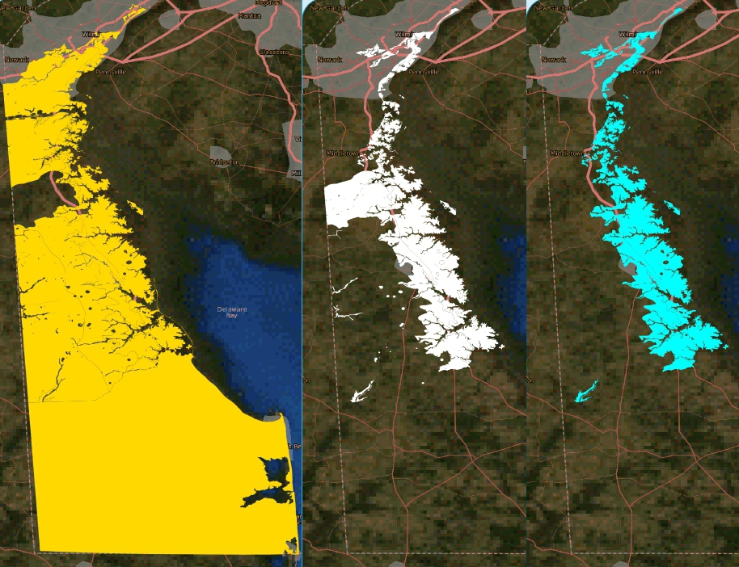
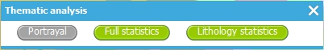

.. _use_portal_thematic_analysis:

Using the thematic analysis tools
=================================

As we have seen in section 1.4.1.1, we may use the ‘*Active Layers Properties*’ tool to discover further information about any of our active layers in a map session.  Information that may be revealed in this dialogue is that the layer is available for ‘*Thematic Analysis*’, as in the below example.

.. figure:: ThematicAnal.jpg
   :width: 395
   :height: 57
   :alt: Layer properties dialogue, showing thematic analysis functionality is available in an active layer.

   Layer properties dialogue, showing thematic analysis functionality is available in an active layer.

The thematic analysis tool has two principal functions.  The first is an analysis of map features available in an associated GeoSciML WFS, the default supported version is v4, though the older v3.2 is also supported; the OneGeology Portal knows about this GeoSciML association by the presence of either a **GeoSciML32_wfs_age_or_litho_queryable** or **GeoSciML4_wfs_age_or_litho_queryable** keyword in the layer metadata. The second function is the ability to apply an external SLD to a layer which has GeoSciML-Portrayal attribution; the OneGeology Portal knows that a layer has this capability by the presence of a **Geosciml_portrayal_age_or_litho_queryable** keyword in the layer metadata.

Click on the ‘*Thematic Analysis*’ link to show the options available for the layer.  For example for the Nevada service layer, US-NV NBMG 1:500k Geology, there is only a WMS portrayal service enabled, so only the Portrayal functionality is available (green button), the other functionality buttons are not available (greyed out).

.. figure:: ThematicAnalysisSelection.jpg
   :width: 640
   :height: 650
   :alt: Thematic analysis options dialog

   Thematic analysis options dialog
    

   The thematic analysis query builder window
  
GeoSciML-Portrayal
------------------

The analysis window offers you two ways to filter your map, you can filter by lithology or you can filter by age. The initial view in the lithology filter window is simply the ‘*Compound material*’ option, and in the age filter window the initial view shows the ‘*Phanerozoic*’ and ‘*Precambrian*’ options.  These options reflect the structure of the underlying controlled vocabularies.

The values for the lithology filter options are taken from the `CGI Simple Lithology controlled vocabulary <http://resource.geosciml.org/static/vocabulary/cgi/201211/simplelithology.html>`_. 

The values for the age filter options come from the ICS 2012 Geologic timescale vocabularies, for example, `Phanerozoic <http://resource.geosciml.org/classifier/ics/ischart/Phanerozoic>`_ or `Precambrian <http://resource.geosciml.org/classifier/ics/ischart/Precambrian>`_.

In any window you can refine your selection by drilling down into the hierarchy, and then clicking on an option box to make your filter selection. In the above figure example, we have expanded the lithology view options by first clicking on the white arrow next to the ‘*Compound material*’ option (the arrow turns black on such a selection).  Similarly, we have expanded the age filter options by first selecting the ‘*Phanerozoic*’ then ‘*Paleozoic*’.  We haven’t yet made any selection on what we want to filter, but instead we are just exploring the available options by which we could filter.
  
.. figure:: ThematicAnalysisQueryBuilderSearch.jpg
   :width: 854
   :height: 622
   :alt: Searching the controlled vocabularies

   Searching the controlled vocabularies

As well as drilling down through the hierarchy progressively to find the term you wish to filter by, you can also search for terms directly by entering the search term in the box at the top of the respective Age and Lithology windows, then clicking the magnifying glass icon.  For example in the above example we have searched the Lithology vocabulary for ‘*Sand*’ and the Age vocabularies for the term ‘*Tonian*’.   To search for another term use the X icon to clear the old search term, or just start typing a new term in the search window. Note that even though there are exact matches for both terms the search shows partial matches as well.  Again, at this stage we have not made any selection by which to filter.

      
.. figure:: ThematicAnalysisSelectionByAge.jpg
   :width: 882
   :height: 692
   :alt: Generating an automatic SLD file to filter by age (Pleistocene) in the Delaware WMS

   Generating an automatic SLD file to filter by age (Pleistocene) in the Delaware WMS

In this (above) example we have selected the Delaware WMS service ‘*US-DE DGS 100k Surficial Geology*’ layer, which has GeoSciML-Portrayal v2.0 attribution.  We then decided to filter by age, looking to view only those geology polygons that are attributed as belonging to the Pleistocene (by ticking the options window to the left of the term).  Then we select a colour with which to apply to all the polygons that match the age criteria, the tool generates an external SLD file like the one below:

.. code-block:: xml

   <sld:StyledLayerDescriptor 
   version="1.0.0" 
   xmlns="http://www.opengis.net/ogc"
   xmlns:sld="http://www.opengis.net/sld" 
   xmlns:ogc="http://www.opengis.net/ogc"
   xmlns:gml="http://www.opengis.net/gml" 
   xmlns:xsi="http://www.w3.org/2001/XMLSchema-instance"
   xsi:schemaLocation="http://www.opengis.net/sld 
     http://schemas.opengis.net/sld/1.0.0/StyledLayerDescriptor.xsd">
     <sld:NamedLayer>
       <sld:Name>US-DE_DGS_100k_Surficial_Geology</sld:Name>
         <sld:UserStyle>
           <sld:FeatureTypeStyle>
             <sld:Rule>
               <ogc:Filter>
                 <ogc:Or>
                   <ogc:PropertyIsEqualTo>
                     <ogc:PropertyName>representativeAge_uri</ogc:PropertyName>
                     <ogc:Literal>
                       http://resource.geosciml.org/classifier/ics/ischart/Pleistocene
                     </ogc:Literal>
                   </ogc:PropertyIsEqualTo>
                   <ogc:PropertyIsEqualTo>
                     <ogc:PropertyName>representativeAge_uri</ogc:PropertyName>
                     <ogc:Literal>
                       http://resource.geosciml.org/classifier/ics/ischart/Calabrian
                     </ogc:Literal>
                   </ogc:PropertyIsEqualTo>
                   <ogc:PropertyIsEqualTo>
                     <ogc:PropertyName>representativeAge_uri</ogc:PropertyName>
                     <ogc:Literal>
                       http://resource.geosciml.org/classifier/ics/ischart/Gelasian
                     </ogc:Literal>
                   </ogc:PropertyIsEqualTo>
                   <ogc:PropertyIsEqualTo>
                     <ogc:PropertyName>representativeAge_uri</ogc:PropertyName>
                     <ogc:Literal>
                       http://resource.geosciml.org/classifier/ics/ischart/Ionian
                     </ogc:Literal>
                   </ogc:PropertyIsEqualTo>
                   <ogc:PropertyIsEqualTo>
                     <ogc:PropertyName>representativeAge_uri</ogc:PropertyName>
                     <ogc:Literal>
                       http://resource.geosciml.org/classifier/ics/ischart/UpperPleistocene
                     </ogc:Literal>
                   </ogc:PropertyIsEqualTo>
                 </ogc:Or>
               </ogc:Filter>
             <sld:PolygonSymbolizer>
               <sld:Fill>
                 <sld:CssParameter name="fill">#3366FF</sld:CssParameter>
               </sld:Fill>
             </sld:PolygonSymbolizer>
           </sld:Rule>
         </sld:FeatureTypeStyle>
       </sld:UserStyle>
     </sld:NamedLayer>
   </sld:StyledLayerDescriptor>

When this external customized SLD file has been generated for our age filter selection, the OneGeology Portal then makes a new `GetMap request referencing this SLD <http://maps.dgs.udel.edu/geoserver/DGS_Surficial_and_Contact_Geology/wms?service=WMS&TRANSPARENT=TRUE&version=1.3.0&request=GetMap&STYLES=&EXCEPTIONS=INIMAGE&FORMAT=image/png&CRS=EPSG%3A4326&SLD=http%3A%2F%2Fogc.bgs.ac.uk%2Fsld%2F20130628_1372432351566_OpenLayers.Layer.WMS_991.sld&SAVEDLAYERS=US-DE_DGS_100k_Surficial_Geology&BBOX=39.57931760121924,-75.79289049774037,39.784397224903465,-75.45691470533502&WIDTH=1250&HEIGHT=763&>`_ for our area of selection like:

.. code-block:: text

   http://maps.dgs.udel.edu/geoserver/DGS_Surficial_and_Contact_Geology/wms?
     SERVICE=WMS&
     TRANSPARENT=TRUE&
     VERSION=1.3.0&
     REQUEST=GetMap&
     STYLES=&
     EXCEPTIONS=INIMAGE&
     FORMAT=image/png&
     CRS=EPSG%3A4326&
     SLD=http://portal.onegeology.org/slds/20130628_1372432351566_OpenLayers.Layer.WMS_991.sld&
     SAVEDLAYERS=US-DE_DGS_100k_Surficial_Geology&
     BBOX=39.57931760121924,-75.79289049774037,39.784397224903465,-75.45691470533502&
     WIDTH=1250&
     HEIGHT=763&

The resultant custom map (with the GeoSciML-Portrayal filter for Pleistocene polygons applied) is shown below:

.. figure:: ThematicAnalysisSelectionByAgeResult.jpg
   :width: 774
   :height: 776
   :alt: Pleistocene geology polygons

   Pleistocene geology polygons

Similarly, we could filter for some other GeoSciML-Portrayal attribution in the map, such as the following lithology filter on ‘*Composite genesis material*’

.. figure:: ThematicAnalysisSelectionByLithoResult.jpg
   :width: 834
   :height: 556
   :alt: Composite genesis material

   Composite genesis material

Finally, it is possible to filter by both Age and Lithology, for example in the below image we can see first the result for ‘*Sand*’, then the search results for ‘*Upper Pleistocene*’, and then the results for a combined search for ‘*Sand*’ **and** ‘*Upper Pleistocene*’.

   Age and lithology search results comparison: Sand / Upper Pleistocene / Sand plus Upper Pleistocene

The generated external SLD will be available on the OneGeology portal server for a least one day, but no longer than one week.  In the age filter example above we have taken a copy of the generated SLD and put it on the BGS WMS server for long term reference.

	  
Statistics
----------
      
The statistics functionality (Full statistics and Lithology statistics) of the Thematic analysis tools are coupled to a WFS associated with a WMS Layer, as identified by the presence of a **GeoSciML32_wfs_age_or_litho_queryable** keyword in the layer metadata

If the OneGeology Portal detects that your selected layer has an associated GeoSciML v3.2 WFS, then when you open the Thematic analysis window you will see the Full statistics, and Lithology statistics buttons will be highlighted in green, if not the buttons will be greyed out and you will not be able to use these analyses tools.
 

   Thematic analysis window showing that statistical analysis is available for the selected layer

      
Full statistics
'''''''''''''''

Make your filter selection, by age or lithology, in the same way as described for the GeoSciML-Portrayal section.  In the below example we have first selected the ‘*Full statistics*’ option button, then searched for the Lithology term ‘*Breccia*’, selecting the broad term as the filter keyword.  We now have two options, we can opt to ‘*Download the GeoSciML*’, or we can view the Full statistics.

.. figure:: FullStatsBrecciaScotland.jpg
   :width: 962
   :height: 730
   :alt: Full statistics query: Breccia in a region of Scotland

   Full statistics query: Breccia in a region of Scotland
	  
If you select the ‘*Download the GeoSciML*’ button, the portal will generate a WFS filter query that covers the selected area and the query term and send that query to the WFS server.  It then retrieves the result and you should get the option (depending on your browser settings) of either downloading the resultant GeoSciML, or viewing in your browser.
  
`Example GeoSciML download request for Breccia in a region of Scotland <http://portal.onegeology.org/ProxyWFSTools.jsp?request=gsmlbbox&bbox=55.07762036519571,-4.54515462888095,55.78778525593572,-3.516434912749198&srs=EPSG:4326&url=http%3A//ogc.bgs.ac.uk/digmap625k_gsml32_insp_gs/wfs%3F&typename=gsml%3AMappedFeature&version=2.0.0&filter=%3Cfes%3AOr%3E%3Cfes%3APropertyIsEqualTo%3E%3Cfes%3AValueReference%3Egsml%3Aspecification/gsmlgu%3AGeologicUnit/gsmlgu%3Acomposition/gsmlgu%3ACompositionPart/gsmlgu%3Amaterial/gsmlem%3ARockMaterial/gsmlem%3Alithology/@xlink%3Ahref%3C/fes%3AValueReference%3E%3Cfes%3ALiteral%3Ehttp%3A//resource.geosciml.org/classifier/cgi/lithology/breccia%3C/fes%3ALiteral%3E%3C/fes%3APropertyIsEqualTo%3E%3Cfes%3APropertyIsEqualTo%3E%3Cfes%3AValueReference%3Egsml%3Aspecification/gsmlgu%3AGeologicUnit/gsmlgu%3Acomposition/gsmlgu%3ACompositionPart/gsmlgu%3Amaterial/gsmlem%3ARockMaterial/gsmlem%3Alithology/@xlink%3Ahref%3C/fes%3AValueReference%3E%3Cfes%3ALiteral%3Ehttp%3A//inspire.ec.europa.eu/codelist/LithologyValue/breccia%3C/fes%3ALiteral%3E%3C/fes%3APropertyIsEqualTo%3E%3C/fes%3AOr%3E>`_. The full request query is shown below in a fragmented style for easier reading:

.. code-block:: text

   http://portal.onegeology.org/ProxyWFSTools.jsp?
     request=gsmlbbox&
     bbox=55.07762036519571,-4.54515462888095,55.78778525593572,-3.516434912749198&
     srs=EPSG:4326&
     url=http%3A//ogc.bgs.ac.uk/digmap625k_gsml32_insp_gs/wfs%3F&
     typename=gsml%3AMappedFeature&
     version=2.0.0&
     filter=
       %3Cfes%3AOr%3E
           %3Cfes%3APropertyIsEqualTo%3E
               %3Cfes%3AValueReference%3E
                   gsml%3Aspecification/
                   gsmlgu%3AGeologicUnit/
                   gsmlgu%3Acomposition/
                   gsmlgu%3ACompositionPart/
                   gsmlgu%3Amaterial/
                   gsmlem%3ARockMaterial/
                   gsmlem%3Alithology/
                   @xlink%3Ahref
               %3C/fes%3AValueReference%3E
               %3Cfes%3ALiteral%3E
                   http%3A//resource.geosciml.org/classifier/cgi/lithology/breccia
               %3C/fes%3ALiteral%3E
           %3C/fes%3APropertyIsEqualTo%3E
           %3Cfes%3APropertyIsEqualTo%3E
               %3Cfes%3AValueReference%3E
                   gsml%3Aspecification/   
                   gsmlgu%3AGeologicUnit/  
                   gsmlgu%3Acomposition/
                   gsmlgu%3ACompositionPart/
                   gsmlgu%3Amaterial/
                   gsmlem%3ARockMaterial/
                   gsmlem%3Alithology/
                   @xlink%3Ahref
               %3C/fes%3AValueReference%3E
               %3Cfes%3ALiteral%3E
                   http%3A//inspire.ec.europa.eu/codelist/LithologyValue/breccia
               %3C/fes%3ALiteral%3E
           %3C/fes%3APropertyIsEqualTo%3E
       %3C/fes%3AOr%3E 

Alternatively, you may chose the ‘*Full statistics*’ option button.  With this option the filter query is sent to the WFS server and the results are then tabulated in the page.  By default the shows the description of features matching the query, as in the top part of the below image.  However you may use the dropdown box at the top of the form to display other fields returned in the results such as EventProcess, CompositionPart, OlderNamedAge, and (not shown in the image below) YoungerNamedAge.

.. figure:: FullStatsResultsCompilation.jpg
   :width: 802
   :height: 442
   :alt: Full statistics query: compilation of results forms

   Full statistics query: compilation of results forms

    
Lithology statistics
''''''''''''''''''''

Instead of selecting the ‘*Full statistics*’ option we can instead chose the ‘*Lithology statistics*’ option.  Unlike the ‘*Full statistics*’ option, where you can select multiple ages and lithologies (in particular by selecting a category and all sub-classes at the same time), with the ‘*Lithology statistics*’ query you can **only** select one lithology term exactly and sub-classes will not be returned.  For example in the below query we have selected an area near Glasgow (Longitude -4, Latitude 56 at a scale of 1:150,000), and are filtering for features that have a proportion of coal greater than or equal to 5%.

.. figure:: LithStatsCoalQuery.jpg
   :width: 681
   :height: 840
   :alt: Lithology statistics query: greater than or equal to 5% of coal

   Lithology statistics query: greater than or equal to 5% of coal

Just like the ‘*Full statistics*’ option we can chose to ‘*Download the GeoSciML*’ result of the query, or we can view the results in forms in a portal results window, by selecting the ‘*Lithology statistics*’ button.

`Example GeoSciML download request for 5% coal in formations near Glasgow <http://portal.onegeology.org/ProxyWFSTools.jsp?request=gsmlbbox&bbox=55.80026612447937,-4.2893274201620555,56.19973387552063,-3.7106725798379445&srs=EPSG:4326&url=http%3A//ogc.bgs.ac.uk/digmap625k_gsml32_insp_gs/wfs%3F&typename=gsml%3AMappedFeature&version=2.0.0&filter=%3Cfes%3AOr%3E%3Cfes%3APropertyIsGreaterThanOrEqualTo%3E%3Cfes%3AValueReference%3Egsml%3Aspecification/gsmlgu%3AGeologicUnit/gsmlgu%3Acomposition/gsmlgu%3ACompositionPart%5Bgsmlgu%3Amaterial/gsmlem%3ARockMaterial/gsmlem%3Alithology/@xlink%3Ahref%20%3D%20%27570%27%5D/gsmlgu%3Aproportion/gsmlu%3AGSML_QuantityRange/gsmlu%3AlowerValue%3C/fes%3AValueReference%3E%3Cfes%3ALiteral%3E5%3C/fes%3ALiteral%3E%3C/fes%3APropertyIsGreaterThanOrEqualTo%3E%3Cfes%3APropertyIsGreaterThanOrEqualTo%3E%3Cfes%3AValueReference%3Egsml%3Aspecification/gsmlgu%3AGeologicUnit/gsmlgu%3Acomposition/gsmlgu%3ACompositionPart%5Bgsmlgu%3Amaterial/gsmlem%3ARockMaterial/gsmlem%3Alithology/@xlink%3Ahref%20%3D%20%27http%3A//inspire.ec.europa.eu/codelist/LithologyValue/coal%27%5D/gsmlgu%3Aproportion/gsmlu%3AGSML_QuantityRange/gsmlu%3AlowerValue%3C/fes%3AValueReference%3E%3Cfes%3ALiteral%3E5%3C/fes%3ALiteral%3E%3C/fes%3APropertyIsGreaterThanOrEqualTo%3E%3C/fes%3AOr%3E">`_. The full request query is shown below in a fragmented style for easier reading:

.. code-block:: text

   http://portal.onegeology.org/ProxyWFSTools.jsp?
     request=gsmlbbox&
     bbox=55.80026612447937,-4.2893274201620555,56.19973387552063,-3.7106725798379445&
     srs=EPSG:4326&
     url=http%3A//ogc.bgs.ac.uk/digmap625k_gsml32_insp_gs/wfs%3F&
     typename=gsml%3AMappedFeature&
     version=2.0.0&
     filter=
       %3Cfes%3AOr%3E
           %3Cfes%3APropertyIsGreaterThanOrEqualTo%3E
               %3Cfes%3AValueReference%3E
                   gsml%3Aspecification/
                   gsmlgu%3AGeologicUnit/
                   gsmlgu%3Acomposition/
                   gsmlgu%3ACompositionPart%5Bgsmlgu%3Amaterial/
                   gsmlem%3ARockMaterial/
                   gsmlem%3Alithology/
                   @xlink%3Ahref%20%3D%20%27570%27%5D/
                       gsmlgu%3Aproportion/
                       gsmlu%3AGSML_QuantityRange/
                       gsmlu%3AlowerValue
               %3C/fes%3AValueReference%3E
               %3Cfes%3ALiteral%3E
                   5
               %3C/fes%3ALiteral%3E
           %3C/fes%3APropertyIsGreaterThanOrEqualTo%3E
           %3Cfes%3APropertyIsGreaterThanOrEqualTo%3E
               %3Cfes%3AValueReference%3E
                   gsml%3Aspecification/
                   gsmlgu%3AGeologicUnit/
                   gsmlgu%3Acomposition/
                   gsmlgu%3ACompositionPart%5Bgsmlgu%3Amaterial/
                   gsmlem%3ARockMaterial/
                   gsmlem%3Alithology/
                   @xlink%3Ahref%20%3D%20%27http%3A//inspire.ec.europa.eu/
                       codelist/
                       LithologyValue/
                       coal%27%5D/
                       gsmlgu%3Aproportion/
                       gsmlu%3AGSML_QuantityRange/
                       gsmlu%3AlowerValue
               %3C/fes%3AValueReference%3E
               %3Cfes%3ALiteral%3E
                   5
               %3C/fes%3ALiteral%3E
           %3C/fes%3APropertyIsGreaterThanOrEqualTo%3E
       %3C/fes%3AOr%3E
  
Alternatively you can view the statistics in a form version sorted by field, by selecting the ‘*Lithology statistics*’ button.

.. figure:: LithStatsCoalQueryRFormCompilation.jpg
   :width: 802
   :height: 620
   :alt: Lithology statistics query: compilation of form results

   Lithology statistics query: compilation of form results 5% coal near Glasgow
    
Caveat
''''''

The statistics function is only able to work when zoomed in to quite small areas; precisely this is when the spatial resolution is less than 0.0015 (e.g. a pixel shows less than 0.0015 degrees latitude of the ground surface). When viewing the map if you are not zoomed in far enough you will see the following error.

.. figure:: AnalError.jpg
   :width: 434
   :height: 163
   :alt: Error message received when the scale of the selected map is too small

   Error message received when the scale of the selected map is too small

If you get this error you must close the results (‘*Statistics on BBOX*’) window, to be able to access the zoom tools, and then zoom in further.

